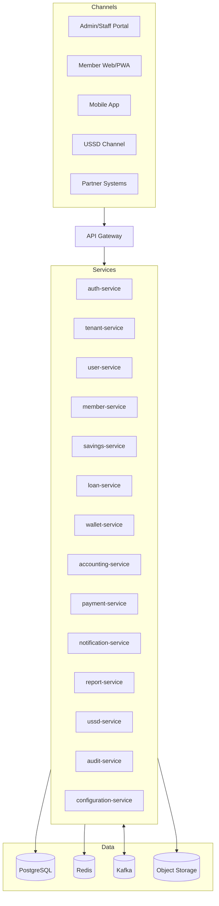

# SACCO Platform Project Overview

## 1. Purpose

This document provides the executive and technical overview for the SACCO platform. It summarizes the product vision, architecture direction, technology stack, delivery principles, documentation map, and recommended implementation roadmap.

The platform is a modern, multi-tenant, API-first SACCO system designed to support web, PWA, mobile app, USSD, and third-party integration channels for more than 1 million members.

This document does not generate implementation code.

## 2. Product Vision

The SACCO platform will provide a configurable, secure, and scalable digital financial platform for savings and credit cooperative organizations. It will allow SACCO tenants to manage members, savings, loans, wallets, payments, accounting, reports, notifications, users, roles, workflows, and operational settings through modern digital channels.

The platform must support both administrative/staff operations and member self-service experiences while preserving financial integrity, auditability, tenant isolation, and operational resilience.

## 3. Primary Objectives

- Build a modern replacement platform using decoupled microservices.
- Support multiple SACCO tenants from the beginning.
- Support over 1 million members.
- Provide reusable APIs for web, mobile app, PWA, USSD, and partners.
- Enable configurable branding, menus, products, workflows, fees, limits, and notifications.
- Support secure financial transactions with idempotency, audit, reconciliation, and ledger integrity.
- Use PostgreSQL as the primary transactional data platform.
- Use Kafka where asynchronous event-driven processing is valuable.
- Package services using Docker and keep deployment Kubernetes-ready.
- Maintain strong documentation to guide implementation and collaboration.

## 4. Supported Channels

| Channel | Purpose |
| --- | --- |
| Admin Portal | Tenant/platform administration, setup, operations, reporting, approvals |
| Staff Portal | SACCO staff workflows such as onboarding, KYC, approvals, savings, loans, reconciliation |
| Member Web Portal | Member self-service through browser |
| PWA | Installable member web experience with safe offline-aware behavior |
| Mobile App | Member-facing mobile experience using the same API layer |
| USSD | Low-bandwidth member channel through telco/aggregator integration |
| Partner APIs | Approved integrations with payment, reporting, regulatory, or ecosystem partners |

## 5. Target Technology Stack

| Layer | Technology |
| --- | --- |
| Frontend | Next.js, TypeScript, Tailwind CSS, shadcn/ui |
| Frontend state | TanStack Query, Zustand |
| Frontend forms | React Hook Form, Zod |
| Backend | Spring Boot microservices |
| API edge | API Gateway |
| Identity and access management | Keycloak preferred, or equivalent OIDC/OAuth2 IAM provider |
| Authentication tokens | JWT access tokens, refresh tokens, MFA-ready flows |
| Database | PostgreSQL |
| Messaging | Kafka where durable asynchronous workflows are required |
| Cache/session | Redis |
| Packaging | Docker |
| Local orchestration | Docker Compose |
| Production orchestration | Kubernetes-ready architecture |
| Storage | Object storage for documents, exports, and branding assets |

## 6. Architecture Summary

The platform follows a decoupled microservice architecture. Each service owns its domain logic, APIs, events, and persistence boundary. Services communicate through versioned APIs for bounded synchronous workflows and through events for asynchronous propagation, reporting, audit, notifications, payment outcomes, and long-running workflows.

## 7. Core Architectural Principles

- Never create a monolith.
- Services must be decoupled and independently deployable.
- Services must not share writable database tables.
- APIs must be reusable across channels.
- Tenant isolation must be enforced at gateway, service, database, cache, event, storage, reporting, and observability layers.
- Business rules should be configurable where appropriate.
- Financial transactions must be idempotent, auditable, and traceable.
- Ledger entries must be append-only.
- Cross-service distributed transactions are forbidden.
- Sagas, outbox/inbox, retries, and reconciliation must be used for cross-service financial workflows.
- Frontend applications must not contain authoritative financial business rules.
- Documentation must be updated with architecture, API, database, deployment, or workflow changes.

## 8. Core Service Overview

| Service | Purpose |
| --- | --- |
| gateway-service | External API routing, tenant resolution, edge policies, rate limiting |
| auth-service | Platform authentication facade, Keycloak/IAM integration, token lifecycle, sessions, MFA |
| tenant-service | Tenant identity, lifecycle, status, routing metadata |
| user-service | Users, roles, permissions, staff access scopes |
| member-service | Member profiles, KYC, lifecycle, document metadata |
| savings-service | Savings products, accounts, contributions, withdrawals, holds |
| loan-service | Loan products, applications, approvals, disbursements, repayments |
| wallet-service | Wallet accounts, balances, holds, transfers |
| accounting-service | Chart of accounts, journals, ledger entries, reconciliation |
| payment-service | Payment initiation, callbacks, provider references, settlements |
| notification-service | SMS, email, push, in-app notifications, templates |
| report-service | Read models, dashboards, reports, exports |
| ussd-service | USSD sessions, menus, channel orchestration |
| audit-service | Immutable audit records and audit search/export |
| configuration-service | Tenant rules, workflows, fees, limits, branding, feature flags |

## 9. Channel Ownership and Collaboration

The frontend work may be split into multiple workstreams:

| Workstream | Scope |
| --- | --- |
| Member/customer workstream | Member web portal, PWA behavior, mobile app journeys, USSD member flows |
| Admin/staff workstream | Admin portal, staff portal, configuration, approvals, reports, accounting, audit |
| Shared platform workstream | API contracts, auth/session, tenant branding, shared UI, shared types, permission model |

All channels consume the same backend API platform. The PWA, mobile app, and USSD channel do not share UI code directly, but they reuse backend business logic through shared APIs.

## 10. Documentation Map

| Document | Purpose |
| --- | --- |
| `01-project-overview.md` | Executive and architecture overview |
| `03-technical-specification.md` | Enterprise technical specification |
| `04-architecture-blueprint.md` | End-to-end architecture blueprint and diagrams |
| `05-frontend-ui-specification.md` | Frontend architecture, UI, state, and UX rules |
| `06-backend-microservices.md` | Backend service planning and implementation guidance |
| `07-database-design.md` | PostgreSQL, tenancy, ledger, idempotency, schema, and recovery strategy |
| `08-api-specification.md` | API standards, endpoint families, security, idempotency, webhooks |
| `09-deployment-architecture.md` | Docker, Kubernetes, CI/CD, environments, observability, backup, rollback |
| `10-module-mapping.md` | Functional module to service/API/data/event/UI ownership map |
| `11-domain-driven-service-boundaries.md` | Source-of-truth, service ownership, sagas, events, failure handling |
| `12-codex-development-governance.md` | AI-assisted development governance and implementation rules |
| `13-security-architecture.md` | Security controls, threat model, identity, tenancy, financial security |
| `14-integration-architecture.md` | Provider, webhook, USSD, partner, notification, and reconciliation integrations |
| `15-testing-strategy.md` | Testing layers, financial integrity, tenant isolation, contract, E2E, load testing |
| `16-development-workflow-and-collaboration.md` | Git, repository, branch, PR, ownership, and team collaboration workflow |
| `17-mvp-implementation-roadmap.md` | Phased MVP implementation plan and workstream sequencing |
| `18-operations-runbook.md` | Incident, deployment, payment, database, Kafka, USSD, backup, and reconciliation runbooks |

## 11. Current Non-Goals

The current architecture phase does not include:

- Full implementation code.
- Final UI mockups.
- Provider-specific payment implementation.
- Production cloud provider selection.
- Detailed cost model.
- Final RTO/RPO approval.
- Final regulatory/legal compliance sign-off.

## 12. Recommended Implementation Roadmap

### Phase 1: Foundation

- Agree on repository collaboration workflow.
- Finalize API contracts.
- Scaffold gateway, tenant, auth, user, member, and configuration services.
- Scaffold frontend app structure and shared packages.
- Implement tenant-aware auth/session foundation.
- Establish local Docker Compose baseline.

### Phase 2: Member and Staff Core

- Member onboarding and KYC.
- Admin/staff member management.
- Tenant branding and role-aware navigation.
- Savings account foundation.
- Wallet account foundation.
- Notification foundation.

### Phase 3: Financial Workflows

- Savings contributions and withdrawals.
- Payment provider integration foundation.
- Accounting ledger foundation.
- Loan application and approval.
- Loan disbursement and repayment.
- Reconciliation workflows.

### Phase 4: Channels and Operations

- Member PWA hardening.
- Mobile app API aggregation.
- USSD channel adapter and menus.
- Reporting projections and exports.
- Audit search and export.
- Production observability, backup, DR, and runbooks.

## 13. Success Criteria

The platform is successful when:

- Multiple tenants can operate safely on the platform.
- Member, staff, admin, mobile, PWA, and USSD channels consume a shared API layer.
- Financial workflows are traceable, idempotent, auditable, and reconcilable.
- Services remain decoupled and independently deployable.
- Reports and dashboards do not degrade transactional services.
- Deployment and recovery processes are repeatable.
- The team can safely collaborate through shared contracts, Git workflows, and documentation.

## 14. Summary

The SACCO platform is a modern multi-tenant financial system built around microservices, API-first integration, PostgreSQL-backed service persistence, event-driven workflows where appropriate, and enterprise-grade operational practices.

This overview should be used as the entry point for stakeholders, architects, developers, and reviewers before diving into the detailed architecture documents.
