# SACCO Platform Enterprise Architecture Blueprint

## 1. Purpose

This document defines the enterprise architecture blueprint for the modern SACCO platform. It aligns with the technical specification and domain-driven service boundaries and is intended to guide future backend implementation, frontend integration, infrastructure planning, DevOps design, investor review, and production readiness.

The platform is designed as a multi-tenant, API-first financial system supporting:

- Web platform
- Mobile app
- Progressive Web App
- USSD
- Partner and provider integrations
- Over 1 million members
- Configurable tenant branding and workflows
- Spring Boot microservices
- PostgreSQL
- Kafka where asynchronous communication is required
- Redis caching
- Docker and Kubernetes-ready deployment

This blueprint does not generate implementation code.

## 2. Architecture Goals

- Keep services decoupled and independently deployable.
- Preserve clear source-of-truth ownership per domain.
- Enforce tenant isolation at gateway, service, data, cache, event, storage, and observability layers.
- Support financial transaction integrity through idempotency, append-only ledger patterns, sagas, retries, and reconciliation.
- Support high-volume member, USSD, payment, notification, and reporting workloads.
- Provide a shared API platform for web, PWA, mobile app, USSD, and partners.
- Ensure all critical workflows are auditable, traceable, observable, and recoverable.
- Enable containerized local development and Kubernetes production deployment.

## 3. High-Level System Architecture

The system is organized into client channels, edge controls, domain microservices, data stores, event backbone, integrations, and platform operations.

```mermaid
flowchart TB
    subgraph Channels
        Web[Next.js Web Portal]
        PWA[Progressive Web App]
        Mobile[Mobile App]
        USSDClient[USSD Handset]
        Partners[Partner Systems]
    end

    subgraph Edge
        CDN[CDN / WAF]
        Gateway[API Gateway]
    end

    subgraph CoreServices[Spring Boot Microservices]
        Auth[auth-service]
        Tenant[tenant-service]
        User[user-service]
        Member[member-service]
        Config[configuration-service]
        Savings[savings-service]
        Loan[loan-service]
        Wallet[wallet-service]
        Accounting[accounting-service]
        Payment[payment-service]
        Notification[notification-service]
        Report[report-service]
        USSD[ussd-service]
        Audit[audit-service]
    end

    subgraph DataLayer
        PG[(PostgreSQL Service Stores)]
        Redis[(Redis Cache / Session Store)]
        ObjectStore[(Object Storage)]
        Kafka[(Kafka Event Backbone)]
    end

    subgraph External
        MobileMoney[Mobile Money Providers]
        SMS[SMS Gateway]
        Email[Email Provider]
        Push[Push Provider]
        Telco[USSD Telco Gateway]
        Credit[Credit / KYC Providers]
    end

    subgraph Ops
        Logs[Central Logs]
        Metrics[Metrics]
        Traces[Distributed Tracing]
        Alerts[Alerting]
    end

    Web --> CDN --> Gateway
    PWA --> CDN
    Mobile --> Gateway
    Partners --> Gateway
    USSDClient --> Telco --> USSD
    USSD --> Gateway

    Gateway --> Auth
    Gateway --> Tenant
    Gateway --> User
    Gateway --> Member
    Gateway --> Savings
    Gateway --> Loan
    Gateway --> Wallet
    Gateway --> Payment
    Gateway --> Report

    CoreServices --> PG
    CoreServices --> Redis
    CoreServices --> ObjectStore
    CoreServices <--> Kafka

    Payment --> MobileMoney
    Notification --> SMS
    Notification --> Email
    Notification --> Push
    Member --> Credit

    CoreServices --> Logs
    CoreServices --> Metrics
    CoreServices --> Traces
    Alerts --> Metrics
```

## 4. Architecture Layers

| Layer | Responsibility |
| --- | --- |
| Channel layer | Web, PWA, mobile app, USSD, and partner entry points |
| Edge layer | TLS, WAF, tenant resolution, rate limiting, routing, token validation, correlation IDs |
| Identity layer | Authentication, sessions, MFA, user roles, permissions |
| Domain layer | Member, savings, loans, wallet, accounting, payments, configuration, notifications |
| Event layer | Kafka events, outbox publishing, asynchronous workflows, sagas, projections |
| Data layer | PostgreSQL service-owned data, Redis cache, object storage, reporting projections |
| Observability layer | Logs, metrics, traces, dashboards, alerts, audit evidence |
| Deployment layer | Docker images, Kubernetes workloads, namespaces, secrets, autoscaling |

## 5. Frontend Architecture

The frontend shall be built with Next.js, TypeScript, Tailwind CSS, shadcn/ui, Zustand, TanStack Query, React Hook Form, and Zod. The same API platform shall serve web, PWA, and mobile clients.

### 5.1 Frontend Responsibilities

- Render tenant-aware administrative, staff, and member experiences.
- Support responsive desktop, tablet, and mobile layouts.
- Support PWA installability and safe offline-aware behavior.
- Retrieve tenant branding, menus, feature flags, and workflow configuration from backend APIs.
- Apply route and component-level permission visibility.
- Use client validation for usability while treating backend services as the source of truth.
- Avoid embedding financial business rules in the UI.

### 5.2 Frontend Runtime View

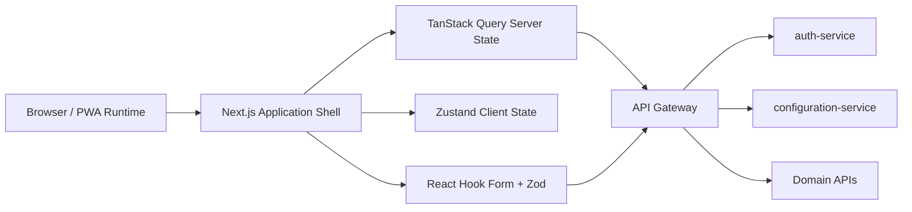

### 5.3 PWA Considerations

- Cache static assets and selected safe read-only data.
- Do not finalize financial transactions offline.
- Allow draft capture only where clearly marked as unsynchronized.
- Show pending, failed, and retry states clearly.
- Use push notifications where supported.
- Preserve tenant branding and accessibility settings across sessions.

## 6. Backend Microservice Topology

Services are separated by business capability and source-of-truth ownership.

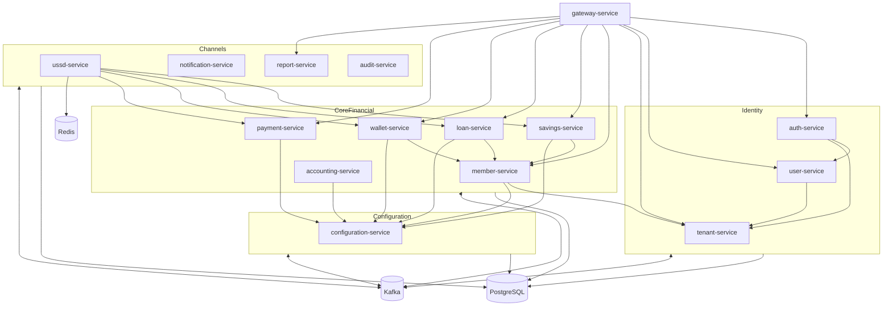

### 6.1 Service Groups

| Group | Services | Purpose |
| --- | --- | --- |
| Edge | gateway-service | Controlled external entry point |
| Identity and tenancy | auth-service, user-service, tenant-service | Authentication, authorization, tenant lifecycle |
| Configuration | configuration-service | Tenant rules, workflow definitions, feature flags, branding |
| Core financial | member-service, savings-service, loan-service, wallet-service, accounting-service, payment-service | Member and financial transaction processing |
| Channel and support | ussd-service, notification-service, report-service, audit-service | Channel orchestration, communications, reports, audit |

## 7. API Gateway Flow

The API gateway is the entry point for web, PWA, mobile app, partner APIs, and selected USSD service requests. It must not contain domain business logic.

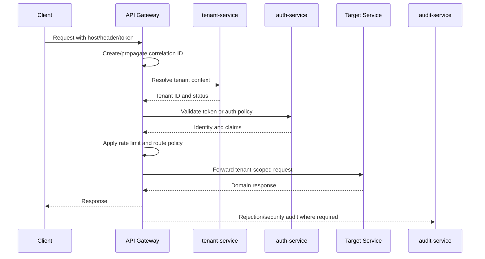

### 7.1 Gateway Responsibilities

- TLS termination
- API version routing
- Tenant resolution
- Token validation
- Rate limiting
- Request size enforcement
- Correlation ID propagation
- Partner IP allowlisting where required
- Routing to backend services
- Edge metrics and security logging

## 8. Authentication and Authorization Flow

Authentication is owned by auth-service. Roles and permissions are owned by user-service. Tenant lifecycle and status are owned by tenant-service.

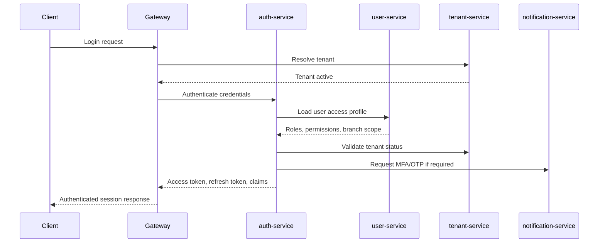

### 8.1 Authorization Model

Authorization combines:

- Tenant isolation
- Role-based access control
- Permission-based access control
- Branch or organizational scope
- Transaction limits
- Approval workflow rules
- Step-up authentication for sensitive actions

Every domain service must enforce authorization for the actions it accepts. Gateway checks are necessary but not sufficient.

## 9. Multi-Tenant Isolation Model

Tenant isolation must be enforced across all layers.

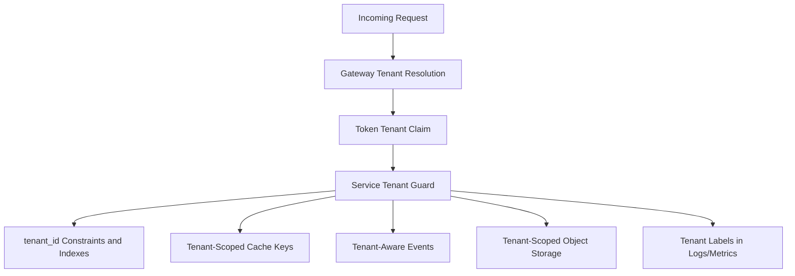

### 9.1 Isolation Controls

| Layer | Control |
| --- | --- |
| DNS and routing | Tenant domain, subdomain, short code, or selected tenant context |
| Gateway | Trusted tenant resolution, token tenant validation, rate limits |
| Service | Tenant guard on commands, queries, events, and authorization |
| Database | Explicit tenant keys, indexes, constraints, optional schema/database isolation tier |
| Cache | Tenant-prefixed keys and TTL policies |
| Events | Tenant ID in every event, partitioning by tenant and aggregate where needed |
| Storage | Tenant-scoped object keys and signed access URLs |
| Observability | Tenant labels for diagnostics without exposing sensitive data |

### 9.2 Data Isolation Evolution

The default model is service-owned PostgreSQL schemas or databases with tenant partitioning. The architecture must allow higher isolation tiers:

- Shared database with tenant keys for standard tenants.
- Schema per tenant for higher isolation or larger tenants.
- Database per tenant for regulated or enterprise tenants.

## 10. Database Architecture

PostgreSQL is the primary system of record. Each service owns its persistence boundary and must not access another service's tables directly.

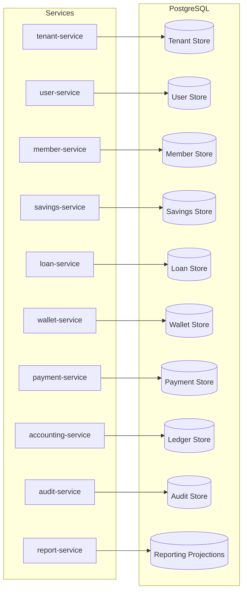

### 10.1 Database Design Rules

- Use strong keys and service-local referential integrity.
- Include tenant ID in tenant-owned records.
- Use composite indexes matching real query patterns.
- Use append-only ledger entries for accounting.
- Use idempotency tables or equivalent uniqueness controls for transaction-critical commands.
- Use outbox records to atomically persist domain state and publishable events.
- Partition high-volume tables such as ledger entries, wallet transactions, payment callbacks, audit records, notification logs, and USSD sessions where required.
- Use read replicas or projections for read-heavy reporting workloads.

## 11. Event-Driven Communication Flow

Kafka is used for durable asynchronous communication, event propagation, reporting projections, notification dispatch, audit capture, and saga progress.

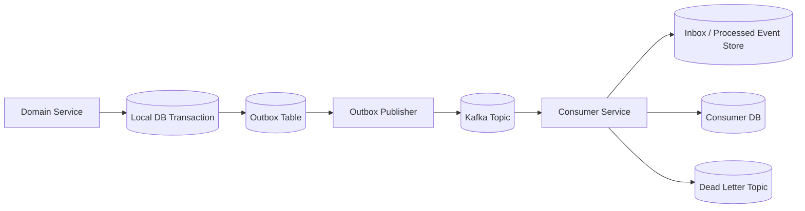

### 11.1 Event Standards

Every event must include:

- Event ID
- Event type
- Event version
- Tenant ID
- Correlation ID
- Causation ID
- Source service
- Aggregate type and ID
- Actor context where applicable
- Timestamp
- Payload

### 11.2 Synchronous vs Asynchronous Strategy

| Use Synchronous APIs For | Use Events For |
| --- | --- |
| Immediate validation | Completed business facts |
| User-facing reads | Reporting projections |
| Short command acknowledgement | Notifications |
| Tenant and auth resolution | Audit propagation |
| Simple bounded workflows | Long-running sagas |
| Real-time status lookup | Payment callbacks and reconciliation |

## 12. Payment Processing Flow

Payment-service owns external provider interaction, callback capture, provider references, and settlement status. Domain services own the business application of payment outcomes.

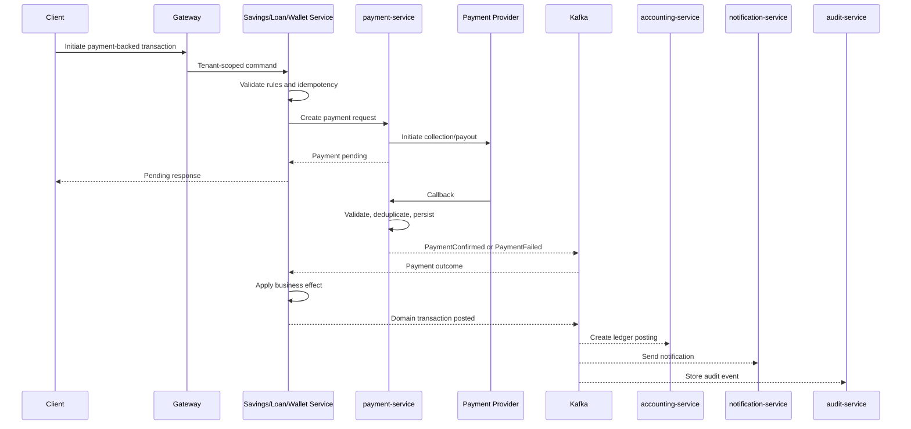

### 12.1 Payment Integrity Rules

- Provider callbacks must be acknowledged only after durable capture.
- Duplicate callbacks must be idempotently handled.
- Provider status is not final until validated by payment-service.
- Domain services must not process raw provider payloads.
- Confirmed but unapplied payments must enter a repair queue.
- Settlement discrepancies must be visible and auditable.

## 13. Loan Processing Flow

Loan-service owns loan products, applications, approvals, loan accounts, disbursement state, repayment application, arrears, and closure.

### 13.1 Loan Application and Approval

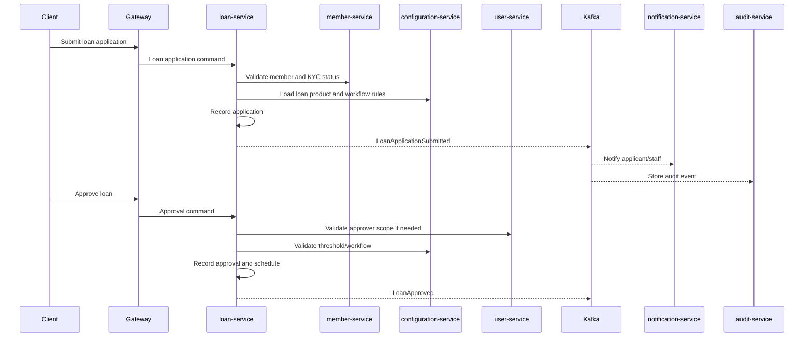

### 13.2 Loan Disbursement

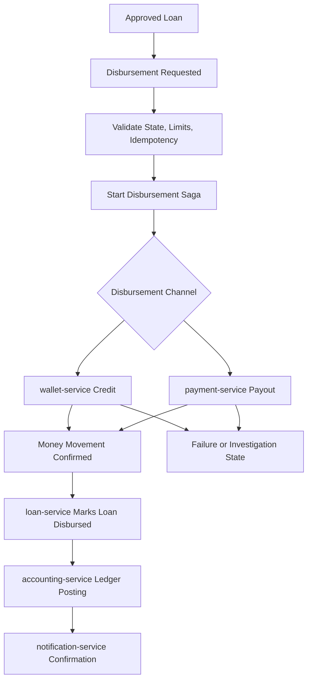

### 13.3 Loan Failure Handling

- Failed disbursement before money movement leaves the platform marks the disbursement failed and retryable.
- Successful money movement with failed accounting creates an accounting-pending state and retry workflow.
- Reversed provider payout must start an explicit reversal workflow.
- Approved loans are not deleted; they are cancelled, reversed, or adjusted through controlled workflows.

## 14. Savings Transaction Flow

Savings-service owns savings products, savings accounts, contributions, withdrawals, holds, and account statements.

### 14.1 Savings Contribution

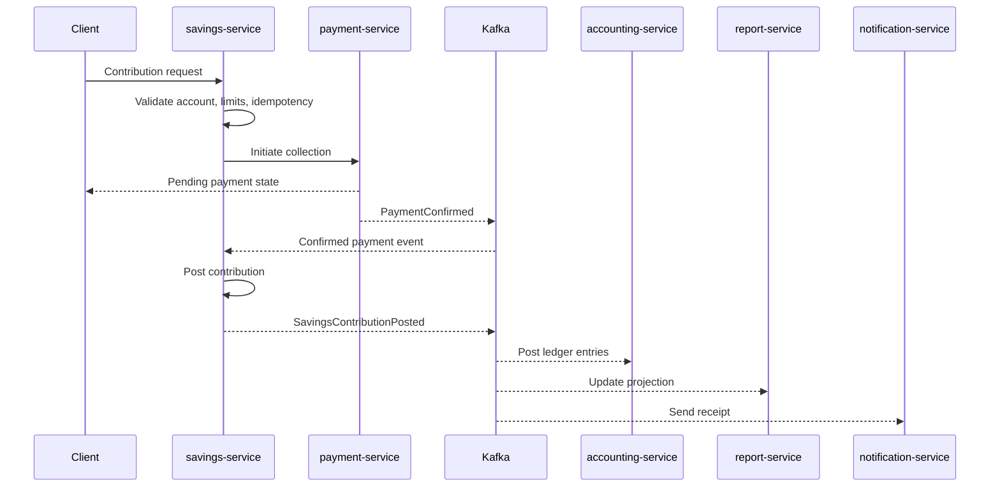

### 14.2 Withdrawal

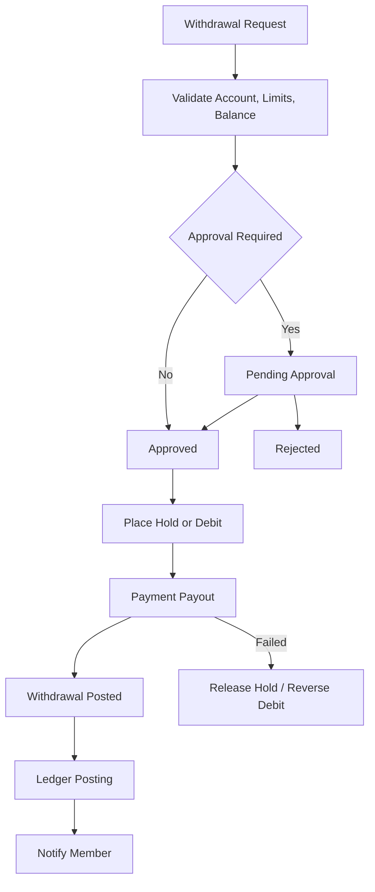

### 14.3 Savings Integrity Rules

- Savings account state is authoritative only in savings-service.
- Payment confirmations must be idempotently applied.
- Withdrawals must distinguish requested, approved, posted, rejected, failed, and reversed states.
- Accounting failure must not delete savings records; it creates retryable accounting-pending state.

## 15. Wallet Transaction Flow

Wallet-service owns wallet accounts, balances, holds, debits, credits, and wallet transfers.

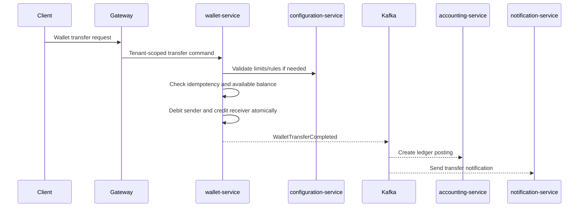

### 15.1 Wallet Controls

- Prevent double-spend through strong transaction controls and concurrency protection.
- Use holds for reserved funds.
- Never delete completed wallet transactions.
- Use explicit reversal transactions for corrections.
- Preserve transaction references for reconciliation.

## 16. USSD Integration Flow

USSD-service owns USSD sessions, menu flows, telco gateway integration, session authentication, and USSD-specific orchestration. It does not own core financial state.

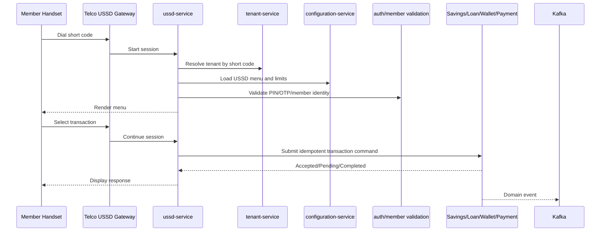

### 16.1 USSD Resiliency

- USSD sessions must be short-lived and stored in Redis or equivalent fast session storage.
- USSD retries must include idempotency keys derived from session and transaction reference.
- Session timeout must not roll back a transaction already accepted by a domain service.
- Members should be able to query transaction status after session interruption.
- High USSD traffic must scale horizontally.

## 17. Mobile App Integration Flow

The mobile app consumes the same API platform through the gateway. It must be treated as an untrusted client.

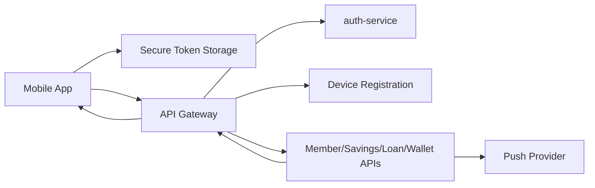

### 17.1 Mobile Requirements

- Use versioned APIs to support app release compatibility.
- Support refresh token rotation and revocation.
- Register device and push tokens.
- Apply step-up authentication for sensitive or high-value actions.
- Avoid storing secrets or raw sensitive financial data unnecessarily.
- Support degraded network states with clear pending status.

## 18. Reporting Architecture

Report-service owns reporting projections, dashboards, export jobs, and generated report metadata. It is not the source of truth for transactional records.

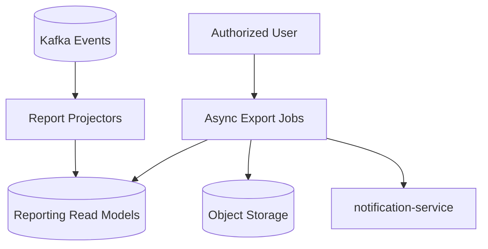

### 18.1 Reporting Rules

- Heavy reports must use projections, replicas, or asynchronous exports.
- Financial reports must disclose projection freshness and cutoff logic.
- Reports must be tenant-scoped.
- Report access must be authorized and audited.
- Rebuilds must be possible from retained events or controlled source exports.

## 19. Audit and Logging Flow

Audit-service owns immutable audit records. Producing services own the action facts and must emit audit events.

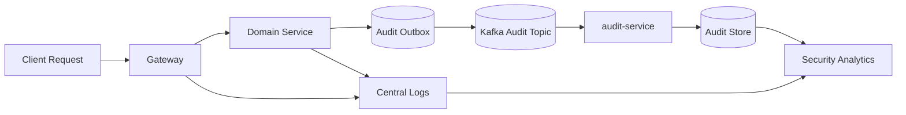

### 19.1 Logging Standards

Structured logs must include:

- Timestamp
- Service name
- Environment
- Tenant ID where applicable
- Correlation ID
- Request ID
- Operation
- Status
- Error details where safe

Logs must not include passwords, tokens, OTPs, PINs, full identity numbers, payment secrets, or unmasked sensitive data.

## 20. Deployment Topology

Production deployment shall be Kubernetes-ready and separated into logical namespaces.

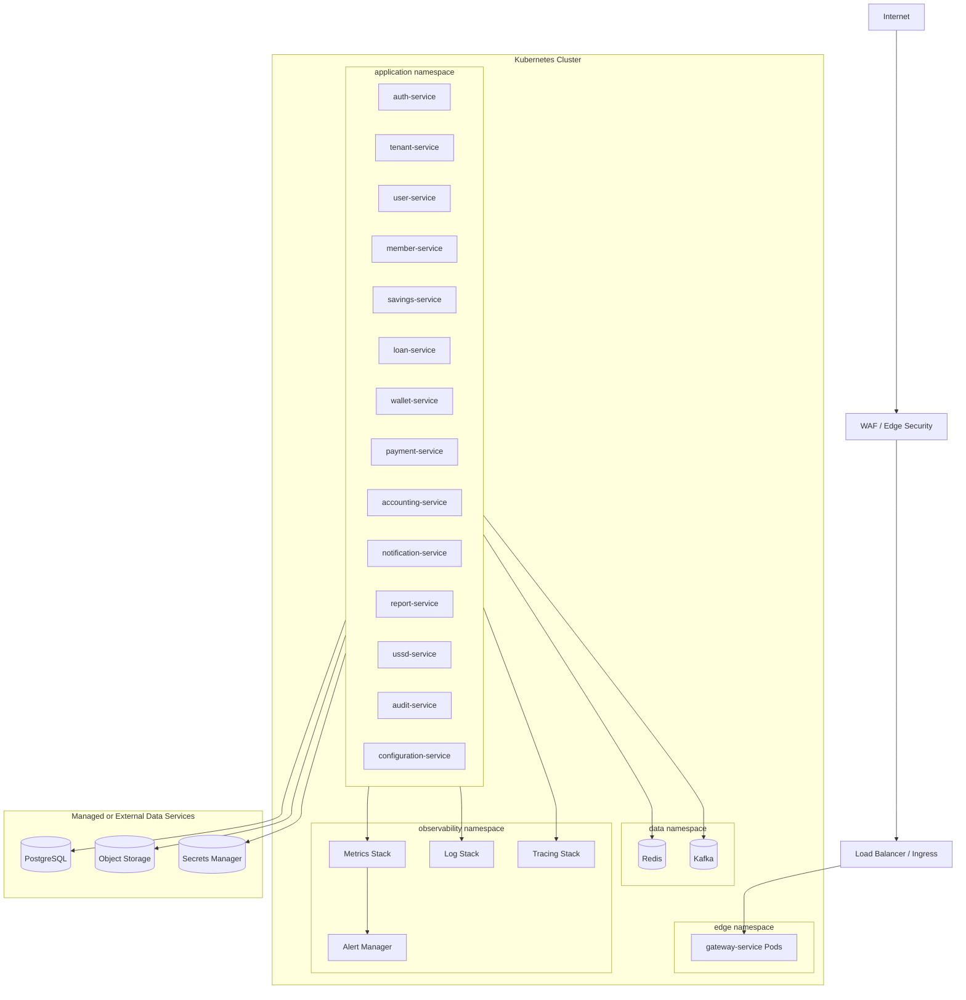

### 20.1 Environment Strategy

| Environment | Purpose |
| --- | --- |
| Local | Developer workflow with Docker Compose |
| Development | Shared integration environment |
| QA/Test | Automated and manual quality validation |
| Staging | Production-like release validation |
| Production | Live tenant and member traffic |
| Disaster Recovery | Recovery environment for continuity planning |

## 21. Docker and Kubernetes Deployment View

### 21.1 Docker View

Every service shall be packaged as an immutable container image. Images must be versioned, scanned, and promoted through environments.

Docker Compose may be used for local development with:

- Gateway
- Selected microservices
- PostgreSQL
- Redis
- Kafka
- Local observability dependencies where useful

### 21.2 Kubernetes View

Each service shall define:

- Deployment
- Service
- ConfigMap
- Secret references
- Resource requests and limits
- Readiness probe
- Liveness probe
- Horizontal pod autoscaler where appropriate
- Pod disruption budget for critical services
- Network policy

### 21.3 Scaling Priorities

| Service | Scaling Characteristic |
| --- | --- |
| gateway-service | Horizontal, traffic-driven |
| auth-service | Horizontal, login burst-driven |
| ussd-service | Horizontal, session spike-driven |
| payment-service | Horizontal, callback spike-driven |
| notification-service | Horizontal, queue-driven |
| report-service | Worker scaling for exports and projections |
| savings/loan/wallet services | Horizontal plus database concurrency controls |
| accounting-service | Write throughput and ledger partitioning |

## 22. Caching Strategy

Redis shall be used for carefully scoped caching and session workloads. Caching must never violate financial correctness.

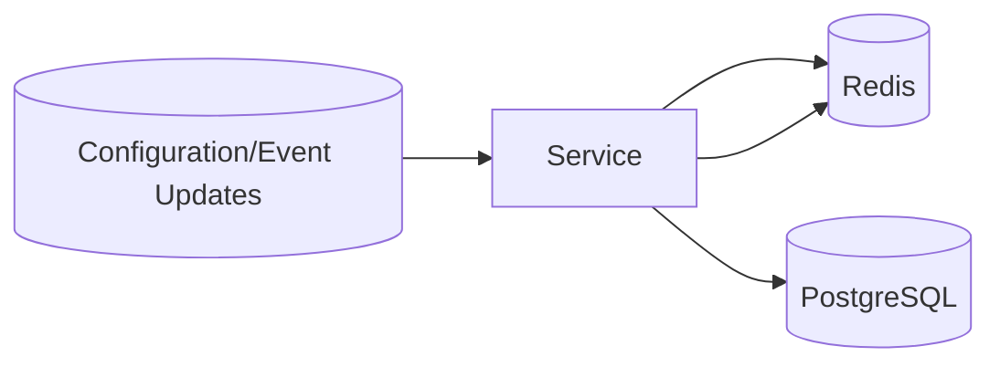

### 22.1 Cache Candidates

| Data | Cache Use | Notes |
| --- | --- | --- |
| Tenant routing metadata | High read, low write | Invalidate on TenantDomainConfigured |
| Tenant configuration | High read, controlled writes | Invalidate on TenantConfigurationChanged |
| Feature flags | High read | Short TTL plus event invalidation |
| USSD sessions | Primary session store | Short TTL |
| Rate limit counters | Operational cache | Tenant and client scoped |
| Authorization metadata | Short-lived cache | Invalidate on role/permission changes |
| Public reference data | Read optimization | Safe TTL |

### 22.2 Cache Restrictions

- Do not treat cached balances as authoritative.
- Do not cache sensitive data without explicit security review.
- Use tenant-scoped cache keys.
- Use TTLs and event-driven invalidation.
- Prefer stale-safe behavior over silent incorrect responses.

## 23. Observability Architecture

Observability must support engineering diagnostics, operational monitoring, security review, tenant-level analysis, and financial workflow tracing.

```mermaid
flowchart TB
    Services[All Services]
    Metrics[Metrics Collector]
    Logs[Log Collector]
    Traces[Trace Collector]
    Dashboards[Dashboards]
    Alerts[Alerts]
    OnCall[Operations Team]

    Services --> Metrics
    Services --> Logs
    Services --> Traces
    Metrics --> Dashboards
    Logs --> Dashboards
    Traces --> Dashboards
    Metrics --> Alerts
    Logs --> Alerts
    Alerts --> OnCall
```

### 23.1 Required Observability Dimensions

- Service name
- Environment
- Tenant ID where applicable
- Correlation ID
- Request ID
- Actor type where safe
- Channel
- Operation
- Transaction reference
- Provider reference
- Event ID
- Saga ID

### 23.2 Dashboards

Dashboards shall include:

- Platform health
- Service health
- API traffic
- Tenant traffic
- Payment status
- Loan workflow health
- Savings transaction health
- Wallet transaction health
- USSD traffic and failures
- Notification delivery
- Kafka lag and dead letters
- Database health
- Audit pipeline health

## 24. Failure Handling and Retry Flows

Failures must be explicit, observable, and recoverable. Silent failure is not acceptable for financial, audit, payment, or USSD transaction flows.

```mermaid
flowchart TB
    Event[Incoming Command/Event]
    Validate[Validate Tenant, Auth, Schema, Idempotency]
    Process[Process Operation]
    Success[Persist Success and Emit Event]
    Retryable{Retryable Failure}
    Retry[Retry with Backoff]
    DLQ[Dead Letter / Repair Queue]
    NonRetry[Reject with Business Error]
    Alert[Alert Operations]
    Repair[Authorized Repair Workflow]

    Event --> Validate
    Validate -->|Invalid| NonRetry
    Validate -->|Valid| Process
    Process -->|Success| Success
    Process -->|Failure| Retryable
    Retryable -->|Yes| Retry --> Process
    Retryable -->|Exceeded| DLQ --> Alert --> Repair
    Retryable -->|No| NonRetry
```

### 24.1 Retry Rules

Retryable:

- Temporary network failure
- Provider timeout without final status
- Kafka publish failure from outbox
- Temporary database connection failure
- Temporary downstream service unavailability

Non-retryable:

- Validation failure
- Authorization failure
- Tenant mismatch
- Insufficient funds
- Duplicate idempotency key with different payload
- Business rule rejection

### 24.2 Idempotency Rules

Idempotency keys must be scoped by:

- Tenant ID
- Service
- Operation type
- Actor or client identity where applicable
- Business reference

Duplicate requests with the same key and same payload return the original outcome. Duplicate requests with the same key and different payload are rejected and audited.

## 25. Recommended Service Interaction Patterns

| Pattern | Use Case | Guidance |
| --- | --- | --- |
| Direct synchronous API | Immediate validation or simple query | Keep shallow and time-bound |
| Domain event | Completed fact propagation | Consumers must be idempotent |
| Outbox pattern | Reliable event publication | Required for transaction-critical services |
| Saga orchestration | High-risk multi-service workflow | Use explicit state and compensation |
| Choreography | Notifications, reporting, audit | Keep consumer side effects independent |
| Read model projection | Reporting and dashboards | Must not become source of truth |
| Provider adapter | External integrations | Normalize provider concepts |

## 26. Request Lifecycle View

```mermaid
flowchart LR
    Client[Client]
    Gateway[Gateway]
    Auth[Auth and Tenant Checks]
    Service[Domain Service]
    DB[(Service DB)]
    Outbox[(Outbox)]
    Kafka[(Kafka)]
    Downstream[Downstream Consumers]
    Response[Client Response]

    Client --> Gateway --> Auth --> Service
    Service --> DB
    Service --> Outbox
    Service --> Response
    Outbox --> Kafka --> Downstream
```

### 26.1 Lifecycle Steps

1. Client sends request through the appropriate channel.
2. Gateway resolves tenant, validates token, applies rate limits, and propagates correlation ID.
3. Target service validates tenant, authorization, schema, business rules, and idempotency.
4. Target service persists domain state and outbox events atomically.
5. Target service returns immediate response.
6. Outbox publisher emits events.
7. Downstream services update projections, send notifications, post accounting entries, or store audit records.

## 27. Resiliency and Failover Considerations

### 27.1 Service Resiliency

- Use horizontal scaling for stateless services.
- Use readiness and liveness probes.
- Use circuit breakers for external provider calls.
- Use timeouts on all network calls.
- Use backpressure for event consumers.
- Use dead letter queues for poison messages.
- Use repair workflows for failed financial side effects.

### 27.2 Data Resiliency

- Use PostgreSQL backups and point-in-time recovery where available.
- Test restore procedures regularly.
- Use read replicas for read-heavy workloads where appropriate.
- Use Kafka retention and replay planning.
- Replicate object storage or use provider durability guarantees.

### 27.3 Business Continuity

- Reports may degrade without blocking transactions.
- Notifications may queue while providers are unavailable.
- Payment callbacks must be durably captured before downstream processing.
- USSD may display controlled maintenance or pending-status messages.
- Financial posting failures must enter visible repair queues.

## 28. Production Readiness Checklist

- Tenant isolation validated across APIs, events, databases, cache, logs, and reports.
- API gateway route, rate limit, and tenant policies defined.
- Auth, MFA, role, permission, and branch-scope flows defined.
- Service source-of-truth boundaries documented.
- Domain events and versions documented.
- Outbox and dead letter strategy defined.
- Financial idempotency keys and uniqueness rules defined.
- Saga states and compensation flows defined for high-risk workflows.
- Payment callback deduplication and reconciliation defined.
- Ledger posting and reversal strategy defined.
- USSD session scaling and timeout behavior defined.
- Mobile app token, device, and API versioning strategy defined.
- Reporting projection freshness and rebuild plan defined.
- Audit propagation and retention strategy defined.
- Docker image build and scan process defined.
- Kubernetes namespaces, probes, autoscaling, and network policies planned.
- Observability dashboards and alerts planned.
- Backup, restore, and disaster recovery plans tested before production.

## 29. Summary

This blueprint defines a production-ready enterprise architecture for the SACCO platform. It uses a decoupled microservice topology, tenant-aware API gateway, strong identity and authorization controls, PostgreSQL-backed service ownership, Kafka-based asynchronous communication, Redis caching, auditable financial workflows, and Kubernetes-ready deployment.

The architecture supports web, mobile app, PWA, and USSD channels at scale while preserving financial integrity through idempotency, sagas, durable events, append-only ledger patterns, reconciliation, and explicit failure handling.
