# Database Architecture and Design

## 1. Purpose

This document defines the enterprise database architecture and design strategy for the modern SACCO platform. It aligns with the technical specification, architecture blueprint, and domain-driven service boundaries.

The platform uses PostgreSQL as the primary relational database technology and must support:

- Multi-tenancy from inception
- Over 1 million members
- High-volume financial transactions
- Strong financial integrity
- Service-owned persistence boundaries
- Auditability and traceability
- Reporting and read-model projections
- Event-driven integration through reliable outbox persistence
- Production backup, recovery, archival, and scaling practices

This document does not generate implementation code or DDL.

## 2. Database Design Goals

- Preserve clear source-of-truth ownership per service.
- Prevent cross-service database coupling.
- Support strong consistency inside a service boundary.
- Avoid distributed database transactions across services.
- Make every financial write idempotent, auditable, tenant-scoped, and traceable.
- Support append-only financial ledger principles.
- Scale high-volume transaction tables through indexing, partitioning, archival, and read models.
- Protect tenant data at schema, table, query, cache, reporting, and operational levels.
- Support repeatable migrations and safe production releases.
- Enable backup, recovery, reconciliation, and incident investigation.

## 3. PostgreSQL Architecture

PostgreSQL shall be the primary data store for transactional service data. Each microservice owns its persistence boundary and must not directly read or write another service's tables.

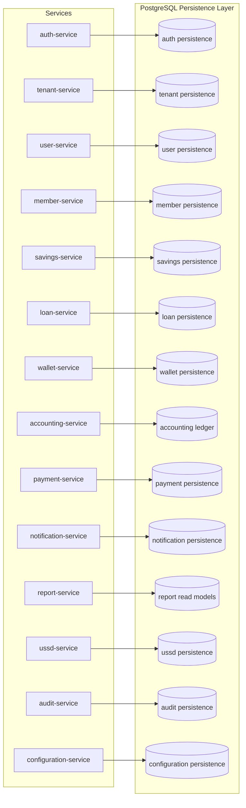

## 4. Persistence Boundary Model

### 4.1 Service-Owned Persistence

Each service shall own:

- Its transactional tables
- Its indexes
- Its migration history
- Its domain constraints
- Its idempotency records
- Its outbox records
- Its local read models where needed
- Its archival and retention rules

Services must not:

- Join against another service's tables
- Depend on another service's internal schema
- Share writable tables
- Use database triggers to mutate another service's state
- Treat reporting projections as authoritative data

### 4.2 Source-of-Truth Ownership

| Business Fact | Database Owner |
| --- | --- |
| Tenant identity, status, routing metadata | tenant-service |
| IAM credentials and identity-provider state | Keycloak or selected OIDC/OAuth2 IAM provider, integrated through auth-service |
| Platform session metadata, login attempts, auth audit coordination | auth-service |
| Users, roles, permissions, branch scopes | user-service |
| Member profile, KYC, lifecycle | member-service |
| Savings products, savings accounts, contributions, withdrawals | savings-service |
| Loan products, applications, approvals, loan accounts, schedules | loan-service |
| Wallet accounts, balances, holds, wallet transactions | wallet-service |
| Chart of accounts, journals, ledger entries | accounting-service |
| Payment requests, callbacks, provider references, settlements | payment-service |
| Notification templates, dispatch logs, delivery status | notification-service |
| USSD sessions and menu/session state | ussd-service |
| Immutable audit records | audit-service |
| Tenant business rules, workflow definitions, fees, limits | configuration-service |
| Reporting projections and export metadata | report-service |

## 5. Multi-Tenant Database Strategy

### 5.1 Recommended Starting Model

The recommended initial model is service-owned schemas or databases with shared tables partitioned or filtered by `tenant_id`. This provides operational simplicity while supporting more than 1 million members when paired with correct indexing, partitioning, and archival.

Every tenant-owned table must include `tenant_id`, except for purely platform-global reference tables that are explicitly approved.

### 5.2 Isolation Tiers

| Model | Recommended Use | Benefits | Tradeoffs |
| --- | --- | --- | --- |
| Shared database, service schemas, tenant keys | Default platform model | Operationally efficient, easier migrations | Requires strict tenant guardrails |
| Service database per bounded context | Stronger service isolation | Clear ownership and permissions | More operational overhead |
| Schema per tenant | Larger or higher-isolation tenants | Better tenant-level operational separation | Harder migrations and connection management |
| Database per tenant | Regulated or enterprise tenant tier | Strongest isolation and backup control | Highest cost and complexity |

### 5.3 Tenant Isolation Controls

Tenant isolation must be enforced by:

- Gateway tenant resolution
- Token tenant claims
- Service-level tenant validation
- Database `tenant_id` columns and indexes
- Tenant-scoped uniqueness constraints
- Tenant-scoped idempotency records
- Tenant-scoped outbox events
- Tenant-scoped reporting filters
- Tenant-scoped object storage metadata
- Tenant labels in audit and operational logs

### 5.4 Tenant-Aware Uniqueness

Most business identifiers must be unique within a tenant, not globally. Examples:

- Member number
- Savings account number
- Loan account number
- Wallet account number
- Payment business reference
- Product code
- Role name
- Branch code

Platform-level identifiers such as tenant domain or subdomain may require global uniqueness.

## 6. Schema Strategy

### 6.1 Service Schema Naming

Recommended logical schema names:

| Service | Schema Name |
| --- | --- |
| auth-service | `auth` |
| tenant-service | `tenant` |
| user-service | `iam` |
| member-service | `member` |
| savings-service | `savings` |
| loan-service | `loan` |
| wallet-service | `wallet` |
| accounting-service | `accounting` |
| payment-service | `payment` |
| notification-service | `notification` |
| report-service | `reporting` |
| ussd-service | `ussd` |
| audit-service | `audit` |
| configuration-service | `configuration` |

These names are recommendations. If the deployment model uses database-per-service, the same naming should be used for database names or migration namespaces.

### 6.2 Table Naming Conventions

- Use lowercase snake_case names.
- Use plural or singular consistently within the project; singular domain nouns are recommended for core aggregates.
- Use clear business names rather than technical abbreviations.
- Use suffixes intentionally:
  - `_event` for stored domain/audit events
  - `_outbox` for outbox records
  - `_inbox` for consumed event/idempotent event processing
  - `_history` for explicit historical snapshots
  - `_projection` for read models
  - `_archive` only where an archive table remains queryable in PostgreSQL

### 6.3 Cross-Service Reference Strategy

A service may store another service's identifier as a reference, but not enforce a database foreign key across service boundaries.

Examples:

- savings-service may store `member_id` as an external reference.
- loan-service may store `member_id`, `payment_request_id`, or `wallet_transaction_id` as references.
- accounting-service may store source transaction references from savings, loan, wallet, or payment services.

The owning service remains authoritative.

## 7. Identifier Strategy

### 7.1 UUID Strategy

Primary keys should use globally unique identifiers suitable for distributed systems. UUIDs are recommended for:

- Tenant IDs
- User IDs
- Member IDs
- Account IDs
- Transaction IDs
- Event IDs
- Saga IDs
- Audit IDs

The implementation may choose UUIDv7 or another time-sortable UUID strategy for better index locality. If random UUIDs are used, index bloat and write locality must be monitored.

### 7.2 Business Reference Strategy

Financial workflows also require human-usable business references:

- Member number
- Account number
- Loan number
- Payment reference
- Journal reference
- Receipt number
- Provider reference

Business references must be unique within the appropriate tenant and domain scope. They must not replace immutable primary keys.

## 8. Timestamp and Audit Field Conventions

### 8.1 Standard Fields

Most mutable business tables should include:

- `id`
- `tenant_id`
- `created_at`
- `created_by`
- `updated_at`
- `updated_by`
- `version` for optimistic locking where needed
- `status`

Financial append-only tables should include creation metadata but should avoid mutable `updated_at` semantics unless they have explicit lifecycle state.

### 8.2 Timezone Strategy

- Store timestamps in UTC.
- Render tenant-local time in the application layer.
- Store business dates separately where posting date, value date, due date, or accounting period date matters.
- Financial reports must distinguish transaction time, posting date, value date, settlement date, and report cutoff.

### 8.3 Actor and Channel Metadata

Transaction-critical records should capture:

- Actor ID
- Actor type
- Source channel: web, mobile, PWA, USSD, partner, system
- Correlation ID
- Causation ID
- Request ID
- Idempotency key where applicable

## 9. Soft Delete Strategy

Soft delete should be used carefully.

### 9.1 Allowed Uses

Soft delete is appropriate for:

- Draft configuration
- Deactivated templates
- Archived UI-visible setup records
- Non-financial reference records where historical visibility is needed

### 9.2 Restricted Uses

Soft delete must not be used to hide or remove:

- Ledger entries
- Posted savings transactions
- Loan repayments
- Wallet transactions
- Payment callbacks
- Audit events
- Reconciliation records

Financial corrections must use explicit reversal, adjustment, cancellation, or supersession records.

### 9.3 Deactivation Over Deletion

Most business records should use lifecycle states such as active, inactive, suspended, closed, cancelled, reversed, or expired instead of generic deletion.

## 10. Core Database Patterns

### 10.1 ACID Within Service Boundary

Each service must use local ACID transactions for:

- Validating idempotency
- Applying domain state changes
- Writing financial records
- Writing outbox records
- Writing local audit metadata where applicable

No workflow may depend on a cross-service database transaction.

### 10.2 Outbox Pattern

Transaction-critical services must persist outbox events in the same database transaction as the domain state change.

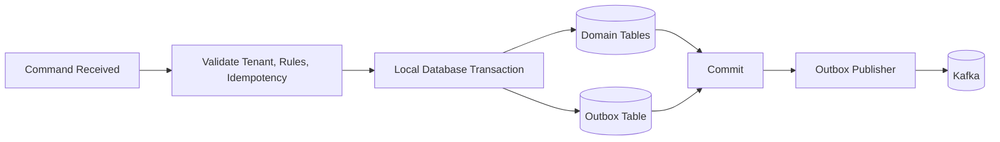

Outbox records should include:

- Event ID
- Event type
- Event version
- Tenant ID
- Aggregate type
- Aggregate ID
- Correlation ID
- Causation ID
- Payload
- Status
- Attempt count
- Next retry time
- Created timestamp
- Published timestamp

### 10.3 Inbox / Processed Event Pattern

Consumers should persist processed event IDs to prevent duplicate side effects. This is especially important for:

- accounting-service
- savings-service
- loan-service
- wallet-service
- payment-service
- report-service
- notification-service
- audit-service

### 10.4 Idempotency Persistence

Accepted commands must be protected by idempotency records.

Recommended idempotency record fields:

- Tenant ID
- Operation name
- Idempotency key
- Request hash
- Actor/client ID
- Business reference
- Status
- Response summary or result reference
- Created timestamp
- Expiration timestamp where appropriate

Duplicate requests with the same key and same request hash return the original result. Duplicate requests with the same key and different request hash must be rejected and audited.

## 11. Domain Data Model Overview

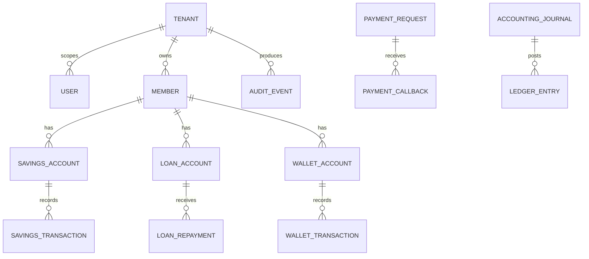

This diagram shows business relationships, not cross-service foreign key requirements. Each service owns its own tables and may store external references without direct database coupling.

## 12. Tenant, Auth, User, and Access Data

### 12.1 Tenant-Service Table Groups

Recommended table groups:

- Tenant profile
- Tenant domains and subdomains
- Tenant status history
- Tenant isolation tier
- Tenant subscription metadata where applicable
- Tenant routing metadata

Source of truth:

- tenant-service owns tenant identity, status, and routing metadata.

Key considerations:

- Tenant domain and subdomain require global uniqueness.
- Tenant status changes must be audited.
- Tenant status should be cached outside the database but invalidated through tenant events.

### 12.2 Auth-Service Table Groups

Recommended table groups:

- IAM user/account mapping references
- Session metadata
- Refresh token references where stored by the platform rather than the IAM provider
- Sessions
- MFA challenge references where orchestrated by the platform
- Login attempts
- Device records
- Service account/client references

Source of truth:

- Keycloak or the selected OIDC/OAuth2 IAM provider owns credential verification, token signing keys, OIDC clients, core IAM configuration, and identity-provider state.
- auth-service owns platform authentication metadata, session references, login attempts, auth audit coordination, and integration state required by the platform.

Security considerations:

- Prefer storing credentials in the selected IAM provider rather than duplicating password stores in platform databases.
- If platform-side token references are stored, store them securely and support rotation/revocation.
- OTP/MFA data must be short-lived and protected.
- Login attempts should support rate limiting and fraud monitoring.

### 12.3 User-Service Table Groups

Recommended table groups:

- Users
- Roles
- Permissions
- User-role assignments
- Role-permission assignments
- Branch or organizational scopes
- Access reviews
- Service account authorization scopes

Source of truth:

- user-service owns staff/admin users, roles, permissions, and access scopes.

Design notes:

- Role names should be tenant-scoped.
- Permissions should use stable machine-readable keys.
- Access changes must be audited.
- Authorization read paths may need indexes by tenant, user, role, and permission.

## 13. Member Data Model Strategy

Member-service owns member identity, profile, KYC, lifecycle, and member document metadata references.

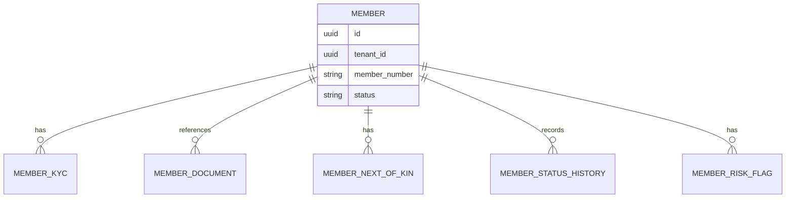

### 13.1 Recommended Table Groups

- Member profile
- Member contact details
- Member KYC
- Member document metadata
- Member next of kin / beneficiaries
- Member branch or group assignment
- Member status history
- Member risk flags
- Member onboarding workflow state

### 13.2 Integrity Rules

- Member number must be unique within tenant.
- KYC status must be explicit and auditable.
- Member status changes must preserve history.
- KYC document binaries should live in object storage; database stores metadata only.
- Other services may reference `member_id`, but member-service remains authoritative.

### 13.3 Indexing Recommendations

- Tenant and member number
- Tenant and status
- Tenant and branch/group
- Tenant and identity document hash/reference where allowed
- Tenant and created timestamp
- KYC status and review queue fields

## 14. Savings Data Model Strategy

Savings-service owns savings products, savings accounts, contributions, withdrawals, holds, and savings statements.

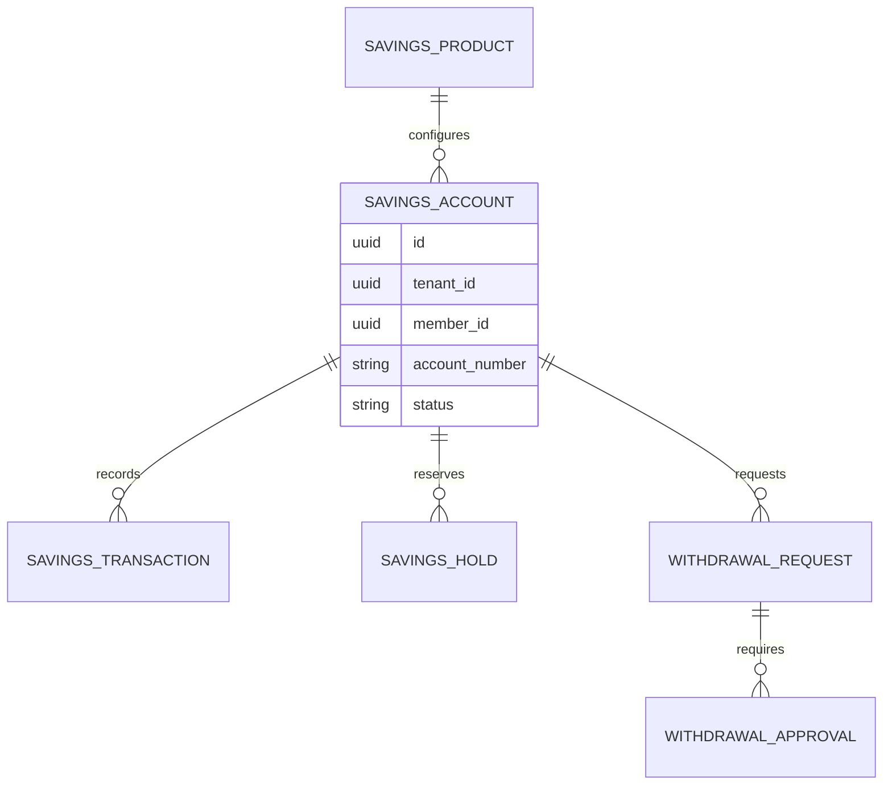

### 14.1 Recommended Table Groups

- Savings products
- Savings product rule snapshots
- Savings accounts
- Savings account status history
- Savings transactions
- Contribution records
- Withdrawal requests
- Withdrawal approvals
- Savings holds
- Interest/dividend calculation records where applicable
- Statement generation metadata

### 14.2 Source-of-Truth Rules

- savings-service owns savings account state and savings transaction state.
- payment-service owns external payment confirmation.
- accounting-service owns ledger posting.
- member-service owns member eligibility facts.

### 14.3 Financial Integrity Rules

- Contribution posting must be idempotent.
- Withdrawal lifecycle must distinguish requested, approved, posted, rejected, failed, reversed, and reconciled.
- Posted savings transactions must be immutable except for controlled status transitions.
- Corrections must use reversal or adjustment records.
- Account balance strategy must be explicitly chosen:
  - Derived from immutable transactions for maximum auditability, or
  - Stored balance updated transactionally with periodic reconciliation against transaction history.

### 14.4 Indexing Recommendations

- Tenant and account number
- Tenant and member ID
- Tenant, account ID, transaction date
- Tenant, transaction reference
- Tenant, status, created timestamp for work queues
- Tenant, payment reference where applicable

## 15. Loan Data Model Strategy

Loan-service owns loan products, applications, approvals, loan accounts, repayment schedules, repayments, arrears, restructuring, and closure state.

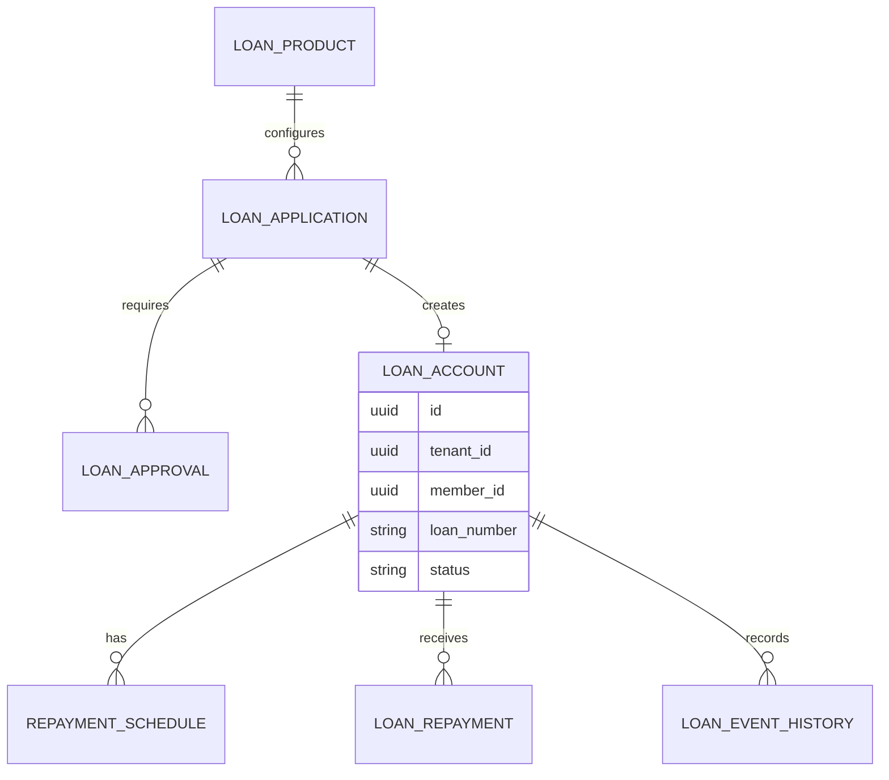

### 15.1 Recommended Table Groups

- Loan products
- Loan product rule snapshots
- Loan applications
- Eligibility evaluation records
- Loan approvals
- Guarantor records where applicable
- Loan accounts
- Repayment schedules
- Repayment application records
- Loan disbursement records
- Penalty and arrears records
- Restructure and write-off records
- Loan status history

### 15.2 Source-of-Truth Rules

- loan-service owns loan application, approval, disbursement state, loan account, schedule, and repayment application.
- payment-service owns external repayment confirmation and payout confirmation.
- wallet-service owns wallet movements.
- accounting-service owns ledger postings.

### 15.3 Integrity Rules

- Loan approvals must record approver, workflow step, threshold context, and decision timestamp.
- Loan schedules should preserve the calculation basis used at creation time.
- Repayment application must be idempotent by payment reference or repayment command key.
- Loan disbursement must track pending, disbursed, failed, reversed, and accounting-pending states.
- Changes to approved loans require explicit cancellation, reversal, restructuring, or adjustment workflows.

### 15.4 Indexing Recommendations

- Tenant and loan number
- Tenant and member ID
- Tenant and application status
- Tenant, loan account ID, due date for repayment schedules
- Tenant and repayment reference
- Tenant, status, created timestamp for approval queues
- Tenant and arrears status

## 16. Wallet Data Model Strategy

Wallet-service owns wallet accounts, balances, holds, wallet debit/credit records, transfers, and wallet reconciliation state.

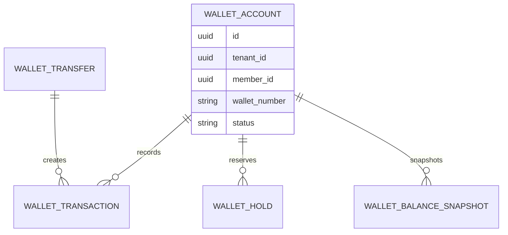

### 16.1 Recommended Table Groups

- Wallet accounts
- Wallet balance records or balance snapshots
- Wallet transactions
- Wallet holds
- Wallet transfers
- Wallet reversal records
- Wallet reconciliation records
- Wallet transaction status history

### 16.2 Integrity Rules

- Wallet debits and credits must be protected against double-spend.
- Holds must reserve funds before payout workflows where required.
- Transfers inside wallet-service should commit debit and credit atomically.
- Completed wallet transactions are immutable and corrected through reversal transactions.
- Wallet balances must be reconcilable against transaction history.

### 16.3 Concurrency Strategy

Wallet-service should use one or more of:

- Optimistic locking on wallet account/balance records
- Strict transactional update ordering
- Per-account transaction serialization where required
- Database constraints preventing negative available balances where supported by the selected model

### 16.4 Indexing Recommendations

- Tenant and wallet number
- Tenant and member ID
- Tenant, wallet account ID, transaction timestamp
- Tenant and transaction reference
- Tenant, status, created timestamp
- Tenant and hold expiration status

## 17. Accounting and Ledger Architecture

Accounting-service owns chart of accounts, accounting mappings, journals, ledger entries, reversals, trial balance data, accounting periods, and accounting reconciliation state.

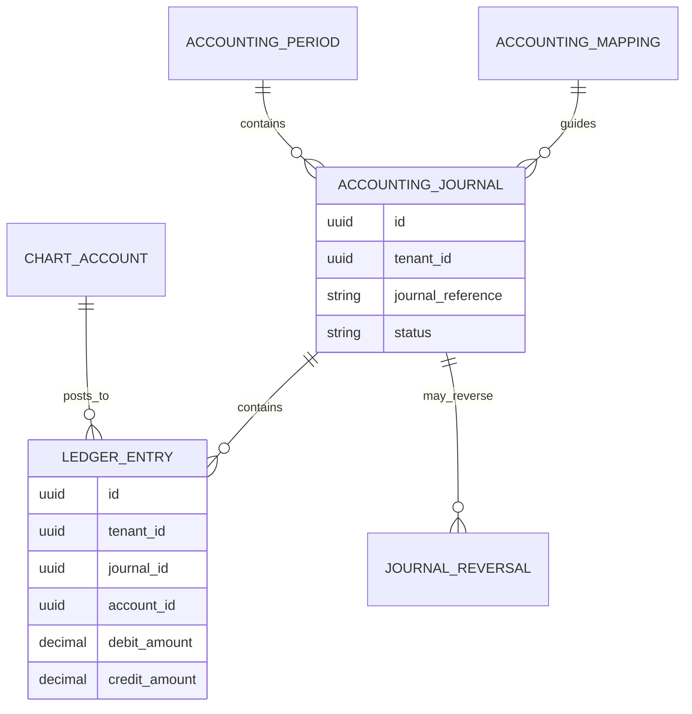

### 17.1 Ledger Principles

- Ledger entries must be append-only.
- A journal must balance: total debits equal total credits.
- Corrections require reversal or adjustment journals.
- Ledger entries must reference source service, source aggregate, source transaction reference, tenant, and correlation ID.
- Accounting period close must prevent unauthorized postings into closed periods.
- Ledger posting failures must be visible and retryable.

### 17.2 Recommended Table Groups

- Chart of accounts
- Accounting periods
- Accounting mappings
- Journals
- Ledger entries
- Journal reversals
- Trial balance snapshots
- Reconciliation records
- Posting failure records

### 17.3 Source Transaction References

Ledger entries should preserve source metadata:

- Source service
- Source aggregate type
- Source aggregate ID
- Source transaction reference
- Source event ID
- Correlation ID
- Causation ID

No cross-service foreign key should be required for source references.

### 17.4 Indexing Recommendations

- Tenant and journal reference
- Tenant, accounting period, account ID
- Tenant, account ID, posting date
- Tenant, source service, source transaction reference
- Tenant, status, created timestamp
- Tenant, event ID for idempotent postings

## 18. Payment Data Model Strategy

Payment-service owns payment requests, provider initiation records, callbacks, provider references, payment status, settlement tracking, provider reconciliation, and provider credential references.

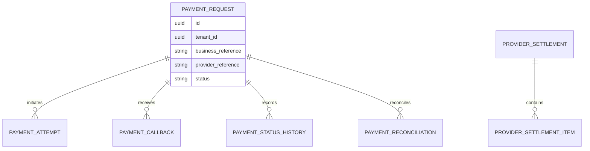

### 18.1 Recommended Table Groups

- Payment requests
- Payment attempts
- Provider callback records
- Payment status history
- Provider references
- Provider settlement files or batches
- Settlement items
- Payment reconciliation records
- Provider configuration references

### 18.2 Integrity Rules

- Provider callbacks must be durably captured before downstream processing.
- Provider callback deduplication must use provider reference, tenant, provider, and callback type where applicable.
- Payment request status must distinguish pending, confirmed, failed, reversed, expired, ambiguous, and under investigation.
- Confirmed but unapplied payments must remain visible for repair workflows.
- Raw provider payloads should be stored safely with masking or secure storage controls where needed.

### 18.3 Indexing Recommendations

- Tenant and business reference
- Tenant and provider reference
- Tenant, provider, external transaction ID
- Tenant, payment status, created timestamp
- Tenant, settlement batch ID
- Tenant, callback received timestamp

## 19. Audit Data Model Strategy

Audit-service owns immutable audit records for security-sensitive and business-critical activity.

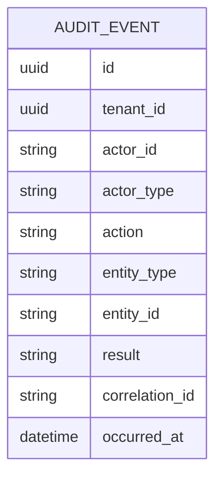

### 19.1 Recommended Table Groups

- Audit events
- Security audit events
- Audit export jobs
- Audit retention metadata
- Audit search projections where needed

### 19.2 Audit Requirements

Audit records must capture:

- Tenant ID
- Actor ID and actor type
- Service name
- Action
- Entity type and ID
- Channel
- Correlation ID
- Causation ID
- Request ID
- Result
- Timestamp
- Safe before/after summaries where applicable

### 19.3 Integrity Rules

- Audit records must be immutable or tamper-evident.
- Audit event publication must use reliable outbox persistence.
- Audit storage must support long retention.
- Sensitive values must be masked or omitted.
- Audit records must be searchable by tenant, actor, action, entity, correlation ID, and time.

### 19.4 Partitioning Recommendations

Audit events should be partitioned by date range and possibly tenant for very large tenants. Retention and archival should be designed before production launch.

## 20. Notification, USSD, Configuration, and Document Metadata

### 20.1 Notification-Service Table Groups

- Notification templates
- Template versions
- Notification requests
- Dispatch attempts
- Delivery status records
- Provider response records
- Communication preferences where assigned to notification domain

Indexes:

- Tenant and template key
- Tenant, delivery status, created timestamp
- Tenant and recipient reference
- Tenant and provider reference

### 20.2 USSD-Service Table Groups

- USSD sessions
- USSD session steps
- Menu definitions or menu cache references
- USSD authentication attempts
- USSD transaction requests
- USSD provider/gateway metadata

Design notes:

- USSD session state may primarily live in Redis, but durable records should exist for audit, diagnostics, and accepted transaction requests.
- Session records should be short-retention and partitioned or archived aggressively.

### 20.3 Configuration-Service Table Groups

- Tenant configuration sets
- Feature flags
- Workflow definitions
- Fee schedules
- Transaction limits
- Product rule configuration
- Branding configuration
- Configuration version history
- Approval rules

Design notes:

- Financially relevant configuration must be versioned.
- Domain services should store rule/version snapshots used for completed transactions.
- Configuration changes must be audited.

### 20.4 File and Document Metadata

File binaries should be stored in object storage. PostgreSQL stores metadata only.

Recommended metadata:

- Tenant ID
- Owner service
- Owner entity type and ID
- Document category
- Storage key
- File name
- MIME type
- File size
- Hash/checksum
- Upload actor
- Upload timestamp
- Retention category
- Access classification
- Scan status

## 21. Reporting and Read-Model Strategy

Report-service owns read models, dashboards, export metadata, and reporting projections. It is not the source of truth for transactional data.

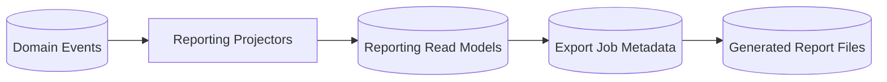

### 21.1 Reporting Table Groups

- Member projection
- Savings projection
- Loan portfolio projection
- Wallet transaction projection
- Payment reconciliation projection
- Ledger reporting projection
- Dashboard metric snapshots
- Export jobs
- Export access logs

### 21.2 Reporting Rules

- Reporting projections must be read-only from the reporting API perspective.
- Projection freshness must be visible for financial reports.
- Report-service must track consumed event versions and offsets.
- Heavy reports must not query transactional service databases directly.
- Rebuild procedures must be documented for every projection.

### 21.3 Read Replica Considerations

Read replicas may be used for:

- Read-heavy operational dashboards
- Internal analytics
- Low-risk report queries
- Export generation

Read replicas must not be used when a workflow requires read-after-write consistency for financial decisions.

## 22. Indexing Strategy

### 22.1 General Index Principles

- Index tenant ID with high-traffic query dimensions.
- Use composite indexes matching real query filters and sort order.
- Index external references used for idempotency and reconciliation.
- Avoid over-indexing high-write tables.
- Monitor index bloat and unused indexes.
- Prefer partial indexes for active queues where appropriate.
- Use date/time indexes for range scans and partition pruning.

### 22.2 Common Composite Index Patterns

| Query Pattern | Recommended Index Shape |
| --- | --- |
| Tenant record lookup | tenant ID + record ID |
| Business reference lookup | tenant ID + business reference |
| Work queue | tenant ID + status + created timestamp |
| Member domain lookup | tenant ID + member ID |
| Account transaction history | tenant ID + account ID + transaction timestamp |
| Reconciliation lookup | tenant ID + provider/reference/status |
| Audit search | tenant ID + occurred timestamp + action/entity |
| Event processing | event ID, tenant ID + aggregate ID |

### 22.3 High-Volume Index Candidates

- Ledger entries
- Wallet transactions
- Savings transactions
- Loan repayments
- Payment callbacks
- Audit events
- Notification dispatch logs
- USSD sessions

## 23. Partitioning Strategy

Partitioning should be planned early for high-volume tables even if not enabled on day one.

### 23.1 Partition Candidates

| Table Group | Partition Strategy |
| --- | --- |
| Ledger entries | Range by posting date, optional tenant subpartition for large tenants |
| Wallet transactions | Range by transaction date |
| Savings transactions | Range by transaction date |
| Loan repayments | Range by repayment/posting date |
| Payment callbacks | Range by received timestamp |
| Audit events | Range by occurred timestamp |
| Notification logs | Range by created timestamp |
| USSD sessions | Range by session start timestamp |

### 23.2 Partitioning Rules

- Partition keys must match common query and retention patterns.
- Unique constraints on partitioned tables must be designed carefully.
- Partition maintenance must be automated and monitored.
- Archival jobs should align with partition boundaries.
- Reporting projections may use separate partitioning optimized for reporting queries.

## 24. ACID Transaction Handling

### 24.1 Local Transaction Requirements

Within a single service, a transaction should atomically handle:

- Idempotency check/record
- Domain validation based on current state
- State mutation
- Financial transaction record creation
- Outbox event creation
- Local status history record

### 24.2 Isolation Level Considerations

Default transaction isolation may be sufficient for many workflows, but transaction-critical workflows must be reviewed for concurrency anomalies.

Higher concurrency controls may be required for:

- Wallet debits
- Savings withdrawals
- Loan repayment application
- Ledger journal posting
- Payment callback deduplication
- Approval finalization

### 24.3 Optimistic Locking

Optimistic locking is recommended for mutable aggregate roots such as:

- Savings account
- Loan application
- Loan account
- Wallet account/balance
- Configuration records
- Approval workflow state

## 25. Reconciliation Considerations

Reconciliation must compare records across domain ownership boundaries without violating database isolation.

### 25.1 Reconciliation Sources

- payment-service provider records and settlement files
- wallet-service wallet transactions
- savings-service contribution and withdrawal records
- loan-service disbursement and repayment records
- accounting-service ledger entries

### 25.2 Reconciliation Records

Reconciliation records should include:

- Tenant ID
- Reconciliation type
- Source service
- Source reference
- Compared service/reference
- Amount
- Currency
- Status
- Difference reason
- Assigned owner
- Resolution notes
- Created and resolved timestamps

### 25.3 Repair Workflow Persistence

Repair workflows must be explicit and auditable. They should not directly mutate completed financial facts without recording reversal, adjustment, or resolution records.

## 26. Migration and Versioning Strategy

### 26.1 Migration Ownership

Each service owns its database migrations. Migration artifacts must be versioned with the service that owns the schema.

### 26.2 Migration Rules

- Migrations must be deterministic and repeatable.
- Migrations must be tested in lower environments.
- Backward-compatible migrations are required for rolling deployments.
- Destructive changes require a phased deprecation plan.
- Large table migrations must be planned to avoid long locks.
- Data backfills must be resumable and observable.

### 26.3 Event and Schema Compatibility

Database migrations must be coordinated with:

- API contract changes
- Event schema changes
- Reporting projection changes
- Mobile app compatibility windows
- Long-running background workers

## 27. Archival and Retention Strategy

### 27.1 Retention Categories

| Data Category | Retention Direction |
| --- | --- |
| Ledger and financial transactions | Long retention, regulatory/business policy driven |
| Audit events | Long retention, compliance driven |
| KYC and identity documents | Long retention with privacy controls |
| USSD sessions | Short operational retention plus audit summary where needed |
| Notification logs | Medium retention, archive old records |
| Reporting exports | Time-bound retention based on sensitivity |
| Outbox/inbox records | Retain until safely published/processed, then archive or purge by policy |

### 27.2 Archival Rules

- Archive by partition boundaries where possible.
- Verify archive integrity before purge.
- Keep archived financial data searchable through controlled processes.
- Encrypt archives.
- Audit access to archived sensitive data.
- Document restore procedures for archived data.

## 28. Backup and Recovery

### 28.1 Backup Requirements

PostgreSQL backup strategy must include:

- Automated full backups
- Write-ahead log archiving or equivalent point-in-time recovery
- Regular restore testing
- Environment-specific retention policies
- Encryption at rest and in transit
- Access-controlled backup storage
- Backup monitoring and alerting

### 28.2 Recovery Objectives

Critical financial databases should target low data loss and fast recovery. Final RTO/RPO must be approved by business stakeholders, but financial services should plan for near-zero to low-minute recovery point objectives where infrastructure supports it.

### 28.3 Restore Testing

Restore drills must verify:

- Tenant data integrity
- Financial transaction integrity
- Ledger balance consistency
- Audit event availability
- Outbox/inbox recovery behavior
- Reporting projection rebuild capability

## 29. Scalability and High-Volume Transaction Handling

### 29.1 Scaling Techniques

- Connection pooling per service
- Service-owned schemas/databases
- Read replicas for reporting and read-heavy workloads
- Table partitioning for high-volume time-series-like data
- Carefully designed composite indexes
- Batch processing for exports and projections
- Outbox publishing with backpressure
- Archival of historical operational data
- Tenant-aware sharding as a future option

### 29.2 High-Volume Write Tables

High-volume write tables include:

- Payment callbacks
- Wallet transactions
- Savings transactions
- Loan repayments
- Ledger entries
- Audit events
- Notification dispatch attempts
- USSD sessions
- Outbox records

These tables require careful index discipline, partition planning, vacuum monitoring, and archival strategy.

### 29.3 Connection Management

Every service must use bounded connection pools. Production sizing should account for:

- Number of service replicas
- Pool size per replica
- Database max connections
- Background workers
- Migration jobs
- Reporting/export jobs

## 30. Database Security

### 30.1 Access Control

- Each service should use its own database credentials.
- Service credentials should have access only to owned schema/database objects.
- Reporting users should have read-only access to reporting schemas only.
- Administrative access must be restricted, audited, and time-bound.
- Cross-service database access must be prohibited by permissions, not just convention.

### 30.2 Encryption and Sensitive Data

- Use TLS for database connections where supported.
- Encrypt database storage and backups.
- Protect password hashes, tokens, OTPs, PINs, identity details, and provider secrets.
- Store provider secrets in a secrets manager, not plain database columns, unless encrypted and explicitly approved.
- Mask sensitive data in logs, audit summaries, exports, and reporting projections.

### 30.3 Row-Level Security Considerations

PostgreSQL row-level security may be considered as a defense-in-depth layer for shared tenant tables. It should not replace service-level tenant validation. If adopted, policies must be tested carefully for performance and operational complexity.

## 31. Operational Monitoring

Database observability must include:

- Connection pool usage
- Query latency
- Slow queries
- Lock waits and deadlocks
- Replication lag
- Backup success/failure
- Table and index bloat
- Partition health
- Outbox backlog
- Inbox processing failures
- Dead letter growth
- Disk usage
- Transaction throughput
- Autovacuum health

Critical alerts should exist for backup failures, replication lag, database saturation, outbox backlog, payment callback backlog, ledger posting failures, and audit pipeline failures.

## 32. Production Readiness Checklist

Before production launch, verify:

- Service-owned persistence boundaries are enforced.
- Tenant ID exists and is indexed on tenant-owned high-volume tables.
- Cross-service foreign keys are not used.
- Idempotency persistence is defined for all transaction-critical commands.
- Outbox and inbox persistence are defined for event producers and consumers.
- Ledger tables are append-only by design.
- Reversal and adjustment strategies are documented.
- High-volume table partitioning plan is documented.
- Archival and retention policies are approved.
- Backup and restore tests are completed.
- Database credentials are service-scoped.
- Sensitive data handling is reviewed.
- Reporting projections are separated from transactional ownership.
- Migration strategy supports rolling deployments.
- Reconciliation records and repair workflows are modeled.
- Read replica usage rules are documented.

## 33. Summary

The SACCO database architecture is built around PostgreSQL, service-owned persistence, tenant-aware records, strong local ACID transactions, reliable outbox publication, idempotency persistence, append-only ledger patterns, and reporting projections.

This design supports high-volume financial workloads and more than 1 million members while preserving tenant safety, financial integrity, auditability, scalability, and operational recovery.
