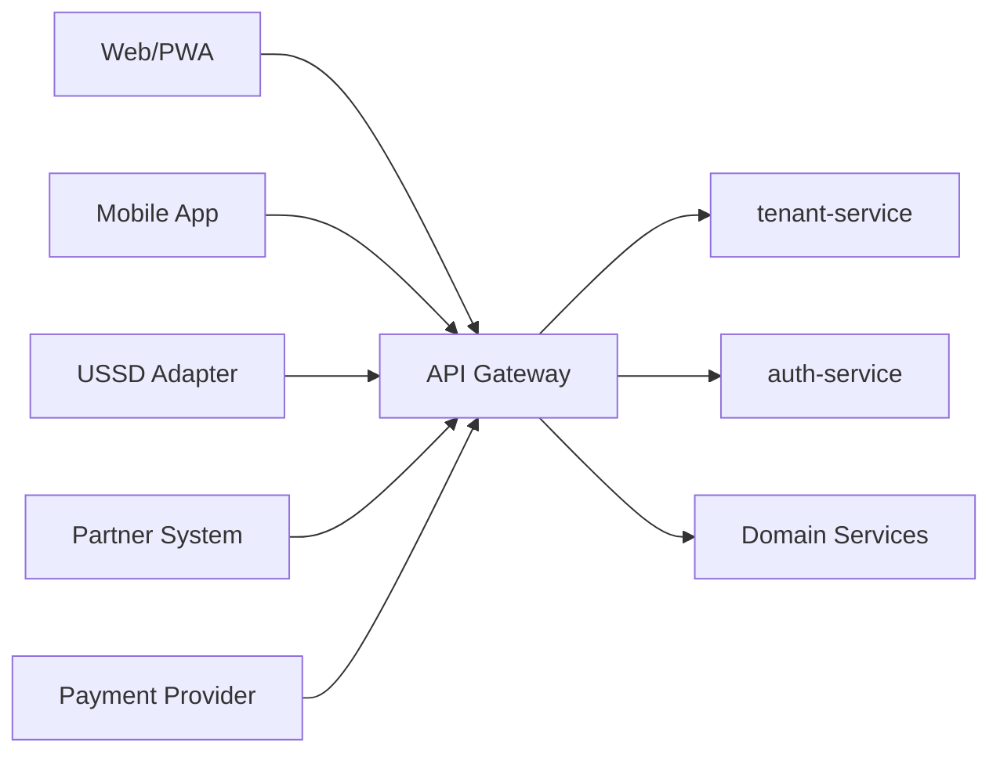

# API Architecture and Specification

## 1. Purpose

This document defines the API architecture and design strategy for the SACCO platform. It establishes the API gateway model, endpoint conventions, request and response standards, authentication and authorization requirements, tenant-aware request handling, idempotency rules, webhook strategy, mobile/web/USSD integration patterns, and service API boundaries.

The API platform must support:

- Web portal
- Member PWA
- Mobile app
- USSD channel adapter
- Admin/staff portal
- Third-party integrations
- Over 1 million members
- Multi-tenancy
- Financial transaction integrity
- Event-driven workflows where required

This document does not generate implementation code.

## 2. API Design Goals

- Provide a reusable API layer for web, mobile app, PWA, USSD, and partners.
- Preserve service ownership and source-of-truth boundaries.
- Enforce tenant isolation on every tenant-owned request.
- Ensure financial operations are idempotent, auditable, traceable, and recoverable.
- Keep public API contracts stable through versioning.
- Support high-volume pagination, filtering, and async exports.
- Provide consistent error, validation, and status response formats.
- Avoid leaking internal database, entity, or provider-specific structures.
- Support OpenAPI documentation for every exposed service API.

## 3. API Gateway Strategy

The API gateway is the required external entry point for clients. Frontend apps, mobile apps, USSD adapters, partners, and provider callbacks must not call internal services directly unless explicitly approved for private network integrations.



### 3.1 Gateway Responsibilities

- TLS termination
- Tenant resolution
- JWT validation or token introspection
- Request routing
- API version routing
- Rate limiting
- Request size limits
- Correlation ID creation/propagation
- Partner allowlisting where required
- Provider callback routing
- Basic request normalization
- Edge security logging
- Gateway metrics

### 3.2 Gateway Non-Responsibilities

The gateway must not:

- Implement domain business rules.
- Own financial transaction state.
- Rewrite business payload semantics.
- Query service databases.
- Replace service-level authorization.
- Become a monolithic backend-for-everything layer.

## 4. API Segmentation

APIs shall be grouped by consumer and risk profile.

| Segment | Path Prefix | Consumers | Notes |
| --- | --- | --- | --- |
| Admin APIs | `/api/v1/admin/...` | Platform and tenant administrators | Broad configuration and operational access |
| Staff APIs | `/api/v1/staff/...` | SACCO staff | Member, loan, savings, approval workflows |
| Member APIs | `/api/v1/member/...` | Member web/PWA/mobile | Self-service only |
| Mobile APIs | `/api/v1/mobile/...` | Mobile app | May aggregate member APIs for mobile UX |
| USSD APIs | `/api/v1/ussd/...` | USSD adapter/gateway | Short session, idempotent commands |
| Partner APIs | `/api/v1/partners/...` | Approved external systems | Strong authentication and quotas |
| Webhooks | `/api/v1/webhooks/...` | Payment/SMS/etc providers | Signature validation and deduplication |
| Internal APIs | `/internal/v1/...` | Service-to-service only | Private network/service identity |

## 5. Versioning Strategy

### 5.1 Versioning Rules

- Public APIs must be explicitly versioned.
- Breaking changes require a new version.
- Backward-compatible additions may remain in the same version.
- Mobile app compatibility windows must be considered before deprecating versions.
- Partner APIs require longer deprecation windows.
- Internal APIs may version faster but must still preserve service contracts.

### 5.2 Version Naming

Recommended path-based versioning:

```text
/api/v1/...
/internal/v1/...
```

Headers may additionally include API contract version metadata, but URL versioning should remain the primary external routing mechanism.

## 6. Request Standards

### 6.1 Required Headers

| Header | Required For | Purpose |
| --- | --- | --- |
| `Authorization` | Protected APIs | Bearer token or approved auth scheme |
| `X-Correlation-Id` | All APIs, generated if absent | End-to-end tracing |
| `X-Request-Id` | Recommended | Client request traceability |
| `X-Tenant-Id` | Trusted internal/service calls only | Tenant context after gateway validation |
| `Idempotency-Key` | Financial commands | Duplicate command protection |
| `X-Client-Channel` | Web/mobile/PWA/USSD/partner | Channel-aware audit and behavior |
| `X-Api-Version` | Optional | Additional compatibility metadata |

Client-supplied tenant IDs must not be trusted without gateway and token validation.

### 6.2 Request Body Standards

Requests should:

- Use JSON for standard APIs.
- Use multipart only for approved upload flows.
- Use ISO date/time strings for timestamps.
- Use explicit decimal string or numeric conventions for money.
- Use stable IDs and business references.
- Avoid embedding raw provider payloads outside integration services.
- Avoid sending sensitive values unless required and protected.

### 6.3 Command Metadata

Financial command requests must carry or derive:

- Tenant ID
- Actor identity
- Channel
- Correlation ID
- Idempotency key
- Business reference where applicable

## 7. Response Standards

### 7.1 Success Response Shape

Recommended response envelope:

```text
data: resource or collection
meta: pagination, correlation, freshness, warnings
```

For simple internal APIs, services may return direct resource DTOs if the standard is documented, but public APIs should use a consistent envelope.

### 7.2 Collection Response Metadata

Collection responses should include:

- Page number or cursor
- Page size
- Total count where practical
- Sort fields
- Applied filters
- Has next page
- Correlation ID

### 7.3 Status Response Metadata

Financial and workflow responses should include:

- Status
- Business reference
- Transaction reference
- Correlation ID
- Pending reason where applicable
- Next action where applicable
- Reconciliation status where applicable

## 8. Error Handling Standards

### 8.1 Error Categories

| Category | Meaning |
| --- | --- |
| validation_error | Request failed schema or field validation |
| authentication_error | Missing, expired, or invalid authentication |
| authorization_error | Authenticated identity lacks permission |
| tenant_error | Tenant missing, inactive, mismatched, or forbidden |
| not_found | Resource not found in tenant scope |
| conflict | Version, uniqueness, or state conflict |
| idempotency_conflict | Same idempotency key with different payload |
| business_rule_error | Domain rule rejected the operation |
| provider_error | External provider failure or ambiguous result |
| rate_limited | Request exceeded quota |
| pending | Operation accepted but not complete |
| internal_error | Unexpected service failure |

### 8.2 Error Response Fields

Error responses should include:

- Error code
- Human-readable message
- Field errors where applicable
- Correlation ID
- Request ID where available
- Retryability indicator where useful
- Support reference for sensitive workflows

Sensitive internal details, stack traces, secrets, and raw provider payloads must not be exposed.

## 9. Pagination, Filtering, Sorting, and Search

### 9.1 Pagination

High-volume list endpoints must use server-side pagination.

Recommended query parameters:

- `page`
- `size`
- `cursor` where cursor pagination is more appropriate
- `sort`
- `direction`

Cursor pagination is recommended for very large, fast-changing transaction lists.

### 9.2 Filtering

Filtering must be explicit and indexed where high volume is expected. Common filters:

- Status
- Date range
- Member ID
- Account ID
- Branch ID
- Product ID
- Provider reference
- Transaction reference
- Actor ID
- Channel

### 9.3 Search

Search endpoints must be tenant-scoped. Free-text search should be carefully limited and backed by appropriate indexing or search infrastructure if needed.

## 10. Validation Strategy

Validation occurs at multiple layers:

- Gateway: request size, content type, basic route constraints.
- Controller/API layer: DTO shape and required fields.
- Application layer: authorization, tenant scope, idempotency.
- Domain layer: business rules and state transitions.
- Persistence layer: integrity constraints.

Frontend validation improves UX but does not replace backend validation.

## 11. Authentication APIs

Authentication uses Keycloak as the preferred IAM provider, or an equivalent OIDC/OAuth2 service. The auth-service owns the platform authentication facade and presents stable platform API contracts to web, PWA, mobile, USSD, and partner clients while integrating with the selected IAM provider behind that boundary.

### 11.1 Auth Endpoints

| Method | Endpoint | Purpose |
| --- | --- | --- |
| POST | `/api/v1/auth/login` | Authenticate user/member |
| POST | `/api/v1/auth/logout` | End current session |
| POST | `/api/v1/auth/token/refresh` | Refresh access token |
| POST | `/api/v1/auth/mfa/challenge` | Start MFA challenge |
| POST | `/api/v1/auth/mfa/verify` | Verify MFA challenge |
| POST | `/api/v1/auth/password/forgot` | Begin password reset |
| POST | `/api/v1/auth/password/reset` | Complete password reset |
| POST | `/api/v1/auth/password/change` | Change authenticated password |
| GET | `/api/v1/auth/sessions` | List active sessions |
| DELETE | `/api/v1/auth/sessions/{sessionId}` | Revoke session |

### 11.2 Auth Rules

- Login must be tenant-aware.
- Failed login and MFA attempts must be audited.
- Token refresh must support rotation and revocation.
- Sensitive auth responses must avoid user enumeration.
- MFA may be required for admins, staff financial actions, new devices, and high-risk member actions.
- OIDC/OAuth2 token validation, issuer validation, audience validation, signing-key rotation, and claim mapping must be documented.
- Keycloak realm/client configuration must not leak into public API payloads beyond approved auth flow requirements.

## 12. Authorization and RBAC APIs

Roles and permissions are owned by user-service.

| Method | Endpoint | Purpose |
| --- | --- | --- |
| GET | `/api/v1/users/me` | Current user profile |
| GET | `/api/v1/users/me/access-profile` | Current roles, permissions, scopes |
| GET | `/api/v1/admin/users` | List users |
| POST | `/api/v1/admin/users` | Create user |
| GET | `/api/v1/admin/users/{userId}` | Retrieve user |
| PATCH | `/api/v1/admin/users/{userId}` | Update user |
| POST | `/api/v1/admin/users/{userId}/disable` | Disable user |
| GET | `/api/v1/admin/roles` | List roles |
| POST | `/api/v1/admin/roles` | Create role |
| PATCH | `/api/v1/admin/roles/{roleId}` | Update role |
| GET | `/api/v1/admin/permissions` | List permissions |
| POST | `/api/v1/admin/users/{userId}/roles` | Assign roles |

Authorization changes require audit events and must invalidate permission caches.

## 13. Tenant Management APIs

Tenant lifecycle and routing metadata are owned by tenant-service.

| Method | Endpoint | Purpose |
| --- | --- | --- |
| GET | `/api/v1/tenants/resolve` | Resolve tenant by domain/subdomain |
| GET | `/api/v1/admin/tenants` | List tenants |
| POST | `/api/v1/admin/tenants` | Create tenant |
| GET | `/api/v1/admin/tenants/{tenantId}` | Retrieve tenant |
| PATCH | `/api/v1/admin/tenants/{tenantId}` | Update tenant metadata |
| POST | `/api/v1/admin/tenants/{tenantId}/activate` | Activate tenant |
| POST | `/api/v1/admin/tenants/{tenantId}/suspend` | Suspend tenant |
| GET | `/api/v1/admin/tenants/{tenantId}/domains` | List domains |
| POST | `/api/v1/admin/tenants/{tenantId}/domains` | Add domain/subdomain |

Tenant status changes require high-severity audit events.

## 14. Member Management APIs

Member-service owns member profile, KYC, lifecycle, and member document metadata references.

### 14.1 Staff/Admin Member APIs

| Method | Endpoint | Purpose |
| --- | --- | --- |
| GET | `/api/v1/staff/members` | Search/list members |
| POST | `/api/v1/staff/members` | Register member |
| GET | `/api/v1/staff/members/{memberId}` | Retrieve member |
| PATCH | `/api/v1/staff/members/{memberId}` | Update member profile |
| POST | `/api/v1/staff/members/{memberId}/kyc/submit` | Submit KYC data |
| POST | `/api/v1/staff/members/{memberId}/kyc/verify` | Verify KYC |
| POST | `/api/v1/staff/members/{memberId}/kyc/reject` | Reject KYC |
| POST | `/api/v1/staff/members/{memberId}/suspend` | Suspend member |
| POST | `/api/v1/staff/members/{memberId}/activate` | Activate member |
| GET | `/api/v1/staff/members/{memberId}/audit` | Member audit timeline |

### 14.2 Member Self-Service APIs

| Method | Endpoint | Purpose |
| --- | --- | --- |
| GET | `/api/v1/member/profile` | Retrieve own profile |
| PATCH | `/api/v1/member/profile` | Update allowed profile fields |
| GET | `/api/v1/member/kyc/status` | Retrieve own KYC status |
| POST | `/api/v1/member/kyc/submit` | Submit allowed KYC data |
| GET | `/api/v1/member/documents` | List own document metadata |
| POST | `/api/v1/member/documents` | Upload document metadata/file flow |

Member self-service APIs must enforce that members can access only their own tenant-scoped records.

## 15. Savings APIs

Savings-service owns savings products, accounts, contributions, withdrawals, holds, and statements.

### 15.1 Admin/Staff Savings APIs

| Method | Endpoint | Purpose |
| --- | --- | --- |
| GET | `/api/v1/admin/savings/products` | List savings products |
| POST | `/api/v1/admin/savings/products` | Create savings product |
| GET | `/api/v1/admin/savings/products/{productId}` | Retrieve savings product |
| PATCH | `/api/v1/admin/savings/products/{productId}` | Update savings product |
| GET | `/api/v1/staff/savings/accounts` | List savings accounts |
| POST | `/api/v1/staff/savings/accounts` | Open savings account |
| GET | `/api/v1/staff/savings/accounts/{accountId}` | Retrieve savings account |
| GET | `/api/v1/staff/savings/accounts/{accountId}/transactions` | List transactions |
| POST | `/api/v1/staff/savings/contributions` | Post/initiate contribution |
| POST | `/api/v1/staff/savings/withdrawals` | Request withdrawal |
| POST | `/api/v1/staff/savings/withdrawals/{withdrawalId}/approve` | Approve withdrawal |
| POST | `/api/v1/staff/savings/withdrawals/{withdrawalId}/reject` | Reject withdrawal |

### 15.2 Member Savings APIs

| Method | Endpoint | Purpose |
| --- | --- | --- |
| GET | `/api/v1/member/savings/accounts` | List own savings accounts |
| GET | `/api/v1/member/savings/accounts/{accountId}` | Retrieve own savings account |
| GET | `/api/v1/member/savings/accounts/{accountId}/transactions` | Own savings transactions |
| POST | `/api/v1/member/savings/contributions` | Initiate contribution |
| POST | `/api/v1/member/savings/withdrawals` | Request withdrawal |
| GET | `/api/v1/member/savings/withdrawals/{withdrawalId}` | Withdrawal status |

Financial savings commands require `Idempotency-Key`.

## 16. Loan Management APIs

Loan-service owns loan products, applications, approvals, loan accounts, schedules, disbursement state, and repayment application.

### 16.1 Admin/Staff Loan APIs

| Method | Endpoint | Purpose |
| --- | --- | --- |
| GET | `/api/v1/admin/loans/products` | List loan products |
| POST | `/api/v1/admin/loans/products` | Create loan product |
| GET | `/api/v1/admin/loans/products/{productId}` | Retrieve product |
| PATCH | `/api/v1/admin/loans/products/{productId}` | Update product |
| GET | `/api/v1/staff/loans/applications` | List applications |
| POST | `/api/v1/staff/loans/applications` | Submit application for member |
| GET | `/api/v1/staff/loans/applications/{applicationId}` | Retrieve application |
| POST | `/api/v1/staff/loans/applications/{applicationId}/approve` | Approve application |
| POST | `/api/v1/staff/loans/applications/{applicationId}/reject` | Reject application |
| POST | `/api/v1/staff/loans/{loanId}/disburse` | Request disbursement |
| GET | `/api/v1/staff/loans/accounts` | List loan accounts |
| GET | `/api/v1/staff/loans/accounts/{loanId}` | Retrieve loan account |
| POST | `/api/v1/staff/loans/{loanId}/repayments` | Apply/initiate repayment |

### 16.2 Member Loan APIs

| Method | Endpoint | Purpose |
| --- | --- | --- |
| GET | `/api/v1/member/loans/products` | Available loan products |
| POST | `/api/v1/member/loans/applications` | Submit own loan application |
| GET | `/api/v1/member/loans/applications` | List own applications |
| GET | `/api/v1/member/loans/applications/{applicationId}` | Retrieve own application |
| GET | `/api/v1/member/loans/accounts` | List own loan accounts |
| GET | `/api/v1/member/loans/accounts/{loanId}` | Retrieve own loan account |
| GET | `/api/v1/member/loans/accounts/{loanId}/schedule` | Repayment schedule |
| POST | `/api/v1/member/loans/{loanId}/repayments` | Initiate repayment |

Approvals, disbursements, and repayments require idempotency and audit.

## 17. Wallet and Accounting APIs

### 17.1 Wallet APIs

Wallet-service owns wallet accounts, balances, holds, debits, credits, and transfers.

| Method | Endpoint | Purpose |
| --- | --- | --- |
| GET | `/api/v1/member/wallet` | Retrieve own wallet summary |
| GET | `/api/v1/member/wallet/transactions` | Own wallet transactions |
| POST | `/api/v1/member/wallet/transfers` | Initiate wallet transfer |
| GET | `/api/v1/staff/wallet/accounts` | List wallet accounts |
| GET | `/api/v1/staff/wallet/accounts/{walletId}` | Retrieve wallet account |
| GET | `/api/v1/staff/wallet/transactions` | Search wallet transactions |
| POST | `/api/v1/staff/wallet/accounts/{walletId}/holds` | Place hold |
| POST | `/api/v1/staff/wallet/holds/{holdId}/release` | Release hold |

### 17.2 Accounting APIs

Accounting-service owns chart of accounts, journals, ledger entries, trial balance, and reconciliation support.

| Method | Endpoint | Purpose |
| --- | --- | --- |
| GET | `/api/v1/admin/accounting/chart-of-accounts` | List accounts |
| POST | `/api/v1/admin/accounting/chart-of-accounts` | Create account |
| GET | `/api/v1/admin/accounting/journals` | List journals |
| GET | `/api/v1/admin/accounting/journals/{journalId}` | Retrieve journal |
| POST | `/api/v1/admin/accounting/journals` | Create controlled manual journal |
| POST | `/api/v1/admin/accounting/journals/{journalId}/reverse` | Reverse journal |
| GET | `/api/v1/admin/accounting/ledger` | Query ledger entries |
| GET | `/api/v1/admin/accounting/trial-balance` | Trial balance |
| GET | `/api/v1/admin/accounting/reconciliation` | Reconciliation status |

Manual accounting actions require elevated authorization and audit.

## 18. Payment Integration APIs

Payment-service owns payment requests, provider initiation, callbacks, status, settlement, and reconciliation.

| Method | Endpoint | Purpose |
| --- | --- | --- |
| POST | `/api/v1/payments/collections` | Initiate collection |
| POST | `/api/v1/payments/payouts` | Initiate approved payout |
| GET | `/api/v1/payments/{paymentId}` | Retrieve payment status |
| GET | `/api/v1/staff/payments` | Search payments |
| GET | `/api/v1/staff/payments/{paymentId}` | Payment detail |
| GET | `/api/v1/staff/payments/reconciliation` | Reconciliation queue |
| POST | `/api/v1/staff/payments/{paymentId}/reconcile` | Resolve reconciliation item |
| POST | `/api/v1/webhooks/payments/{provider}` | Provider callback endpoint |

Payment callbacks must be authenticated or validated by signature, deduplicated, durably captured, and processed idempotently.

## 19. Notification APIs

Notification-service owns templates, dispatch logs, delivery status, push tokens, and communication preferences.

| Method | Endpoint | Purpose |
| --- | --- | --- |
| GET | `/api/v1/admin/notifications/templates` | List templates |
| POST | `/api/v1/admin/notifications/templates` | Create template |
| PATCH | `/api/v1/admin/notifications/templates/{templateId}` | Update template |
| GET | `/api/v1/admin/notifications/deliveries` | Search delivery logs |
| GET | `/api/v1/admin/notifications/deliveries/{deliveryId}` | Delivery detail |
| POST | `/api/v1/member/notifications/push-tokens` | Register push token |
| GET | `/api/v1/member/notifications` | Member notifications |
| PATCH | `/api/v1/member/notifications/preferences` | Update preferences |

Notification failure must not roll back completed financial operations.

## 20. Reporting APIs

Report-service owns dashboards, projections, report definitions, export jobs, and generated report metadata.

| Method | Endpoint | Purpose |
| --- | --- | --- |
| GET | `/api/v1/admin/reports/dashboards/platform` | Platform dashboard |
| GET | `/api/v1/staff/reports/dashboards/operations` | Tenant operations dashboard |
| GET | `/api/v1/admin/reports/definitions` | List report definitions |
| POST | `/api/v1/admin/reports/exports` | Request report export |
| GET | `/api/v1/admin/reports/exports/{exportId}` | Export status |
| GET | `/api/v1/admin/reports/exports/{exportId}/download` | Authorized download |
| GET | `/api/v1/member/reports/statements` | Member statements list |
| POST | `/api/v1/member/reports/statements` | Request statement |

Heavy reports must be asynchronous. Report responses must include freshness/cutoff metadata for financial reports.

## 21. Configuration and Settings APIs

Configuration-service owns tenant rules, feature flags, workflows, fees, limits, branding, menus, and templates references.

| Method | Endpoint | Purpose |
| --- | --- | --- |
| GET | `/api/v1/configuration/tenant` | Current tenant public/app config |
| GET | `/api/v1/admin/configuration/branding` | Retrieve branding |
| PATCH | `/api/v1/admin/configuration/branding` | Update branding |
| GET | `/api/v1/admin/configuration/feature-flags` | List feature flags |
| PATCH | `/api/v1/admin/configuration/feature-flags/{flagKey}` | Update feature flag |
| GET | `/api/v1/admin/configuration/workflows` | List workflows |
| POST | `/api/v1/admin/configuration/workflows` | Create workflow definition |
| PATCH | `/api/v1/admin/configuration/workflows/{workflowId}` | Update workflow |
| GET | `/api/v1/admin/configuration/fees` | List fee schedules |
| PATCH | `/api/v1/admin/configuration/fees/{feeId}` | Update fee schedule |
| GET | `/api/v1/admin/configuration/limits` | List transaction limits |
| PATCH | `/api/v1/admin/configuration/limits/{limitId}` | Update limit |

Financially relevant configuration changes require versioning and audit.

## 22. Audit APIs

Audit-service owns immutable audit storage and search.

| Method | Endpoint | Purpose |
| --- | --- | --- |
| GET | `/api/v1/admin/audit/events` | Search audit events |
| GET | `/api/v1/admin/audit/events/{eventId}` | Audit event detail |
| POST | `/api/v1/admin/audit/exports` | Request audit export |
| GET | `/api/v1/admin/audit/exports/{exportId}` | Audit export status |
| GET | `/api/v1/admin/audit/exports/{exportId}/download` | Download audit export |

Audit search must be tenant-scoped unless performed by platform administrators with explicit cross-tenant authorization.

## 23. USSD APIs

USSD-service owns USSD sessions, menus, channel auth, and channel orchestration. It does not own core financial state.

| Method | Endpoint | Purpose |
| --- | --- | --- |
| POST | `/api/v1/ussd/callbacks/{provider}` | Telco/aggregator callback |
| POST | `/api/v1/ussd/sessions/{sessionId}/continue` | Continue session where provider model requires |
| GET | `/api/v1/admin/ussd/menus` | List USSD menus |
| POST | `/api/v1/admin/ussd/menus` | Create menu |
| PATCH | `/api/v1/admin/ussd/menus/{menuId}` | Update menu |
| GET | `/api/v1/admin/ussd/sessions` | Search USSD sessions |
| GET | `/api/v1/admin/ussd/sessions/{sessionId}` | Session detail |

USSD transaction commands sent to core services must be idempotent and must include session-derived references.

## 24. Mobile App APIs

Mobile app APIs may reuse member APIs directly or use mobile-specific aggregation endpoints where needed.

| Method | Endpoint | Purpose |
| --- | --- | --- |
| POST | `/api/v1/mobile/devices` | Register device |
| PATCH | `/api/v1/mobile/devices/{deviceId}` | Update device metadata |
| DELETE | `/api/v1/mobile/devices/{deviceId}` | Remove device |
| GET | `/api/v1/mobile/home` | Mobile home aggregation |
| GET | `/api/v1/mobile/member/profile-summary` | Mobile profile summary |

Mobile APIs must not bypass authorization or domain ownership. Aggregation endpoints must call service APIs or read approved projections, not service databases.

## 25. Webhook Architecture

Webhook endpoints are public-facing but provider-restricted.

### 25.1 Webhook Rules

- Validate provider identity.
- Validate signatures where supported.
- Apply IP allowlisting where practical.
- Apply replay protection.
- Enforce timestamp tolerance.
- Deduplicate using provider reference and payload identity.
- Durably capture payload before downstream processing.
- Return fast acknowledgement after durable capture.
- Never let provider retries duplicate financial postings.

### 25.2 Webhook Endpoint Families

| Endpoint Family | Owning Service |
| --- | --- |
| `/api/v1/webhooks/payments/{provider}` | payment-service |
| `/api/v1/webhooks/notifications/{provider}` | notification-service where needed |
| `/api/v1/webhooks/identity/{provider}` | member/auth integration where approved |

## 26. Third-Party Integration Strategy

Third-party APIs must be explicitly approved and separated from internal APIs.

### 26.1 Partner API Rules

- Use dedicated client credentials or signed requests.
- Use partner-specific scopes.
- Apply rate limits and quotas.
- Audit partner access.
- Avoid exposing internal IDs when business references are safer.
- Provide versioned documentation.
- Use least-privilege endpoint access.

### 26.2 Partner Endpoint Examples

| Method | Endpoint | Purpose |
| --- | --- | --- |
| GET | `/api/v1/partners/members/{memberReference}` | Partner member lookup where approved |
| POST | `/api/v1/partners/payments` | Partner payment notification/initiation |
| GET | `/api/v1/partners/payments/{reference}` | Partner payment status |
| POST | `/api/v1/partners/loan-repayments` | Partner repayment submission |

Partner APIs must be designed per integration contract, not exposed wholesale from internal APIs.

## 27. Idempotency Strategy

Idempotency is mandatory for all externally triggered financial commands.

### 27.1 Required Idempotent Operations

- Payment initiation
- Payment callbacks
- Savings contributions
- Withdrawals
- Loan applications where duplicate submission is possible
- Loan approvals
- Loan disbursements
- Loan repayments
- Wallet holds, releases, debits, credits, transfers
- Accounting postings
- USSD transaction commands

### 27.2 Idempotency Behavior

- Same key and same payload returns original result.
- Same key and different payload returns idempotency conflict.
- Keys are tenant-scoped.
- Keys include operation scope and actor/client where applicable.
- Results should reference the original transaction or command result.

## 28. Rate Limiting and Quotas

Rate limits must be applied at gateway and may be reinforced per service.

| Consumer | Rate Limit Strategy |
| --- | --- |
| Public auth APIs | Strict limits per tenant, IP, user identifier |
| Member APIs | Per user/member and tenant |
| Admin/staff APIs | Per user, tenant, and operation risk |
| USSD APIs | Per short code/session/provider/tenant |
| Partner APIs | Per partner client, endpoint, and tenant |
| Webhooks | Provider-specific burst handling and dedupe |

High-risk operations may require stricter limits and step-up authentication.

## 29. API Security Strategy

API security must include:

- TLS for all external traffic.
- Strong authentication.
- Server-side authorization.
- Tenant validation.
- Input validation.
- Rate limiting.
- Idempotency for financial commands.
- Secure error responses.
- Audit logging.
- Sensitive data masking.
- Provider signature validation for webhooks.
- Service-to-service authentication for internal APIs.
- No raw secrets in payloads, logs, or query strings.

## 30. OpenAPI and Documentation Strategy

Every service must publish OpenAPI documentation for its public and internal APIs.

### 30.1 Documentation Requirements

OpenAPI specs must include:

- Endpoint purpose
- Authentication requirements
- Authorization scopes/permissions
- Tenant requirements
- Request schemas
- Response schemas
- Error schemas
- Pagination parameters
- Idempotency requirements
- Rate limit notes
- Example responses
- Deprecation status where applicable

### 30.2 Contract Governance

- API changes require review.
- Breaking changes require new version.
- Shared DTO changes must be coordinated with frontend and mobile.
- Partner API changes require compatibility notice.
- Documentation must be updated with implementation changes.

## 31. API Testing Expectations

API implementation must include:

- Request validation tests
- Authorization tests
- Tenant isolation tests
- Idempotency tests
- Pagination/filtering tests
- Error response tests
- Contract tests
- Webhook signature/deduplication tests
- Financial workflow tests
- OpenAPI generation/validation checks

## 32. Production Readiness Checklist

Before API production release, verify:

- Gateway routing is configured.
- API versioning is explicit.
- Tenant isolation is enforced.
- Auth and authorization are enforced server-side.
- DTO/entity separation is maintained.
- Financial commands require idempotency keys.
- Audit events are emitted for sensitive actions.
- Webhooks validate provider identity and deduplicate callbacks.
- High-volume lists are paginated.
- Error responses are standardized.
- OpenAPI documentation is available.
- Rate limits are configured.
- Correlation IDs are propagated.
- Logs do not expose sensitive data.

## 33. Summary

The SACCO API architecture provides a secure, tenant-aware, versioned, gateway-backed contract for web, mobile, PWA, USSD, partner integrations, and internal services. It preserves domain ownership, supports financial transaction integrity, enables high-volume scale, and provides clear standards for idempotency, validation, errors, webhooks, documentation, and production readiness.
