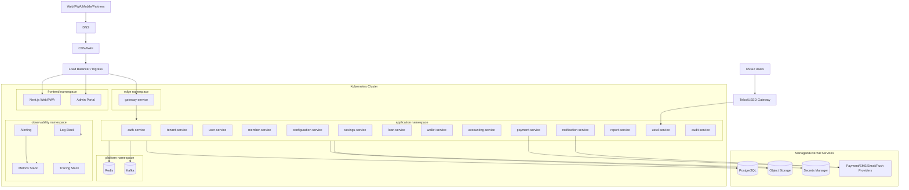
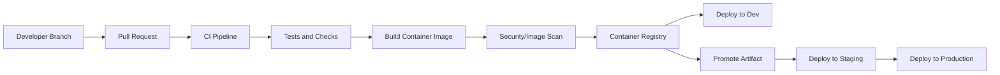
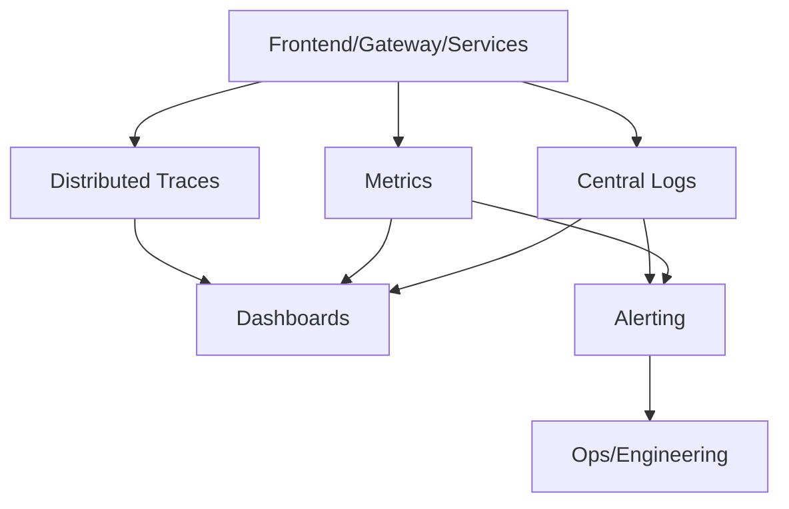

# Deployment Architecture

## 1. Purpose

This document defines the deployment architecture for the SACCO platform. It covers local development, containerization, Kubernetes production topology, environments, CI/CD, secrets, database deployment assumptions, observability, backup/recovery, rollback strategy, and deployment safety.

The platform target stack includes:

- Next.js frontend applications
- Spring Boot microservices
- API Gateway
- PostgreSQL
- Redis
- Kafka
- Object storage
- Docker
- Kubernetes-ready production deployment

This document does not generate implementation code or deployment manifests.

## 2. Deployment Goals

- Support independently deployable microservices.
- Support local development with Docker Compose.
- Support production deployment on Kubernetes.
- Preserve tenant isolation and service boundaries.
- Provide safe CI/CD workflows.
- Protect secrets and credentials.
- Enable horizontal scaling of stateless services.
- Support reliable migrations, backups, restore, monitoring, and rollback.
- Provide operational visibility across gateway, services, databases, Kafka, Redis, and integrations.

## 3. Environment Strategy

The platform shall use separate environments with isolated configuration, secrets, databases, and provider credentials.

| Environment | Purpose | Notes |
| --- | --- | --- |
| Local | Developer workflow | Docker Compose, local services, test providers |
| Development | Shared integration | Frequent deployments, test data |
| QA/Test | Functional and integration validation | Automated tests and manual QA |
| Staging | Production-like release validation | Mirrors production topology as closely as possible |
| Production | Live tenant/member traffic | Strict controls, monitored deployments |
| Disaster Recovery | Business continuity | Restored/replicated critical services and data |

## 4. High-Level Deployment Topology

## 5. Local Development Architecture

Local development should use Docker Compose for predictable service startup without requiring a full Kubernetes cluster.

### 5.1 Local Services

Recommended local stack:

- Selected frontend app
- gateway-service
- Active backend services under development
- PostgreSQL
- Redis
- Kafka or lightweight compatible local broker
- Object storage emulator where needed
- Mail/SMS test sink where needed
- Observability-lite tools where useful

### 5.2 Local Development Rules

- Use local/test secrets only.
- Do not connect local development to production databases or production payment providers.
- Seed data must be clearly non-production.
- Developers should be able to run a focused subset of services.
- Local profile behavior must not weaken production security defaults.

## 6. Containerization Strategy

### 6.1 Container Image Rules

Each deployable unit must have its own container image:

- Frontend app image
- gateway-service image
- One image per Spring Boot microservice
- Worker image where separate workers are introduced

Images must be:

- Immutable
- Versioned
- Built through CI
- Scanned for vulnerabilities
- Promoted between environments rather than rebuilt per environment

### 6.2 Image Tagging Strategy

Recommended tags:

- Git commit SHA
- Semantic release tag where applicable
- Environment promotion metadata

Avoid mutable production tags as the only deployment reference.

## 7. Kubernetes Deployment View

### 7.1 Kubernetes Workload Requirements

Each service should define:

- Deployment or StatefulSet where appropriate
- Service
- ConfigMap references
- Secret references
- Resource requests and limits
- Readiness probe
- Liveness probe
- Startup probe where needed
- Horizontal Pod Autoscaler where appropriate
- Pod Disruption Budget for critical services
- NetworkPolicy
- ServiceAccount with least privilege

### 7.2 Namespace Strategy

| Namespace | Contents |
| --- | --- |
| `edge` | API gateway, ingress-facing edge services |
| `frontend` | Web/PWA apps, admin/member portals |
| `application` | Spring Boot business services |
| `platform` | Redis, Kafka, platform runtime dependencies if self-managed |
| `data` | Database operators or internal data services if self-managed |
| `observability` | Logs, metrics, tracing, dashboards, alerting |
| `security` | Secret sync controllers, policy agents where used |

### 7.3 Service Scaling Priorities

| Service | Scaling Trigger |
| --- | --- |
| gateway-service | API request throughput, latency |
| auth-service | Login/token volume |
| ussd-service | USSD session spikes |
| payment-service | Callback bursts, provider latency |
| notification-service | Dispatch queue volume |
| report-service | Projection lag, export jobs |
| savings/loan/wallet services | Transaction throughput and latency |
| accounting-service | Ledger posting backlog |
| audit-service | Audit event ingestion backlog |

## 8. API Gateway and Ingress

The gateway is the external API entry point. Ingress or load balancer routes traffic to frontend apps and gateway endpoints.

### 8.1 Edge Controls

- TLS termination
- WAF/CDN where available
- API route policy
- Tenant domain/subdomain routing
- Rate limiting
- Request size limits
- Partner allowlists where required
- Provider callback routing
- Correlation ID generation

### 8.2 Routing Model

| Traffic | Target |
| --- | --- |
| Web/PWA pages | Next.js frontend app |
| Admin portal pages | Admin frontend app |
| Public APIs | gateway-service |
| Partner APIs | gateway-service with partner policy |
| Payment webhooks | gateway-service to payment-service |
| USSD callbacks | ussd-service or gateway-to-ussd route depending provider |

## 9. Configuration and Secrets

### 9.1 Configuration Rules

Configuration must be environment-specific and externalized.

Examples:

- API base URLs
- Keycloak/OIDC issuer URLs
- Keycloak realm and client identifiers
- Database connection endpoints
- Kafka broker endpoints
- Redis endpoints
- Object storage buckets
- Feature flags
- Rate limit values
- Provider endpoint URLs

### 9.2 Secret Rules

Secrets must never be committed to source control.

Secrets include:

- Database passwords
- JWT signing keys/private keys
- OAuth/client secrets
- Keycloak admin/service account credentials
- Payment provider credentials
- SMS/email provider credentials
- Encryption keys
- Webhook signing secrets

Recommended storage:

- Managed secrets manager where available
- Kubernetes secrets synchronized from secrets manager
- Encrypted secret storage for lower environments

### 9.3 Rotation

Secrets must support rotation without unsafe downtime. Critical credentials should have documented rotation procedures.

## 10. Database Deployment Architecture

PostgreSQL is the primary system of record. Production should prefer managed PostgreSQL or an operationally mature HA PostgreSQL setup.

### 10.1 Production Database Requirements

- Automated backups
- Point-in-time recovery where supported
- Encryption at rest
- TLS in transit where supported
- Read replicas where useful
- Monitoring and alerting
- Connection pooling
- Restricted network access
- Service-specific credentials

### 10.2 Database Access Rules

- Services use only their own credentials.
- Services access only owned schemas/databases.
- Cross-service database access is forbidden.
- Reporting workloads use reporting projections or approved read replicas.
- Migrations are service-owned and gated in CI/CD.

### 10.3 Migration Safety

Database migrations must:

- Run before or during deployment according to release strategy.
- Be backward-compatible for rolling deployments.
- Avoid long locks on high-volume tables.
- Be tested in lower environments.
- Include rollback or mitigation plans.
- Be monitored in production.

## 11. Redis Deployment

Redis may be used for:

- USSD session state
- Tenant configuration cache
- Feature flag cache
- Rate limit counters
- Short-lived authorization metadata
- App coordination where approved

Redis must not become the authoritative source for financial balances or transaction state.

Production Redis should support:

- Authentication
- TLS where available
- Persistence settings aligned with use case
- Monitoring
- Memory limits and eviction policy
- High availability where required

## 12. Kafka Deployment

Kafka is used for durable asynchronous communication where necessary.

### 12.1 Kafka Responsibilities

- Domain event propagation
- Payment outcome propagation
- Notification triggers
- Audit event transport
- Reporting projections
- Outbox publishing
- Saga progress events

### 12.2 Kafka Requirements

- Topic naming standards
- Event versioning
- Tenant-aware partition keys
- Consumer group naming standards
- Consumer lag monitoring
- Dead letter topics
- Retention policies
- Replay procedures
- Access control where available

Kafka should be managed with strong operational discipline. If self-managed, cluster operations must be explicitly staffed and monitored.

## 13. Object Storage Deployment

Object storage is required for:

- KYC documents
- Profile photos
- Loan attachments
- Generated statements
- Report exports
- Audit exports
- Tenant branding assets

Requirements:

- Tenant-scoped object keys
- Encryption at rest
- Access-controlled buckets/containers
- Signed URL strategy where applicable
- Malware scanning for uploaded files
- Retention lifecycle policies
- Audit logging for sensitive file access

## 14. CI/CD Pipeline Architecture

### 14.1 CI Requirements

CI should run:

- Formatting/linting checks
- Type checks where applicable
- Unit tests
- Integration tests where feasible
- Contract tests
- Security/dependency scans
- Container build
- Container vulnerability scan
- OpenAPI validation
- Migration validation where applicable

### 14.2 CD Requirements

CD should support:

- Environment-specific deployment approvals
- Artifact promotion
- Rolling deployments
- Blue-green or canary for high-risk services where mature
- Automated smoke tests
- Rollback procedures
- Deployment audit trail

## 15. Release Strategy

### 15.1 Deployment Modes

| Mode | Use Case |
| --- | --- |
| Rolling deployment | Default stateless service update |
| Blue-green deployment | High-risk gateway/frontend/service releases |
| Canary deployment | Risk-controlled gradual rollout |
| Manual approval deployment | Production and financial-service releases |

### 15.2 Feature Flags

Feature flags should be used for:

- New frontend modules
- Tenant-specific feature rollout
- New workflows
- New provider integrations
- Controlled API behavior changes

Feature flags must not bypass authorization, tenant isolation, audit, or financial integrity rules.

## 16. Rollback Strategy

Rollback must consider application, database, event, and frontend compatibility.

### 16.1 Rollback Rules

- Container rollback must use previously promoted immutable images.
- Database migrations must be backward-compatible wherever possible.
- Breaking database changes require phased release.
- Event schema changes must be backward-compatible or versioned.
- Mobile API rollback must account for clients already in the field.
- Provider callback handling must remain compatible during rollback.

### 16.2 Rollback Decision Points

Rollback should be considered when:

- Error rate rises above threshold.
- Payment callbacks fail or duplicate unexpectedly.
- Ledger posting fails unexpectedly.
- Login/auth is degraded.
- Tenant isolation issue is suspected.
- Data corruption risk is detected.

Financial data issues may require repair workflows rather than simple application rollback.

## 17. Observability Deployment

Observability must be deployed as a first-class platform capability.

### 17.1 Required Dashboards

- Platform overview
- API gateway health
- Service health
- Authentication health
- Payment health
- Kafka health
- Database health
- Redis health
- USSD traffic
- Notification delivery
- Loan and savings workflow health
- Wallet transaction health
- Accounting posting health
- Audit pipeline health
- Tenant activity

### 17.2 Required Alerts

- Service unavailable
- High error rate
- High latency
- Database saturation
- Redis memory pressure
- Kafka consumer lag
- Dead letter growth
- Payment callback failures
- Ledger posting failures
- Audit backlog
- Backup failure
- Replication lag
- Disk pressure
- Suspicious auth failures

## 18. Backup and Recovery

### 18.1 Backup Scope

Backups must cover:

- PostgreSQL databases
- Object storage
- Configuration
- Secrets recovery process
- Kafka retention/replay plan
- Deployment manifests/configuration
- Generated reports where retention requires

### 18.2 Recovery Requirements

Recovery must be tested through restore drills. Restore tests should verify:

- Tenant isolation remains intact.
- Financial ledger consistency.
- Payment status integrity.
- Outbox/inbox recovery behavior.
- Audit event availability.
- Reporting projection rebuild capability.

### 18.3 Recovery Targets

Final RTO/RPO must be approved by business stakeholders. Financial transaction services should plan for low RPO and fast RTO due to business criticality.

## 19. Disaster Recovery

DR planning should define:

- Recovery region or environment
- Database restore/replication approach
- Object storage recovery
- DNS failover process
- Secrets restoration
- Kafka/event replay approach
- Runbooks
- DR test frequency
- Communication process

Reports and notifications may recover asynchronously. Payment, wallet, savings, loans, accounting, auth, and gateway require higher priority recovery.

## 20. Network and Security Architecture

### 20.1 Network Segmentation

- Public ingress only through approved load balancer/ingress.
- Backend services are private inside the cluster/network.
- Databases are not publicly accessible.
- Kafka, Redis, and PostgreSQL access is restricted to authorized services.
- Network policies should restrict service-to-service traffic.

### 20.2 Service Security

- Use least-privilege service accounts.
- Use service-specific database credentials.
- Use private network paths for internal traffic.
- Use TLS/mTLS where supported and operationally mature.
- Apply WAF/rate limiting on public endpoints.
- Scan images and dependencies.
- Avoid running containers as root where possible.

## 21. Frontend Deployment

Frontend deployment must support:

- Next.js web/admin/member apps
- Tenant-aware routing
- Static asset caching through CDN
- PWA manifest and service worker delivery
- Environment-specific API base configuration
- Safe rollback of frontend bundles
- Monitoring of route load failures and API error rates

The PWA must not cache financial transaction finalization logic. Offline behavior must remain safe and read-only/draft-only as defined in the frontend specification.

## 22. USSD Deployment

USSD-service must be deployed for low-latency and high-concurrency session workloads.

Requirements:

- Horizontally scalable service replicas
- Short-lived Redis-backed session state
- Provider callback endpoint availability
- Idempotency for transaction requests
- Timeout-aware service calls
- Clear degraded-mode responses
- Monitoring of session starts, completions, expirations, and failures

## 23. Payment Provider Deployment Considerations

Payment-service must be highly available for callbacks.

Requirements:

- Stable callback URLs
- Provider allowlisting/signature validation
- Fast durable callback capture
- Idempotent callback handling
- Dead letter and repair workflows
- Reconciliation dashboards
- Alerting for callback failures and settlement discrepancies

## 24. Production Readiness Checklist

Before production deployment, verify:

- Environment separation is complete.
- Secrets are stored securely.
- Gateway routing and rate limits are configured.
- Tenant resolution is tested.
- Service health/readiness/liveness probes are configured.
- Resource requests and limits are defined.
- Autoscaling rules are defined for critical services.
- Database migrations are tested.
- Backups and restore drills are complete.
- Observability dashboards are available.
- Alerts are routed to responsible teams.
- Payment callbacks are tested.
- USSD callbacks are tested.
- Audit pipeline is tested.
- Rollback procedure is documented.
- DR procedure is documented.
- Security scans are passing.

## 25. Recommended Deployment Roadmap

### Phase 1: Local and Shared Development

- Docker Compose for local stack.
- Initial gateway, tenant, auth, user, member services.
- Local PostgreSQL, Redis, Kafka.
- Basic CI checks.

### Phase 2: QA/Staging Foundation

- Kubernetes namespace structure.
- Container registry.
- Automated deployments to dev/QA.
- Database migration pipeline.
- Observability baseline.

### Phase 3: Production Readiness

- Managed PostgreSQL/Redis/Kafka decisions finalized.
- Secrets management.
- Backup/restore testing.
- Autoscaling policies.
- Alerting and runbooks.
- Payment and USSD provider connectivity.

### Phase 4: Production Operations

- Controlled release process.
- DR drills.
- Capacity testing.
- Security review.
- Operational handover.

## 26. Summary

The SACCO deployment architecture uses Docker for packaging, Docker Compose for local development, Kubernetes-ready service deployment, PostgreSQL for transactional data, Redis for short-lived cache/session workloads, Kafka for asynchronous event processing, and a full observability and recovery model.

The deployment design preserves service independence, tenant isolation, financial integrity, auditability, scalability, and operational safety across development, staging, production, and disaster recovery environments.
