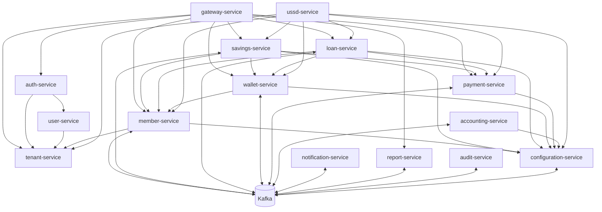

# Module Mapping

## 1. Purpose

This document maps SACCO platform functional modules to their owning services, APIs, databases, events, frontend areas, channels, and operational concerns. It is intended to help the team avoid duplication, prevent service-boundary drift, coordinate frontend/backend workstreams, and guide implementation planning.

This document does not generate implementation code.

## 2. Mapping Principles

- Every functional module must have a clear owning backend service.
- Every business fact must have one source of truth.
- Frontend modules may display data from many services, but they do not own backend state.
- Cross-service communication must use APIs or events, not shared database access.
- Financial workflows must include idempotency, audit, transaction references, reconciliation, and outbox/inbox where required.
- Reporting modules consume projections and events; they do not become sources of truth.
- USSD, PWA, mobile app, admin portal, and member portal are channels over the same business services.

## 3. High-Level Module Ownership

| Functional Module | Owning Service | Primary Data Owner | Primary Frontend Area |
| --- | --- | --- | --- |
| Tenant management | tenant-service | tenant-service | Admin portal |
| Authentication | auth-service plus Keycloak/IAM provider | auth-service and selected IAM provider | Shared auth UI |
| Users and roles | user-service | user-service | Admin portal |
| Member management | member-service | member-service | Admin/staff portal, member portal |
| KYC and documents | member-service | member-service plus object storage metadata | Staff portal, member portal |
| Savings | savings-service | savings-service | Staff portal, member portal |
| Loans | loan-service | loan-service | Staff portal, member portal |
| Wallet | wallet-service | wallet-service | Staff portal, member portal |
| Accounting | accounting-service | accounting-service | Admin/staff portal |
| Payments | payment-service | payment-service | Staff portal, member portal |
| Notifications | notification-service | notification-service | Admin portal, member portal |
| Reports | report-service | report-service projections | Admin/staff portal, member portal |
| USSD | ussd-service | ussd-service | Admin portal for configuration, USSD channel for members |
| Audit | audit-service | audit-service | Admin/staff portal |
| Configuration | configuration-service | configuration-service | Admin portal |
| Gateway/API edge | gateway-service | gateway-service operational state only | All channels |

## 4. Channel to Module Mapping

| Channel | Modules Used | Notes |
| --- | --- | --- |
| Admin portal | Tenant, users, roles, configuration, products, accounting, reports, audit, USSD config | Broadest operational access |
| Staff portal | Members, KYC, savings, loans, wallet, payments, approvals, reconciliation | Tenant-scoped SACCO operations |
| Member web/PWA | Profile, KYC status, savings, loans, wallet, payments, statements, notifications | Self-service only |
| Mobile app | Member self-service modules through shared APIs or mobile aggregation | Must not bypass service auth |
| USSD | Auth/member validation, savings, loans, wallet, payments, notifications | Menu/session adapter only |
| Partners | Approved member/payment/loan/payment status APIs | Strict scopes and rate limits |

## 5. Service Dependency Map

## 6. Module Detail Mapping

### 6.1 Tenant Management

| Area | Mapping |
| --- | --- |
| Owning service | tenant-service |
| Source of truth | Tenant identity, status, domains, routing metadata, isolation tier |
| Primary APIs | `/api/v1/tenants/resolve`, `/api/v1/admin/tenants` |
| Primary data | Tenant profile, domains, status history, routing metadata |
| Events | TenantCreated, TenantActivated, TenantSuspended, TenantDomainConfigured |
| Frontend | Admin portal tenant registry and tenant profile |
| Channels | Admin only, gateway resolution for all channels |
| Critical controls | Global domain uniqueness, tenant status enforcement, audit |

### 6.2 Authentication

| Area | Mapping |
| --- | --- |
| Owning service | auth-service as platform facade; Keycloak or equivalent OIDC/OAuth2 IAM provider for identity-provider capabilities |
| Source of truth | IAM provider for credentials/OIDC clients/token signing keys; auth-service for platform session metadata, auth audit coordination, and integration state where required |
| Primary APIs | Login, logout, token refresh, MFA, password reset/change |
| Primary data | IAM account references, session metadata, login attempts, MFA challenge references, token/session integration state |
| Events | UserAuthenticated, UserAuthenticationFailed, SessionRevoked, MfaChallengeCompleted |
| Frontend | Shared auth screens for admin/staff/member channels |
| Channels | Web, PWA, mobile, USSD where configured |
| Critical controls | Credential security, refresh token rotation, MFA, audit |

### 6.3 Users, Roles, and Permissions

| Area | Mapping |
| --- | --- |
| Owning service | user-service |
| Source of truth | Users, roles, permissions, branch scopes |
| Primary APIs | `/api/v1/users/me`, `/api/v1/admin/users`, `/api/v1/admin/roles` |
| Primary data | Users, roles, permissions, assignments, access scopes |
| Events | UserCreated, UserDisabled, UserRoleChanged, PermissionChanged |
| Frontend | Admin portal users/roles; shared permission-aware navigation |
| Channels | Admin/staff primarily |
| Critical controls | Authorization, segregation of duties, cache invalidation, audit |

### 6.4 Member Management and KYC

| Area | Mapping |
| --- | --- |
| Owning service | member-service |
| Source of truth | Member profile, KYC, lifecycle, member document metadata |
| Primary APIs | `/api/v1/staff/members`, `/api/v1/member/profile`, `/api/v1/member/kyc/status` |
| Primary data | Member profile, KYC records, status history, document metadata |
| Events | MemberRegistered, MemberKycSubmitted, MemberKycVerified, MemberSuspended |
| Frontend | Staff member management, member profile/KYC self-service |
| Channels | Staff, member web/PWA/mobile, USSD identity lookup |
| Critical controls | Tenant-scoped member numbers, KYC audit, sensitive data masking |

### 6.5 Savings

| Area | Mapping |
| --- | --- |
| Owning service | savings-service |
| Source of truth | Savings products, accounts, contributions, withdrawals, holds |
| Primary APIs | `/api/v1/admin/savings/products`, `/api/v1/staff/savings/accounts`, `/api/v1/member/savings/accounts` |
| Primary data | Savings products, accounts, transactions, withdrawals, holds |
| Events | SavingsAccountOpened, SavingsContributionPosted, WithdrawalRequested, WithdrawalPosted |
| Frontend | Staff savings operations, member savings dashboard |
| Channels | Staff, member web/PWA/mobile, USSD |
| Critical controls | Idempotency, account state, withdrawal approvals, accounting-pending handling |

### 6.6 Loans

| Area | Mapping |
| --- | --- |
| Owning service | loan-service |
| Source of truth | Loan products, applications, approvals, accounts, schedules, repayments |
| Primary APIs | `/api/v1/admin/loans/products`, `/api/v1/staff/loans/applications`, `/api/v1/member/loans/applications` |
| Primary data | Loan products, applications, approval records, loan accounts, schedules, repayments |
| Events | LoanApplicationSubmitted, LoanApproved, LoanDisbursed, LoanRepaymentApplied |
| Frontend | Staff loan operations, member loan applications/repayments |
| Channels | Staff, member web/PWA/mobile, USSD |
| Critical controls | Approval workflow, disbursement saga, repayment idempotency, audit |

### 6.7 Wallet

| Area | Mapping |
| --- | --- |
| Owning service | wallet-service |
| Source of truth | Wallet accounts, balances, holds, wallet transactions |
| Primary APIs | `/api/v1/member/wallet`, `/api/v1/member/wallet/transfers`, `/api/v1/staff/wallet/accounts` |
| Primary data | Wallet accounts, balance records, transactions, holds, transfers |
| Events | WalletHoldPlaced, WalletDebitCompleted, WalletCreditCompleted, WalletTransferCompleted |
| Frontend | Member wallet, staff wallet support/reconciliation |
| Channels | Member web/PWA/mobile, staff, USSD |
| Critical controls | Double-spend prevention, holds, transfer atomicity, reversals |

### 6.8 Accounting

| Area | Mapping |
| --- | --- |
| Owning service | accounting-service |
| Source of truth | Chart of accounts, journals, ledger entries, accounting periods |
| Primary APIs | `/api/v1/admin/accounting/chart-of-accounts`, `/api/v1/admin/accounting/ledger` |
| Primary data | Accounts, journals, ledger entries, mappings, reversals |
| Events | LedgerEntryPosted, LedgerPostingFailed, LedgerEntryReversed |
| Frontend | Admin/staff accounting screens |
| Channels | Admin/staff only |
| Critical controls | Append-only ledger, balanced journals, reversals, period controls |

### 6.9 Payments

| Area | Mapping |
| --- | --- |
| Owning service | payment-service |
| Source of truth | Payment requests, callbacks, provider references, settlements |
| Primary APIs | `/api/v1/payments/collections`, `/api/v1/payments/payouts`, `/api/v1/webhooks/payments/{provider}` |
| Primary data | Payment requests, attempts, callbacks, settlements, reconciliation |
| Events | PaymentInitiated, PaymentCallbackReceived, PaymentConfirmed, PaymentFailed |
| Frontend | Payment status, exceptions, reconciliation queues |
| Channels | Member, staff, partner, provider callbacks, USSD |
| Critical controls | Callback dedupe, provider validation, idempotency, unapplied payment repair |

### 6.10 Notifications

| Area | Mapping |
| --- | --- |
| Owning service | notification-service |
| Source of truth | Templates, dispatch records, delivery status |
| Primary APIs | `/api/v1/admin/notifications/templates`, `/api/v1/member/notifications` |
| Primary data | Templates, delivery logs, provider attempts, preferences |
| Events | NotificationDispatched, NotificationDelivered, NotificationFailed |
| Frontend | Admin templates/logs, member notifications |
| Channels | SMS, email, push, in-app, USSD responses where applicable |
| Critical controls | Template versioning, provider abstraction, no financial rollback on failure |

### 6.11 Reporting

| Area | Mapping |
| --- | --- |
| Owning service | report-service |
| Source of truth | Reporting projections and export metadata only |
| Primary APIs | `/api/v1/admin/reports/exports`, `/api/v1/admin/reports/dashboards/platform` |
| Primary data | Projections, export jobs, dashboard snapshots |
| Events | ReportExportRequested, ReportExportCompleted, ReportAccessed |
| Frontend | Admin/staff reports, member statements |
| Channels | Admin/staff/member |
| Critical controls | Projection freshness, async exports, tenant-scoped access, audit |

### 6.12 USSD

| Area | Mapping |
| --- | --- |
| Owning service | ussd-service |
| Source of truth | USSD sessions, menus, session transaction requests |
| Primary APIs | `/api/v1/ussd/callbacks/{provider}`, `/api/v1/admin/ussd/menus` |
| Primary data | Sessions, menu definitions, auth attempts, request references |
| Events | UssdSessionStarted, UssdTransactionRequested, UssdTransactionCompleted |
| Frontend | Admin USSD configuration; USSD channel for members |
| Channels | USSD telco/aggregator |
| Critical controls | Short session handling, idempotency, tenant short-code routing, timeout behavior |

### 6.13 Audit

| Area | Mapping |
| --- | --- |
| Owning service | audit-service |
| Source of truth | Immutable audit events |
| Primary APIs | `/api/v1/admin/audit/events`, `/api/v1/admin/audit/exports` |
| Primary data | Audit records, audit exports, retention metadata |
| Events | AuditEventStored, AuditExportRequested, AuditExportCompleted |
| Frontend | Admin/staff audit search and detail |
| Channels | All services produce audit events |
| Critical controls | Immutability, sensitive value masking, long retention, searchability |

### 6.14 Configuration

| Area | Mapping |
| --- | --- |
| Owning service | configuration-service |
| Source of truth | Tenant rules, workflows, fees, limits, branding, feature flags |
| Primary APIs | `/api/v1/configuration/tenant`, `/api/v1/admin/configuration/...` |
| Primary data | Feature flags, workflows, branding, fees, limits, rule versions |
| Events | TenantConfigurationChanged, FeatureFlagChanged, WorkflowDefinitionChanged |
| Frontend | Admin settings, shared tenant branding/config |
| Channels | All channels consume selected config |
| Critical controls | Versioning for financial rules, audit, cache invalidation |

## 7. Functional Workflow Mapping

| Workflow | Primary Owner | Supporting Services | Channel Entry Points |
| --- | --- | --- | --- |
| Member registration | member-service | tenant-service, configuration-service, notification-service, audit-service | Staff, member web/PWA/mobile |
| KYC verification | member-service | audit-service, notification-service | Staff portal |
| Savings contribution | savings-service | payment-service, accounting-service, notification-service, report-service, audit-service | Member, staff, USSD |
| Withdrawal processing | savings-service | wallet-service, payment-service, accounting-service, notification-service, audit-service | Member, staff, USSD |
| Loan application | loan-service | member-service, configuration-service, notification-service, audit-service | Member, staff, USSD where enabled |
| Loan approval | loan-service | user-service, configuration-service, audit-service, notification-service | Staff/admin |
| Loan disbursement | loan-service | wallet-service, payment-service, accounting-service, notification-service, audit-service | Staff/admin |
| Loan repayment | loan-service | payment-service, accounting-service, notification-service, audit-service | Member, staff, USSD, partner |
| Wallet transfer | wallet-service | accounting-service, notification-service, audit-service | Member, staff, USSD |
| Payment callback | payment-service | target domain service, accounting-service, audit-service, report-service | Provider webhook |
| Report export | report-service | object storage, notification-service, audit-service | Admin/staff/member |
| USSD session | ussd-service | tenant-service, configuration-service, member-service, financial services | USSD |

## 8. API Segment Mapping

| API Segment | Main Modules |
| --- | --- |
| `/api/v1/admin/...` | Tenants, users, roles, configuration, products, accounting, reports, audit, USSD config |
| `/api/v1/staff/...` | Members, KYC, savings operations, loan operations, wallet support, payments, reconciliation |
| `/api/v1/member/...` | Profile, savings, loans, wallet, payments, notifications, statements |
| `/api/v1/mobile/...` | Mobile device registration and mobile-optimized member aggregations |
| `/api/v1/ussd/...` | USSD callbacks, sessions, menus |
| `/api/v1/partners/...` | Approved partner payment/member/repayment integrations |
| `/api/v1/webhooks/...` | Provider callbacks |
| `/internal/v1/...` | Private service-to-service APIs |

## 9. Database Schema Mapping

| Service | Recommended Schema | Notes |
| --- | --- | --- |
| auth-service | `auth` | Platform auth metadata, session references, login attempts, IAM integration records; Keycloak/IAM owns core credentials where used |
| tenant-service | `tenant` | Tenant identity, domains, status |
| user-service | `iam` | Users, roles, permissions |
| member-service | `member` | Member profile, KYC, lifecycle |
| savings-service | `savings` | Products, accounts, transactions, withdrawals |
| loan-service | `loan` | Products, applications, accounts, schedules |
| wallet-service | `wallet` | Wallet accounts, balances, holds, transactions |
| accounting-service | `accounting` | Chart, journals, ledger |
| payment-service | `payment` | Requests, callbacks, settlements |
| notification-service | `notification` | Templates, dispatches, delivery |
| report-service | `reporting` | Projections, exports |
| ussd-service | `ussd` | Sessions, menus, diagnostics |
| audit-service | `audit` | Immutable audit events |
| configuration-service | `configuration` | Rules, workflows, flags, branding |

## 10. Event Mapping

| Event Family | Owner | Typical Consumers |
| --- | --- | --- |
| Tenant events | tenant-service | gateway-service, auth-service, configuration-service, audit-service |
| User/access events | user-service | auth-service, audit-service |
| Member events | member-service | notification-service, report-service, audit-service, loan-service |
| Savings events | savings-service | accounting-service, notification-service, report-service, audit-service |
| Loan events | loan-service | wallet-service, payment-service, accounting-service, notification-service, report-service, audit-service |
| Wallet events | wallet-service | accounting-service, notification-service, report-service, audit-service |
| Payment events | payment-service | savings-service, loan-service, wallet-service, accounting-service, notification-service, report-service, audit-service |
| Accounting events | accounting-service | report-service, audit-service |
| Notification events | notification-service | report-service, audit-service where required |
| USSD events | ussd-service | audit-service, report-service, notification-service |
| Configuration events | configuration-service | gateway-service, domain services, frontend cache invalidation, audit-service |

## 11. Frontend Module Mapping

| Frontend Module | Backend Modules | Shared Concerns |
| --- | --- | --- |
| Auth screens | auth-service, tenant-service, user-service | Tenant branding, MFA, session handling |
| Dashboard | report-service, audit-service, domain services | Role-aware metrics, projections |
| Members | member-service | KYC, documents, audit timeline |
| Savings | savings-service, payment-service, accounting-service | Transaction status, idempotency, statements |
| Loans | loan-service, payment-service, wallet-service, accounting-service | Application/approval/disbursement/repayment status |
| Wallet | wallet-service, accounting-service | Transfer status, holds, transaction history |
| Payments | payment-service | Provider references, reconciliation |
| Accounting | accounting-service | Ledger, journals, trial balance |
| Reports | report-service | Async exports, freshness metadata |
| Notifications | notification-service | Templates, delivery logs, preferences |
| USSD admin | ussd-service, configuration-service | Menus, sessions, limits |
| Settings/configuration | configuration-service, tenant-service | Branding, workflows, fees, limits |
| Audit | audit-service | Search, exports, sensitive access controls |

## 12. Ownership Split for Collaboration

| Owner | Primary Scope | Shared Coordination Needed |
| --- | --- | --- |
| Member/customer workstream | Member portal, PWA, mobile app journeys, USSD member flows | Shared API contracts, auth, tenant branding, member/savings/loan/wallet APIs |
| Admin/staff workstream | Admin portal, staff workflows, setup, approvals, reports, accounting, audit | Shared UI, permissions, configuration, product and workflow APIs |
| Backend/platform workstream | Services, database, gateway, integrations, deployment | All API contracts and operational standards |

## 13. Implementation Priority Mapping

### Phase 1: Platform Foundation

| Module | Services |
| --- | --- |
| Tenant, auth, users | tenant-service, auth-service, user-service, gateway-service |
| Member foundation | member-service |
| Configuration foundation | configuration-service |
| Frontend shell | shared frontend, admin/member shells |

### Phase 2: Savings and Wallet

| Module | Services |
| --- | --- |
| Savings | savings-service |
| Wallet | wallet-service |
| Payments foundation | payment-service |
| Notifications | notification-service |
| Accounting foundation | accounting-service |

### Phase 3: Loans and Channels

| Module | Services |
| --- | --- |
| Loans | loan-service |
| Reports | report-service |
| USSD | ussd-service |
| Audit exports and advanced reconciliation | audit-service, payment-service, accounting-service |

## 14. Boundary Risk Matrix

| Risk | Example | Prevention |
| --- | --- | --- |
| Frontend owns business rules | PWA computes loan eligibility as source of truth | Backend loan-service owns eligibility |
| Shared database coupling | loan-service reads savings tables directly | Use APIs/events/read models |
| Payment logic leaks | savings-service parses provider callback payload | payment-service normalizes payment events |
| Reporting becomes source of truth | report-service updates member status | Source service owns writes |
| USSD owns financial state | ussd-service posts balances directly | USSD calls core services |
| Accounting mutates source workflows | accounting-service changes loan repayment status | Source domain owns transaction state |
| Tenant leakage | Queries omit tenant scope | Tenant guard, indexed tenant queries, tests |

## 15. Production Readiness Use

Before implementing a module, confirm:

- Owning service is identified.
- Source-of-truth data is clear.
- API segment is clear.
- Tenant isolation rules are defined.
- Events and consumers are known.
- Idempotency is defined for financial commands.
- Audit requirements are known.
- Reporting projection needs are known.
- Frontend channel ownership is clear.
- Tests and deployment concerns are identified.

## 16. Summary

This module mapping document connects business modules to backend services, APIs, data ownership, events, UI surfaces, and implementation phases. It should be used as a quick reference before building or changing any module so the platform remains decoupled, tenant-safe, financially correct, and easy for multiple developers to work on without collision.
