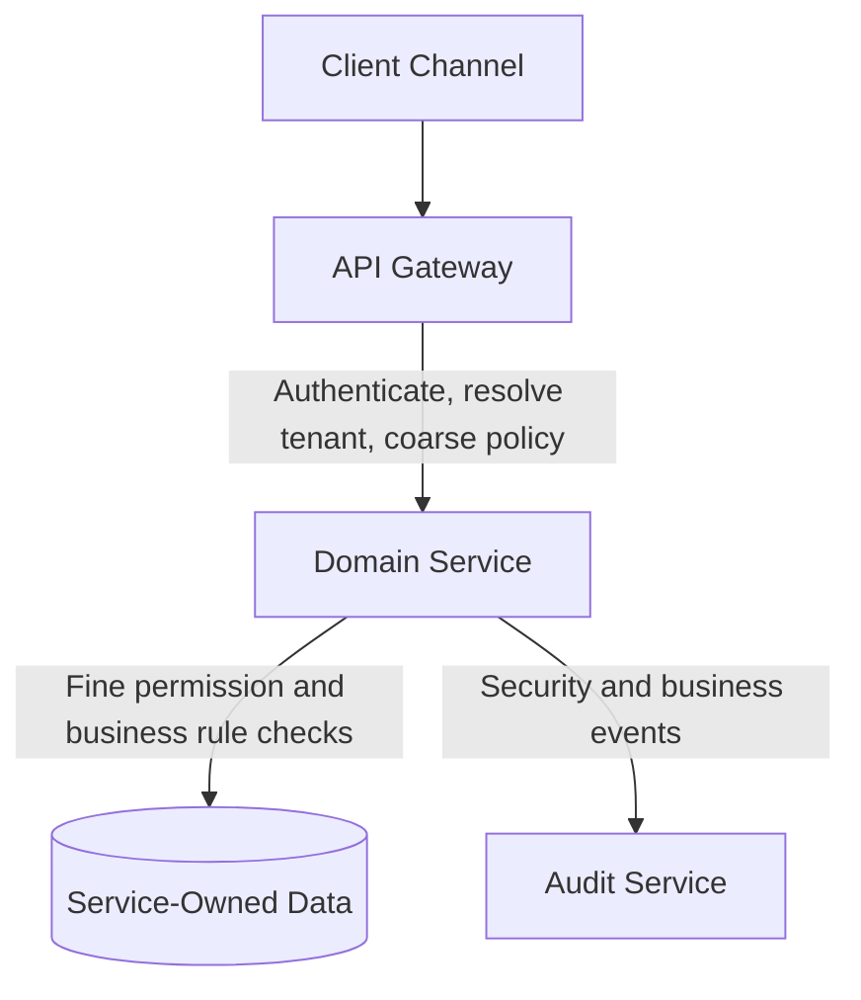

# Security Architecture

## 1. Purpose

This document defines the security architecture for the SACCO platform. It translates the platform architecture into enforceable security controls for identity, access, tenancy, APIs, financial workflows, integrations, data protection, observability, incident response, and compliance readiness.

The platform handles financial records, member personal data, authentication credentials, payment callbacks, and audit evidence. Security must therefore be treated as a core architecture concern, not as a final implementation task.

This document does not generate implementation code.

## 2. Security Objectives

- Protect member, tenant, staff, and financial data.
- Prevent cross-tenant data leakage.
- Enforce least privilege for administrators, staff, members, services, and partners.
- Protect all financial commands from replay, tampering, duplicate posting, and unauthorized execution.
- Preserve immutable audit trails for high-risk actions.
- Secure public APIs, mobile APIs, PWA traffic, USSD callbacks, partner APIs, and provider webhooks.
- Provide monitoring, alerting, and incident response readiness.
- Support enterprise review, compliance preparation, and future penetration testing.

## 3. Security Principles

- Deny by default.
- Authenticate before authorization.
- Authorize at gateway and service layers.
- Never trust client-supplied tenant context without validation.
- Never trust provider callbacks without signature, source, and duplicate validation.
- Keep domain services responsible for enforcing their own business authorization.
- Use short-lived access tokens and controlled refresh tokens.
- Use idempotency and immutable transaction references for financial commands.
- Store secrets outside source code and container images.
- Mask sensitive values in logs, audit records, traces, and exports.
- Prefer explicit permissions over broad role assumptions.
- Treat internal service traffic as untrusted unless authenticated and authorized.

## 4. Threat Model Summary

| Threat | Example | Required Controls |
| --- | --- | --- |
| Tenant data leakage | User from tenant A reads tenant B member data | Tenant resolution, tenant guards, tenant-scoped indexes, authorization tests |
| Credential compromise | Staff password stolen | MFA, session revocation, suspicious login detection, audit |
| Privilege escalation | Staff user performs admin-only approval | RBAC/ABAC checks, maker-checker, permission cache invalidation |
| Duplicate financial posting | Repeated loan repayment callback | Idempotency key, provider reference dedupe, ledger constraints |
| Callback spoofing | Fake payment callback sent to webhook | Signature validation, allowlisting, provider reference verification |
| Replay attack | Old request resent to execute withdrawal again | Idempotency, timestamp windows, nonce/reference validation |
| API abuse | High-volume scraping or brute force | Rate limits, WAF, lockouts, anomaly alerts |
| Data exfiltration | Reports exported by unauthorized user | Export authorization, audit, object storage access expiry |
| Insider misuse | Admin views sensitive member records unnecessarily | Fine permissions, audit search, access reason capture |
| Supply chain risk | Vulnerable dependency deployed | Dependency scanning, image scanning, pinned builds |

## 5. Identity and Authentication Architecture

### 5.1 IAM Provider Strategy

The platform shall use Keycloak as the preferred identity and access management provider, or an equivalent standards-compliant OIDC/OAuth2 IAM service if the final infrastructure decision changes.

Keycloak or the selected IAM provider should own:

- User credential verification.
- OIDC/OAuth2 authorization flows.
- Token signing keys and key rotation.
- Realms, clients, scopes, and identity-provider configuration.
- MFA/OTP integration where supported and selected.
- Service accounts or client credentials for approved machine-to-machine access.
- Identity federation where required in future.

The auth-service remains required as the SACCO platform authentication facade. It owns platform-specific auth orchestration, tenant-aware login coordination, session metadata, auth audit events, channel-specific authentication adaptations, and stable APIs for frontend/mobile/USSD clients. Domain services must not directly implement their own password stores or bypass the IAM/auth-service boundary.

### 5.2 User Categories

| Identity Type | Authentication Model | Notes |
| --- | --- | --- |
| Platform admin | Strong password plus MFA | Highest privilege, strict audit |
| Tenant admin | Strong password plus MFA | Tenant-scoped administration |
| SACCO staff | Password plus optional/required MFA by role | Approval and operational workflows |
| Member | Password/PIN/OTP depending on channel | Self-service only |
| USSD member | MSISDN validation plus PIN/OTP where configured | Short session constraints |
| Partner system | Client credentials, mTLS, signed requests, or API keys | Scoped and rate limited |
| Internal service | Service identity/token or mTLS | Private service-to-service calls |

### 5.3 Token Strategy

- Access tokens must be short-lived.
- Refresh tokens must be rotated and revocable.
- Tokens must carry subject, tenant context, role/permission hints, channel, and expiry.
- Services must not trust permission hints alone for sensitive operations if fresh authorization is required.
- Token revocation must be supported for compromised accounts, disabled users, tenant suspension, and role changes.
- Mobile and PWA clients must handle token refresh without exposing long-lived secrets to JavaScript where avoidable.
- OIDC issuer, audience, signing-key, and claim mapping rules must be validated consistently at the gateway and service boundary.

### 5.4 MFA Strategy

MFA should be required for:

- Platform administrators.
- Tenant administrators.
- Staff users approving financial workflows above configured thresholds.
- Password reset and recovery for privileged accounts.
- Sensitive configuration changes.

Member MFA may be introduced through OTP or device-based verification for withdrawals, wallet transfers, loan disbursement confirmations, or profile changes.

## 6. Authorization Architecture

### 6.1 Authorization Layers

### 6.2 RBAC and ABAC

The platform should combine:

- RBAC for role-based capability assignment.
- ABAC for tenant, branch, channel, amount limit, product, workflow status, and ownership checks.

Examples:

- A staff user may view members only for assigned tenant and branch scope.
- A loan officer may recommend approval but not approve their own originated loan.
- A member may view only their own savings, loan, wallet, statement, and notification records.
- A tenant administrator may configure tenant rules but cannot access another tenant's configuration.

### 6.3 Maker-Checker Controls

Maker-checker is required for:

- Loan approval above configured thresholds.
- Manual financial adjustments.
- Reversals.
- Payment exception repair.
- Accounting period closure.
- High-risk tenant configuration changes.
- Role assignment for privileged permissions.

The same actor must not both initiate and approve the same controlled action unless explicitly permitted by policy for low-risk operations.

## 7. Tenant Isolation Security

Tenant isolation must be enforced across all layers:

| Layer | Enforcement |
| --- | --- |
| Gateway | Tenant resolution from domain/header/token/channel mapping |
| Auth | Token tenant context and tenant status validation |
| Service | Mandatory tenant guard on every tenant-owned command/query |
| Database | Tenant ID columns, indexes, constraints, optional RLS for selected tables |
| Cache | Tenant-prefixed keys |
| Kafka | Tenant metadata in event headers and payloads |
| Object storage | Tenant-partitioned paths/buckets and signed URL controls |
| Logs/traces | Tenant metadata with sensitive data masking |
| Reports | Tenant-scoped projections and export authorization |
| USSD | Short-code/MSISDN/session tenant routing |

Tenant suspension must block member, staff, API, and USSD access except approved administrative remediation flows.

## 8. API Security

### 8.1 Gateway Controls

- TLS termination.
- WAF/CDN integration where available.
- Rate limiting by IP, tenant, user, partner, endpoint, and channel.
- Request size limits.
- Correlation ID creation and propagation.
- Authentication validation for protected endpoints.
- Provider webhook routing and basic source checks.
- Partner allowlisting and quota enforcement.

### 8.2 Service Controls

Each service must:

- Validate authorization independently.
- Validate tenant context.
- Validate DTOs using explicit request models.
- Reject unknown or unsupported command states.
- Enforce idempotency on financial commands.
- Emit audit events for sensitive actions.
- Avoid leaking internal entity structures in API responses.

### 8.3 Rate Limiting

Recommended rate-limit categories:

| Category | Examples |
| --- | --- |
| Authentication | Login, OTP request, password reset |
| Member self-service | Balance, statements, loan eligibility |
| Financial commands | Payments, withdrawals, wallet transfers, loan repayments |
| USSD sessions | Session start, menu navigation, PIN attempts |
| Partners | Payment status, repayment submission, member lookup |
| Admin exports | Reports, audit exports, bulk downloads |

## 9. Financial Security Controls

Financial commands must include:

- Tenant context.
- Actor identity or system identity.
- Channel.
- Correlation ID.
- Idempotency key or equivalent provider reference.
- Immutable business reference.
- Amount and currency validation.
- State transition validation.
- Audit event.
- Outbox event where downstream processing is required.

Financial state changes must not rely on distributed transactions across services. Use sagas, compensating actions, reconciliation, and append-only ledger posting.

## 10. Payment and Webhook Security

Payment provider callbacks must be handled only by the payment service or an approved payment adapter.

Required controls:

- Signature validation.
- Timestamp tolerance where supported.
- Provider allowlisting where practical.
- Duplicate callback detection.
- Provider reference uniqueness.
- Raw callback preservation with sensitive value masking.
- Normalized payment event creation.
- Reconciliation status tracking.
- Manual exception queue for ambiguous outcomes.

Domain services must consume normalized payment outcomes rather than parse raw provider payloads.

## 11. USSD Security

USSD introduces unique constraints because sessions are short, text-based, and routed through telco/aggregator infrastructure.

Required controls:

- Validate provider source.
- Resolve tenant using short code, service code, or provider routing metadata.
- Validate MSISDN format and member ownership.
- Require PIN/OTP for sensitive actions.
- Limit PIN attempts and lock suspicious sessions.
- Keep menu responses short and avoid exposing excessive sensitive data.
- Use idempotent transaction references for financial commands.
- Expire sessions aggressively.
- Audit high-risk USSD actions.

## 12. Frontend Security

Frontend applications must:

- Avoid storing sensitive data in persistent browser storage unless explicitly approved.
- Use secure cookie/session strategies where selected by implementation.
- Use strict Content Security Policy in production.
- Avoid exposing internal API URLs, secrets, provider credentials, or role assumptions.
- Mask sensitive values in UI by default.
- Enforce route guards, but rely on backend authorization as the source of truth.
- Protect forms against duplicate submissions for financial commands.
- Display transaction states clearly to prevent repeated user actions.
- Use tenant branding only from trusted configuration APIs.

## 13. Data Protection

### 13.1 Classification

| Data Type | Classification | Examples |
| --- | --- | --- |
| Public | Low sensitivity | Marketing-safe tenant names where approved |
| Internal | Business-sensitive | Product configuration, workflow settings |
| Confidential | Personal/member data | Member profile, KYC status, contacts |
| Restricted | Financial/security data | Balances, loan records, credentials, tokens, audit records |

### 13.2 Encryption

- Use TLS for data in transit.
- Use encryption at rest for PostgreSQL, object storage, backups, and secret stores.
- Hash passwords with a modern adaptive hashing algorithm.
- Never encrypt passwords reversibly.
- Protect signing keys and encryption keys in a managed secrets/key system.

### 13.3 Masking and Redaction

Mask or redact:

- Passwords, PINs, OTPs, tokens.
- Full identity numbers where not required.
- Full account numbers where not required.
- Full provider credentials and API keys.
- Sensitive callback payload fields.
- Member contact details in broad reports unless needed.

## 14. Secrets Management

Secrets must not be committed to Git, container images, documentation examples with real values, logs, or issue trackers.

Secret categories:

- Database credentials.
- JWT signing keys.
- Payment provider credentials.
- SMS/email/push provider credentials.
- Object storage credentials.
- Encryption keys.
- Partner API credentials.

Production secrets should be managed through a dedicated secrets manager or Kubernetes secret strategy with strict access controls and rotation procedures.

## 15. Audit and Compliance Controls

Audit events are required for:

- Authentication success/failure for privileged users.
- Password, PIN, OTP, and MFA changes.
- Role and permission changes.
- Tenant lifecycle and configuration changes.
- Member creation, KYC verification, suspension, and sensitive profile edits.
- Financial transaction initiation, approval, completion, failure, reversal, and repair.
- Payment callback receipt and reconciliation decisions.
- Report and audit export requests/downloads.
- Manual data corrections.

Audit records must include:

- Tenant ID.
- Actor identity or system identity.
- Action.
- Target resource type and ID.
- Channel.
- Correlation ID.
- Before/after summary where safe.
- Outcome.
- Timestamp.

## 16. Observability and Security Monitoring

Security monitoring should detect:

- Repeated failed logins.
- Impossible travel or unusual login locations where available.
- Excessive OTP/PIN failures.
- Repeated financial command retries.
- High callback failure rates.
- Unusual export volumes.
- Cross-tenant access denials.
- Permission changes outside normal patterns.
- Provider signature validation failures.
- Spike in 4xx/5xx errors on sensitive endpoints.

Alerts should route by severity and include correlation IDs for investigation.

## 17. Secure Development Requirements

Implementation must include:

- Dependency scanning.
- Container image scanning.
- Static analysis where available.
- Secret scanning.
- API contract review.
- Tenant isolation tests.
- Permission tests.
- Idempotency tests.
- Payment callback security tests.
- Financial workflow state transition tests.

## 18. Security Review Checklist

Before release:

- Authentication and authorization flows are tested.
- Tenant isolation is tested for every tenant-owned module.
- Privileged flows require MFA or approved compensating controls.
- Financial commands are idempotent.
- Audit events are emitted for sensitive actions.
- Webhooks validate signatures and deduplicate callbacks.
- Secrets are not present in source control or images.
- Logs and traces do not expose credentials or sensitive data.
- Rate limits are configured for public and high-risk endpoints.
- Backup and restore access is restricted.
- Incident response contacts and escalation paths are documented.

## 19. Summary

The SACCO platform security architecture is built around tenant isolation, least privilege, strong identity, secure financial workflows, auditability, and operational monitoring. These controls must be implemented from the first development phase because retrofitting them later would create financial, compliance, and architectural risk.
