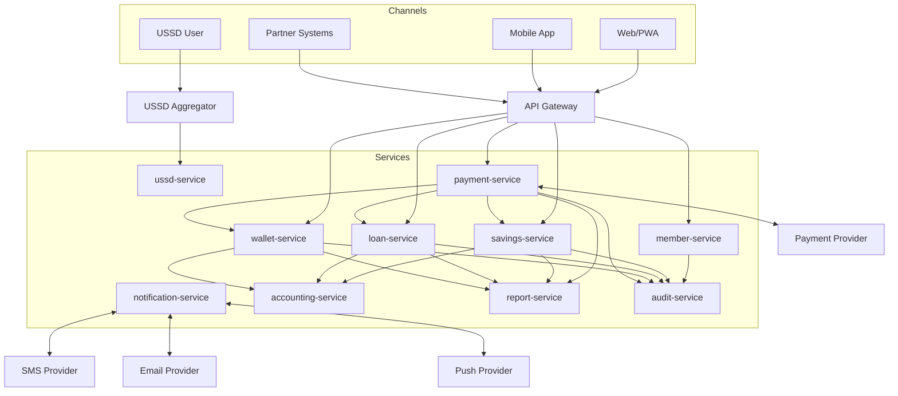
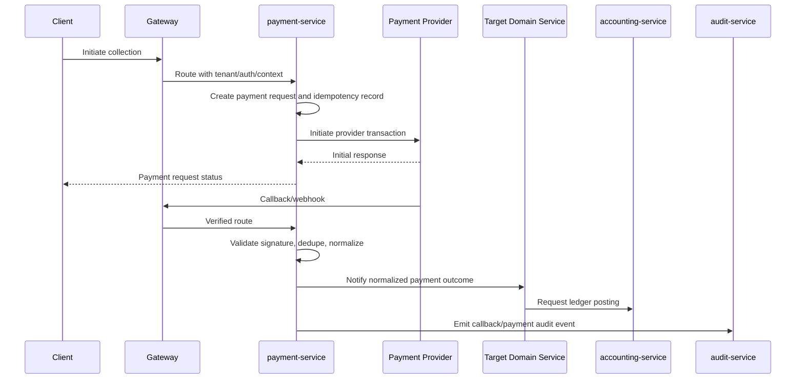
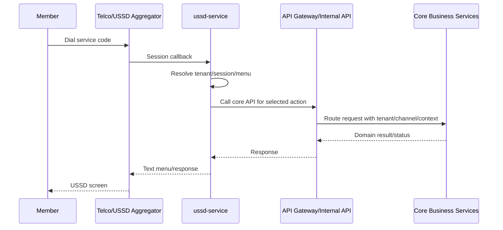

# Integration Architecture

## 1. Purpose

This document defines the integration architecture for the SACCO platform. It covers payment providers, SMS, email, push notifications, USSD aggregators, partner APIs, provider webhooks, external reporting/regulatory integrations, callback security, retry handling, reconciliation, and provider abstraction.

This document does not generate implementation code.

## 2. Integration Goals

- Reuse the same backend business services across web, PWA, mobile app, USSD, and partners.
- Isolate provider-specific behavior inside integration adapters.
- Protect core domain services from raw provider payloads.
- Ensure external callbacks are secure, idempotent, auditable, and reconcilable.
- Support provider replacement without rewriting business logic.
- Provide clear operational visibility for failed, delayed, duplicate, or ambiguous integrations.

## 3. Integration Principles

- External systems must integrate through approved APIs, adapters, or webhooks.
- Provider-specific payloads must not leak into domain models.
- Domain services consume normalized commands/events.
- Webhooks must be verified, deduplicated, and persisted.
- Financial callbacks must never directly mutate multiple services.
- All integration calls must propagate tenant ID, correlation ID, channel, and request references where applicable.
- Failed external calls must be retryable or repairable.
- Ambiguous financial outcomes must enter reconciliation, not be guessed.

## 4. Integration Landscape

## 5. Integration Types

| Integration Type | Owner | Examples |
| --- | --- | --- |
| Payment collection | payment-service | Member deposits, loan repayments, savings contributions |
| Payment payout | payment-service | Withdrawals, loan disbursements, wallet cash-out |
| SMS | notification-service | OTPs, transaction alerts, reminders |
| Email | notification-service | Statements, notices, administrative messages |
| Push notifications | notification-service | Mobile app alerts |
| USSD gateway | ussd-service | Session callbacks, menu responses |
| Partner APIs | gateway-service plus domain services | Approved external ecosystem integrations |
| Reporting exports | report-service | Scheduled exports, regulatory outputs |
| Object storage | owning service | KYC documents, reports, branding assets |

## 6. Provider Adapter Pattern

Provider-specific behavior should be isolated behind adapters owned by the responsible service.

| Domain | Adapter Responsibility |
| --- | --- |
| Payments | Initiate request, validate callback, normalize status, track provider references |
| SMS | Send message, normalize delivery status, retry dispatch |
| Email | Send email, manage template variables, track delivery/bounce |
| Push | Register devices, send push, track delivery where available |
| USSD | Parse provider callback, manage session state, format provider response |

Adapters may vary by provider, but domain services should expose a stable internal contract.

## 7. Payment Integration Architecture

### 7.1 Payment Collection Flow

### 7.2 Payment Payout Flow

Payouts must be more restrictive than collections because they move funds out of the platform.

Required controls:

- Confirm actor authorization.
- Confirm approval workflow completion where required.
- Confirm source account/wallet/savings state.
- Place hold before external payout where applicable.
- Create payout request with idempotency key.
- Send payout to provider.
- Process provider callback or polling result.
- Release hold or complete transaction based on final status.
- Post accounting entry.
- Reconcile provider settlement.

### 7.3 Payment Status Model

Recommended normalized statuses:

| Status | Meaning |
| --- | --- |
| `PENDING` | Request created, provider outcome not final |
| `INITIATED` | Provider accepted initiation |
| `CONFIRMED` | Provider confirmed successful payment |
| `FAILED` | Provider confirmed failure |
| `CANCELLED` | Request cancelled before completion |
| `EXPIRED` | Provider/user did not complete in time |
| `REVERSED` | Previously successful payment reversed |
| `REQUIRES_REVIEW` | Conflicting or incomplete provider evidence |

## 8. Webhook Strategy

All webhook endpoints must:

- Be routed through gateway where possible.
- Validate provider signature or approved authentication mechanism.
- Persist raw callback metadata safely.
- Deduplicate by provider reference, callback ID, and normalized transaction reference.
- Return provider-appropriate acknowledgements only after safe persistence.
- Process domain effects asynchronously where possible.
- Record validation failures and alert on spikes.

Webhook processing must be idempotent. Duplicate callbacks must return success where the previous callback was already accepted, without creating duplicate financial effects.

## 9. USSD Integration Architecture

USSD is a channel adapter, not a PWA conversion.

USSD-specific concerns:

- Short session timeout.
- Stateless provider callbacks with session reconstruction.
- PIN/OTP for sensitive actions.
- Clear pending states for financial commands.
- Transaction references shown in short form.
- Menu versioning by tenant and language where required.

## 10. Notification Integration Architecture

Notification-service owns:

- Templates.
- Dispatch records.
- Provider attempts.
- Delivery status.
- Preferences.
- Retry policies.

Domain services request notifications by event or command, but they should not call SMS/email/push providers directly.

Notification failure must not roll back completed financial transactions. Security-critical notification failure may generate alerts or require secondary action.

## 11. Partner API Integration

Partner APIs must be:

- Explicitly approved.
- Versioned.
- Scoped by tenant and partner permission.
- Rate limited.
- Audited.
- Contract documented.
- Isolated from internal service DTOs.

Partner access may include:

- Payment status lookup.
- Loan repayment submission.
- Member verification where legally and contractually allowed.
- Statement/report retrieval where authorized.

Partner APIs must not expose unrestricted member search, internal ledger detail, raw audit records, or administrative configuration.

## 12. External Reporting and Regulatory Integrations

Reporting integrations should be owned by report-service unless they are specific to a domain service.

Controls:

- Use read models/projections.
- Avoid querying transactional service databases directly.
- Use asynchronous export jobs for large datasets.
- Store generated files in object storage with expiry and access controls.
- Audit export creation and download.
- Include freshness metadata.

## 13. Retry and Backoff Strategy

| Scenario | Retry Strategy |
| --- | --- |
| Provider timeout before acceptance | Safe retry if idempotency/provider reference is preserved |
| Provider accepted but final status unknown | Poll/reconcile instead of duplicate initiation |
| SMS/email transient failure | Exponential retry with max attempts |
| Webhook processing failure after persistence | Retry internal processing from inbox/outbox |
| Domain service unavailable | Queue normalized event and retry |
| Permanent validation failure | Mark failed and route to manual review |

Retries must never create duplicate financial posting.

## 14. Reconciliation Strategy

Reconciliation is required for:

- Payment provider settlements.
- Callback/provider status mismatch.
- Unknown or pending payment outcomes.
- Duplicate callback detection.
- Wallet/savings/loan/accounting mismatches.
- Payout completion failures.

Reconciliation outputs:

- Matched records.
- Exceptions requiring review.
- Automatically repaired items where policy allows.
- Audit records for manual decisions.
- Reports for operations and finance teams.

## 15. Integration Observability

Metrics should include:

- Provider request counts.
- Provider latency.
- Callback counts.
- Callback validation failures.
- Duplicate callbacks.
- Pending payment age.
- Failed notification delivery rate.
- USSD session count and timeout rate.
- Partner API rate-limit hits.
- Reconciliation exceptions.

Logs and traces must include tenant ID, correlation ID, provider reference where safe, and channel.

## 16. Integration Readiness Checklist

Before enabling an integration:

- Provider credentials are stored securely.
- Callback/webhook security is documented.
- Idempotency strategy is confirmed.
- Provider references are persisted.
- Retry and timeout behavior is defined.
- Reconciliation process exists.
- Monitoring and alerts are configured.
- Test provider/sandbox flow is validated.
- Failure handling is documented.
- Audit requirements are implemented.

## 17. Summary

The SACCO platform integration architecture protects the core system by isolating external provider complexity behind controlled adapters, normalized APIs, secure callbacks, idempotent processing, and reconciliation. This allows the business to add or replace providers while preserving financial integrity and service boundaries.
