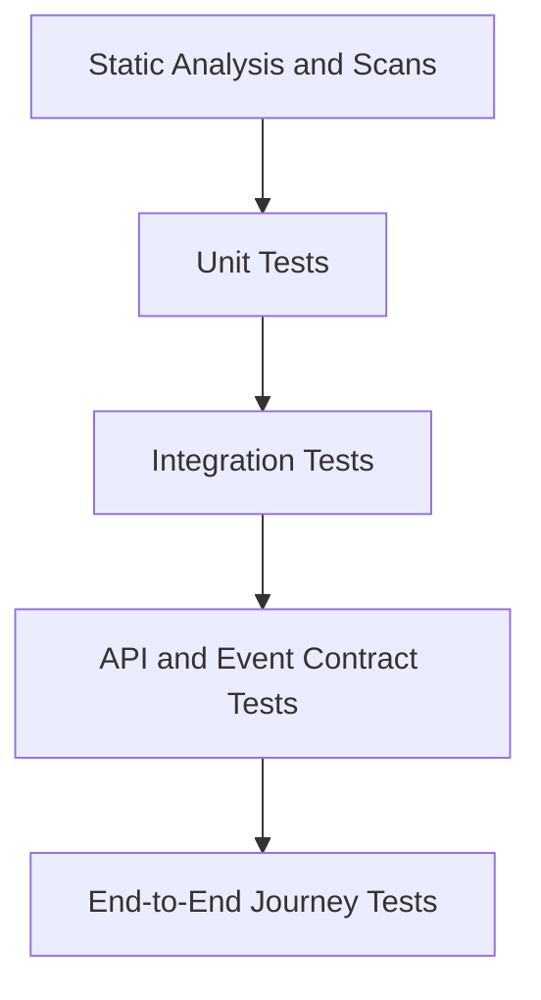

# Testing Strategy

## 1. Purpose

This document defines the enterprise testing strategy for the SACCO platform. It covers unit, integration, contract, end-to-end, security, tenant isolation, financial integrity, performance, resilience, data, deployment, and acceptance testing.

This document does not generate implementation code.

## 2. Testing Goals

- Protect financial correctness.
- Prevent tenant data leakage.
- Validate service boundaries and API contracts.
- Prove core workflows across web, mobile, PWA, and USSD.
- Detect regressions early through automation.
- Provide confidence for production releases.
- Support collaboration between member/mobile and admin/staff workstreams.

## 3. Testing Principles

- Tests should be automated where repeatable.
- Financial behavior must be tested at state transition and ledger levels.
- Tenant isolation must be tested as a first-class requirement.
- Contract tests must protect frontend/backend and service-to-service boundaries.
- End-to-end tests should focus on critical user journeys, not every edge case.
- Test data must never contain production secrets or real member data.
- Tests should run in CI before merge and before deployment.

## 4. Test Pyramid

| Layer | Purpose |
| --- | --- |
| Static analysis/scans | Catch style, dependency, security, and secret issues early |
| Unit tests | Validate isolated business rules and components |
| Integration tests | Validate persistence, transactions, external adapters, and messaging |
| Contract tests | Validate API/event compatibility between services and clients |
| End-to-end tests | Validate critical user journeys across deployed components |

## 5. Backend Testing Strategy

### 5.1 Unit Tests

Required for:

- Domain rules.
- State transitions.
- Fee/limit calculations.
- Loan eligibility rules.
- Savings withdrawal validation.
- Wallet hold/debit/credit rules.
- Idempotency decisions.
- Authorization policy checks.
- Event creation rules.

### 5.2 Integration Tests

Required for:

- Repository/database behavior.
- Transaction boundaries.
- Outbox/inbox persistence.
- Idempotency persistence.
- Ledger posting constraints.
- Kafka publishing/consumption where applicable.
- Redis cache behavior where applicable.
- Object storage metadata flows.

### 5.3 Service API Tests

Each backend service should validate:

- Authentication required.
- Authorization enforced.
- Tenant context required.
- Request validation.
- Error response shape.
- Pagination/filtering behavior.
- Idempotency behavior for financial commands.
- Audit event emission for sensitive commands.

## 6. Frontend Testing Strategy

Frontend tests should cover:

- Route protection.
- Role-based navigation.
- Tenant branding rendering.
- Form validation behavior.
- API error states.
- Loading and empty states.
- Responsive dashboard layouts.
- Accessibility-critical flows.
- Duplicate submit prevention for financial forms.
- PWA install/offline-aware behavior where implemented.

Recommended layers:

| Layer | Scope |
| --- | --- |
| Component tests | Reusable forms, tables, dialogs, navigation, status components |
| Integration tests | Page-level API state, route guards, form submissions |
| E2E tests | Login, member dashboard, savings payment, loan application, admin approval |
| Accessibility tests | Keyboard navigation, labels, contrast, screen-reader semantics |

## 7. API Contract Testing

API contracts must protect:

- Frontend to gateway/domain API compatibility.
- Mobile app compatibility.
- USSD adapter compatibility.
- Partner API compatibility.
- Service-to-service internal APIs.

Contract tests should verify:

- Required headers.
- Request shape.
- Response envelope.
- Error model.
- Status codes.
- Pagination metadata.
- Idempotency requirements.
- Version compatibility.

Breaking changes require explicit versioning and migration planning.

## 8. Event Contract Testing

Event tests should validate:

- Event name.
- Version.
- Tenant metadata.
- Correlation ID.
- Aggregate ID.
- Required payload fields.
- Backward-compatible schema evolution.
- Consumer tolerance for unknown fields.

Critical events include:

- MemberRegistered.
- SavingsContributionPosted.
- WithdrawalPosted.
- LoanApproved.
- LoanDisbursed.
- LoanRepaymentApplied.
- WalletDebitCompleted.
- PaymentConfirmed.
- LedgerEntryPosted.
- TenantConfigurationChanged.

## 9. Financial Integrity Testing

Financial tests must prove:

- Duplicate requests do not double-post.
- Ledger entries are balanced.
- Reversals do not mutate original ledger records.
- Pending transactions remain recoverable.
- Payment callbacks are deduplicated.
- Failed provider calls do not create completed financial state.
- Reconciliation can identify mismatches.
- Holds prevent double spend.
- Loan repayments update schedules correctly.
- Savings balances match transaction history and ledger projections.

## 10. Tenant Isolation Testing

Tenant isolation tests must cover:

- API access across tenants is denied.
- Database queries always filter by tenant where applicable.
- Cache keys are tenant-scoped.
- Events include tenant metadata.
- Reports cannot include another tenant's data.
- Object storage access is tenant-scoped.
- USSD short-code/session routing maps to the correct tenant.
- Admin/staff permissions remain tenant-scoped.

Tests should include at least two tenants with overlapping member numbers, product names, and user roles to expose hidden assumptions.

## 11. Security Testing

Security testing should cover:

- Authentication bypass attempts.
- Authorization bypass attempts.
- Session/token revocation.
- MFA-required actions.
- Rate limits and lockouts.
- Webhook signature failure.
- Replay attempts.
- Input validation.
- Sensitive log redaction.
- Secret scanning.
- Dependency and container scans.
- Cross-site scripting prevention in frontend display surfaces.

## 12. USSD Testing

USSD tests should cover:

- Session start and resume.
- Menu navigation.
- Timeout behavior.
- Invalid menu input.
- PIN failure limits.
- Tenant routing.
- Balance enquiry.
- Savings contribution request.
- Loan repayment request.
- Wallet transaction request.
- Duplicate callback handling.
- Provider callback format variations.

## 13. Mobile and PWA Testing

Mobile/PWA tests should cover:

- Authentication and refresh behavior.
- Device registration where applicable.
- Push notification registration.
- Offline-aware UI states.
- Reconnect behavior.
- Installability where PWA is enabled.
- Sensitive data storage rules.
- Responsive layout across common screen sizes.
- Financial command pending/completed/failed states.

## 14. Performance and Load Testing

Performance tests should validate:

- Gateway throughput.
- Login/session load.
- Member dashboard read load.
- Savings contribution volume.
- Payment callback spikes.
- USSD session concurrency.
- Report export queue behavior.
- Database query performance.
- Kafka consumer lag under load.
- Redis cache pressure.

The platform must be tested against growth toward more than 1 million members, with realistic usage patterns and tenant distribution.

## 15. Resilience Testing

Resilience tests should include:

- Payment provider timeout.
- Duplicate callback storm.
- Kafka unavailable or delayed.
- Redis unavailable.
- Database read replica lag.
- Service restart during transaction processing.
- Notification provider outage.
- USSD provider retry behavior.
- Report export failure.

Expected results must be defined before running resilience tests.

## 16. Data Migration and Seed Testing

Even if the legacy system is not guiding new architecture, future data import may be required.

Testing should validate:

- Seed data consistency.
- Tenant bootstrap data.
- Product/rule configuration.
- Import validation.
- Duplicate detection.
- Reconciliation after import.
- Rollback or correction process.

## 17. CI Quality Gates

Before merge:

- Lint/static checks pass.
- Unit tests pass.
- Relevant integration tests pass.
- API/event contracts pass where changed.
- Security/dependency scans pass or have approved exceptions.
- Documentation updated for architecture/API/database changes.

Before deployment:

- Full regression suite passes.
- Database migration tests pass.
- Smoke tests pass in target environment.
- Rollback plan exists.
- Monitoring and alerts are ready.

## 18. Critical End-to-End Journeys

Initial E2E suite should include:

- Tenant admin login and configuration.
- Staff creates member and verifies KYC.
- Member logs in and views profile.
- Member makes savings contribution.
- Payment callback confirms contribution.
- Staff reviews savings transaction.
- Member applies for loan.
- Staff approves loan.
- Loan is disbursed to wallet or external payout.
- Member repays loan.
- Accounting ledger entries are visible.
- Report export is requested and downloaded.
- USSD user checks balance and initiates a transaction.

## 19. Testing Ownership

| Area | Primary Owner |
| --- | --- |
| Member portal/PWA/mobile UI tests | Member/customer workstream |
| Admin/staff UI tests | Admin/staff workstream |
| Service unit/integration tests | Backend owner of each service |
| API contract tests | Backend plus consuming frontend/mobile owners |
| E2E tests | Shared QA/release responsibility |
| Performance/security tests | Platform/backend responsibility with team review |

## 20. Summary

The SACCO platform testing strategy must protect the areas where failure is most expensive: financial correctness, tenant isolation, authorization, API compatibility, and integration reliability. Testing should begin with the first implementation milestone rather than after the product is feature-complete.
