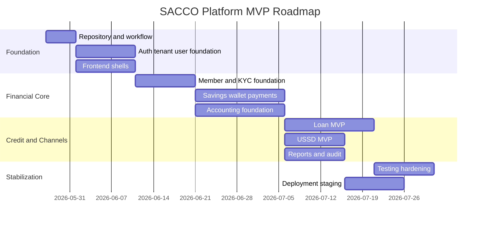

# MVP Implementation Roadmap

## 1. Purpose

This document defines the recommended implementation roadmap for the SACCO platform. It turns the architecture documents into a staged delivery plan that supports parallel work by the member/customer and admin/staff workstreams while protecting service boundaries, financial integrity, and tenant isolation.

This document does not generate implementation code.

## 2. Roadmap Goals

- Start implementation with the smallest useful foundation.
- Avoid building isolated frontend screens before core API contracts are agreed.
- Allow Ken's admin portal work and the member/customer workstream to progress in parallel.
- Deliver a demonstrable MVP without compromising financial correctness.
- Keep USSD, mobile app, and PWA aligned to the same backend services.
- Build toward production readiness from day one.

## 3. MVP Principles

- Build platform foundation before advanced features.
- Use shared API contracts for all channels.
- Deliver vertical slices, not only isolated layers.
- Implement tenant isolation in the first milestone.
- Implement idempotency before financial transaction flows go live.
- Keep accounting/ledger in the critical path for financial MVP validation.
- Defer advanced analytics, advanced automation, and noncritical integrations until foundations are stable.

## 4. Delivery Phases

Dates in this diagram are illustrative and should be adjusted after team capacity is confirmed.

## 5. Phase 0: Team and Repository Alignment

### Objectives

- Create or agree on the shared GitHub repository.
- Confirm branch strategy and pull request rules.
- Import/align any work Ken has already started.
- Agree on initial folder structure.
- Agree on API contract format.
- Establish local environment expectations.

### Deliverables

- Shared repository access for all developers.
- `main` branch protection rules.
- Initial README and environment setup notes.
- Agreed frontend app boundaries.
- Agreed service/module ownership.
- Initial backlog from architecture docs.

### Exit Criteria

- Both workstreams can pull, branch, push, and open pull requests.
- No one is working only on local files without shared visibility.
- Existing admin portal work is mapped to the target structure.

## 6. Phase 1: Platform Foundation

### Backend Scope

- gateway-service foundation.
- tenant-service foundation.
- Keycloak/OIDC IAM setup and auth-service integration foundation.
- user-service/RBAC foundation.
- configuration-service foundation.
- audit-service foundation baseline.

### Frontend Scope

Admin/staff:

- Admin portal shell.
- Login flow.
- Tenant-aware layout.
- Role-aware navigation.
- User/role management starter screens.

Member/customer:

- Member portal shell.
- Login flow.
- Tenant branding.
- Member dashboard placeholder.
- PWA foundation where applicable.

### Required Contracts

- Login/logout/refresh.
- Current user/profile.
- Tenant resolution.
- Permissions/navigation.
- Tenant branding/config.

### Exit Criteria

- Users can authenticate.
- Tenant context is resolved.
- Role-based navigation works.
- Admin and member shells consume shared auth contracts.
- Audit captures authentication and privileged setup actions.

## 7. Phase 2: Member and KYC Foundation

### Backend Scope

- member-service foundation.
- Member registration.
- Member profile.
- KYC status.
- Document metadata strategy.
- Member lifecycle states.

### Frontend Scope

Admin/staff:

- Member list.
- Member detail.
- KYC review.
- Member status management.

Member/customer:

- Member profile.
- KYC status.
- KYC submission journey where included in MVP.

### Exit Criteria

- Staff can create and view members.
- Members can view their own profile.
- Tenant isolation is tested with duplicate member numbers across tenants.
- KYC actions are audited.

## 8. Phase 3: Savings, Wallet, Payments, and Accounting Foundation

### Backend Scope

- savings-service MVP.
- wallet-service MVP.
- payment-service MVP with provider abstraction.
- accounting-service ledger foundation.
- notification-service baseline.

### Financial MVP Workflows

- Open savings account.
- View savings balance.
- Initiate savings contribution.
- Process payment confirmation.
- Post accounting entry.
- View transaction history.
- Wallet balance and basic wallet transaction flow.

### Frontend Scope

Admin/staff:

- Savings products/accounts.
- Payment status/reconciliation queue.
- Wallet support view.
- Basic ledger/accounting view.

Member/customer:

- Savings dashboard.
- Contribution journey.
- Wallet dashboard.
- Transaction status.

### Exit Criteria

- Savings contribution is idempotent.
- Duplicate payment callbacks do not duplicate balances or ledger entries.
- Ledger posting is balanced.
- Payment status is visible to staff and members.
- Notifications are triggered without controlling financial state.

## 9. Phase 4: Loan MVP

### Backend Scope

- loan-service MVP.
- Loan products.
- Loan application.
- Eligibility/rule evaluation.
- Approval workflow.
- Disbursement flow.
- Repayment flow.
- Accounting integration.

### Frontend Scope

Admin/staff:

- Loan products.
- Application review.
- Approval workflow.
- Disbursement monitoring.
- Repayment monitoring.

Member/customer:

- Loan eligibility/status.
- Loan application.
- Loan account view.
- Repayment journey.

### Exit Criteria

- Member can submit loan application.
- Staff can approve/reject.
- Disbursement is traceable and idempotent.
- Repayment updates schedule and accounting correctly.
- Maker-checker rules are enforced where configured.

## 10. Phase 5: USSD MVP

### Scope

- ussd-service foundation.
- Tenant routing by service code/provider metadata.
- Session handling.
- Member authentication by MSISDN/PIN where configured.
- Balance enquiry.
- Savings contribution request.
- Loan repayment request.
- Wallet balance/transfer where approved.

### Exit Criteria

- USSD calls core APIs.
- USSD does not own business state.
- Sessions expire safely.
- Duplicate provider callbacks are safe.
- USSD actions emit audit records where required.

## 11. Phase 6: Reporting, Audit, and Operations

### Scope

- report-service projections.
- Member statement.
- Savings report.
- Loan report.
- Payment reconciliation report.
- Ledger report.
- Audit search/export.
- Operational dashboards.

### Exit Criteria

- Reports are tenant-scoped.
- Large exports are asynchronous.
- Audit events are searchable.
- Projection freshness is visible.
- Export access is audited.

## 12. Phase 7: Deployment and Stabilization

### Scope

- Docker Compose local environment.
- CI pipeline.
- Test environment deployment.
- Staging deployment.
- Observability baseline.
- Backup/restore validation.
- Load testing.
- Security review.
- Release checklist.

### Exit Criteria

- MVP can deploy repeatably.
- Smoke tests pass.
- Monitoring and alerting exist.
- Database backup and restore are tested.
- Critical flows pass E2E tests.

## 13. Workstream Parallelization

| Timeframe | Member/Customer Workstream | Admin/Staff Workstream | Shared Backend/Platform |
| --- | --- | --- | --- |
| Phase 0 | Review member/mobile/PWA journeys | Share existing admin work | Repo setup, ownership alignment |
| Phase 1 | Member shell/auth | Admin shell/auth/RBAC | Gateway, auth, tenant, user |
| Phase 2 | Profile/KYC self-service | Member/KYC operations | member-service |
| Phase 3 | Savings/wallet member journeys | Savings/payment/accounting ops | savings, wallet, payment, accounting |
| Phase 4 | Loan application/repayment | Loan review/approval | loan-service |
| Phase 5 | USSD member menus | USSD config/admin | ussd-service |
| Phase 6 | Statements/notifications | Reports/audit/accounting | report, audit, notification |

## 14. MVP Scope Boundaries

### Include in MVP

- Multi-tenant foundation.
- Auth/RBAC.
- Member management.
- Savings contribution.
- Wallet basics.
- Payment integration abstraction.
- Basic ledger.
- Loan application/approval/repayment.
- Basic USSD.
- Reports and audit baseline.
- Docker-based local setup.

### Defer Unless Required

- Advanced BI dashboards.
- Credit bureau integrations.
- Complex regulatory integrations.
- Advanced mobile offline transactions.
- Multi-region active-active deployment.
- Advanced AI analytics.
- Marketplace-style partner ecosystem.
- Highly customized tenant workflow designer beyond core rules.

## 15. Architecture Gates

Do not move into implementation of a phase unless:

- API contracts are agreed.
- Data ownership is clear.
- Tenant isolation rules are known.
- Security expectations are documented.
- Testing expectations are known.
- Frontend/backend ownership is assigned.

Do not move into production pilot unless:

- Financial idempotency is tested.
- Tenant isolation is tested.
- Backup/restore is tested.
- Payment reconciliation works.
- Audit trails exist.
- Monitoring and alerting are active.

## 16. Summary

The MVP should be delivered through vertical slices that prove real SACCO workflows while preserving the long-term architecture. The immediate next step is repository alignment, followed by platform foundation, then member/KYC, then savings/wallet/payments/accounting, then loans, USSD, reporting, and stabilization.
