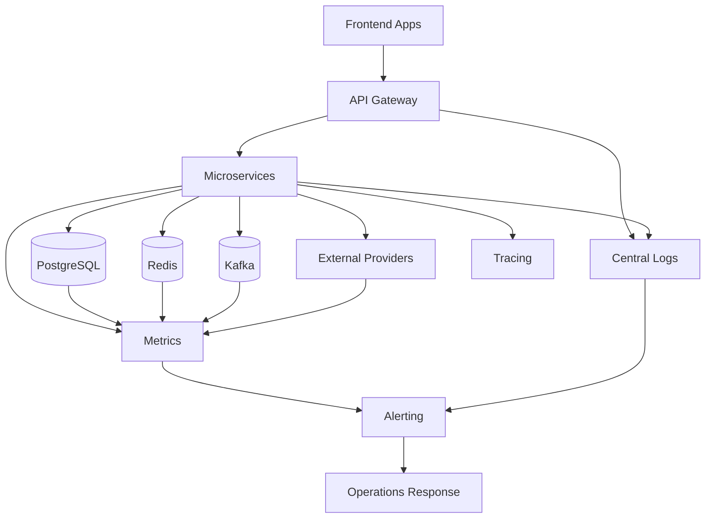

# Operations Runbook

## 1. Purpose

This document defines operational runbook guidance for running, monitoring, troubleshooting, and recovering the SACCO platform. It is intended for future DevOps, backend, support, and technical leadership teams.

This document does not generate implementation code or production commands.

## 2. Operational Goals

- Keep critical SACCO services available and observable.
- Detect incidents before they become financial or member-impacting events.
- Recover safely from failed deployments, provider outages, database issues, and transaction inconsistencies.
- Protect tenant data and financial records during operational actions.
- Provide repeatable procedures for support and engineering teams.

## 3. Service Criticality

| Tier | Services | Operational Priority |
| --- | --- | --- |
| Tier 0 | PostgreSQL, Keycloak/IAM provider, gateway-service, auth-service, tenant-service | Platform access and data foundation |
| Tier 1 | member-service, savings-service, loan-service, wallet-service, payment-service, accounting-service | Core financial/member operations |
| Tier 2 | ussd-service, notification-service, report-service, audit-service, configuration-service | Channel, visibility, compliance |
| Tier 3 | Admin/member frontend apps, object storage exports, analytics projections | User experience and reporting |

Audit-service is listed as Tier 2 operationally, but audit evidence must be preserved with Tier 1 seriousness for sensitive actions.

## 4. Monitoring Overview

## 5. Key Metrics

### 5.1 Platform Metrics

- Request rate by service, tenant, endpoint, and channel.
- Error rate by service and endpoint.
- Latency percentiles.
- Active sessions.
- Authentication failures.
- Rate-limit hits.
- CPU/memory usage.
- Pod/container restarts.

### 5.2 Financial Metrics

- Payment initiation count.
- Payment callback count.
- Payment callback validation failures.
- Pending payment age.
- Duplicate callback count.
- Savings contribution failures.
- Withdrawal failures.
- Loan disbursement failures.
- Loan repayment failures.
- Wallet hold age.
- Ledger posting failures.
- Reconciliation exceptions.

### 5.3 Data Platform Metrics

- PostgreSQL connections.
- Slow queries.
- Lock waits.
- Replication lag.
- Disk usage.
- Backup success/failure.
- Kafka consumer lag.
- Kafka topic error rates.
- Redis memory and eviction rate.

### 5.4 Channel Metrics

- Web/PWA errors.
- Mobile API errors.
- USSD session starts/completions/timeouts.
- Notification delivery failures.
- Partner API usage and throttling.

## 6. Alert Severity

| Severity | Meaning | Examples |
| --- | --- | --- |
| SEV1 | Critical production outage or financial integrity risk | Database unavailable, duplicate ledger posting, authentication unavailable |
| SEV2 | Major user impact or degraded financial processing | Payment callbacks failing, high 5xx on savings/loans, Kafka lag on financial topics |
| SEV3 | Limited impact or recoverable issue | Notification provider outage, report export failures |
| SEV4 | Low-impact warning | Elevated latency, near-threshold disk usage, minor retry increase |

## 7. Incident Response Flow

```mermaid
flowchart LR
    Detect[Detect Alert/User Report]
    Triage[Triage Severity]
    Contain[Contain Impact]
    Diagnose[Diagnose Root Area]
    Resolve[Apply Fix/Failover/Rollback]
    Verify[Verify Recovery]
    Communicate[Communicate Status]
    Review[Post-Incident Review]

    Detect --> Triage --> Contain --> Diagnose --> Resolve --> Verify --> Communicate --> Review
```

Required incident record:

- Incident ID.
- Start time.
- Detection source.
- Affected tenants/channels/services.
- Severity.
- Actions taken.
- Recovery time.
- Financial impact assessment.
- Follow-up tasks.

## 8. Failed Deployment Runbook

Symptoms:

- New release causes elevated errors.
- Health checks fail.
- Frontend route breaks.
- API contract mismatch.
- Database migration issue.

Response:

1. Identify affected service/app and release version.
2. Check deployment logs, health checks, metrics, and recent migrations.
3. Stop further rollout.
4. Roll back stateless service/app to previous stable image where safe.
5. If database migration is involved, assess forward-fix vs rollback using migration plan.
6. Run smoke tests.
7. Monitor error rate and latency.
8. Document incident and required test coverage improvements.

Financial services require extra care. Never roll back a service in a way that reprocesses financial commands without confirming idempotency and outbox state.

## 9. Payment Provider Outage Runbook

Symptoms:

- Provider API timeouts.
- Callback delay.
- Payment initiation failures.
- High pending payment age.
- Settlement mismatch.

Response:

1. Confirm provider status through monitoring and provider dashboard/contact.
2. Mark provider as degraded in operational status.
3. Stop aggressive retries that could create load or duplicate attempts.
4. Keep accepted payment requests in pending or requires-review state.
5. Notify staff/admin users through operational dashboard where applicable.
6. Route critical items to reconciliation queue.
7. Resume normal processing only after provider status is stable.
8. Reconcile pending transactions against provider settlement/status reports.

Do not mark payments successful without provider-confirmed evidence or approved manual reconciliation.

## 10. Duplicate Payment Callback Runbook

Symptoms:

- Multiple callbacks with same provider reference.
- Duplicate callback alerts.
- User sees repeated provider notifications.

Response:

1. Confirm payment-service idempotency record.
2. Check whether duplicate callback was safely ignored.
3. Verify target domain transaction was applied once.
4. Verify ledger entry was posted once.
5. If duplicate effects occurred, freeze affected transaction for manual review.
6. Create reversal/repair only through approved accounting and domain procedures.
7. Update callback dedupe tests if needed.

## 11. Ledger Posting Failure Runbook

Symptoms:

- Domain transaction completed but ledger posting failed.
- LedgerPostingFailed event.
- Accounting-pending status.

Response:

1. Identify affected tenant, transaction, correlation ID, and service.
2. Confirm domain transaction final state.
3. Inspect outbox/inbox and accounting failure reason.
4. Retry ledger posting if failure is transient and idempotency key is preserved.
5. If mapping/configuration is missing, repair configuration and reprocess.
6. If business data is inconsistent, escalate to finance/technical review.
7. Keep audit trail of repair actions.

## 12. Tenant Data Leakage Suspected

Symptoms:

- User reports seeing another tenant's data.
- Cross-tenant access denial alerts spike.
- Query/report contains unexpected tenant records.

Response:

1. Treat as SEV1 until disproven.
2. Identify affected tenant(s), user(s), endpoint(s), and time window.
3. Disable affected endpoint/report if leakage is active.
4. Preserve logs, traces, audit records, and request IDs.
5. Check gateway tenant resolution and service tenant guard.
6. Check recent deployments and query changes.
7. Notify leadership and follow security incident communication procedure.
8. Patch and test tenant isolation before re-enabling affected functionality.

## 13. Database Incident Runbook

Symptoms:

- PostgreSQL unavailable.
- High connection usage.
- Slow queries.
- Lock waits.
- Disk near full.
- Replication lag.

Response:

1. Confirm database health and scope.
2. Identify top queries/connections/locks.
3. Scale application connections down if connection exhaustion is harming recovery.
4. Pause noncritical jobs such as exports.
5. Fail over to standby if primary is unavailable and failover is approved.
6. Verify data consistency after recovery.
7. Reprocess outbox/inbox events safely.
8. Run reconciliation for financial workflows affected during the incident window.

## 14. Kafka/Event Processing Incident

Symptoms:

- Consumer lag grows.
- Events not processed.
- Reports stale.
- Notifications delayed.
- Financial saga steps pending.

Response:

1. Identify affected topics and consumer groups.
2. Determine whether issue is broker, consumer, schema, or poison message.
3. Pause or isolate poison messages according to dead-letter policy.
4. Restart or scale consumers where safe.
5. Monitor lag recovery.
6. Verify idempotent consumers do not duplicate effects.
7. Reconcile affected financial workflows.

## 15. USSD Incident Runbook

Symptoms:

- USSD sessions failing.
- High timeout rate.
- Provider callback errors.
- Incorrect menu routing.

Response:

1. Confirm provider connectivity.
2. Check ussd-service health and session store.
3. Verify tenant short-code routing.
4. Check recent menu/configuration changes.
5. Disable affected menu option if it can trigger incorrect financial actions.
6. Validate financial commands submitted during the incident.
7. Communicate status to operations team.

## 16. Backup and Restore Runbook

Backup requirements:

- Scheduled PostgreSQL backups.
- Point-in-time recovery where available.
- Object storage backup/versioning for documents and exports.
- Backup encryption.
- Access-controlled backup storage.
- Regular restore testing.

Restore validation:

- Database starts successfully.
- Critical tables exist.
- Tenant isolation metadata exists.
- Financial transaction and ledger totals reconcile.
- Outbox/inbox state is understood before restarting consumers.
- Applications pass smoke tests.

## 17. Reconciliation Runbook

Reconciliation should run for:

- Payment settlement files.
- Payment callback/provider status mismatch.
- Ledger/domain mismatch.
- Wallet holds older than threshold.
- Accounting-pending transactions.
- Incident recovery windows.

Outputs:

- Matched transactions.
- Exceptions.
- Repair recommendations.
- Manual approval tasks.
- Audit records.

Manual repair must always preserve original transaction records and use approved reversal/adjustment entries.

## 18. Access and Secret Rotation Runbook

Rotate secrets when:

- Credential leak is suspected.
- Staff with privileged access leaves.
- Provider requires rotation.
- Scheduled rotation window arrives.
- Environment is cloned or rebuilt.

Rotation procedure:

1. Create new secret version.
2. Deploy services with dual-read or coordinated switch where needed.
3. Verify connectivity.
4. Revoke old secret.
5. Monitor errors.
6. Record audit evidence of rotation.

## 19. Release Readiness Checklist

Before production release:

- CI checks pass.
- Critical tests pass.
- API contracts are reviewed.
- Database migrations are reviewed.
- Rollback plan is documented.
- Monitoring dashboards are updated.
- Alerts are active.
- Secrets are configured.
- Smoke tests are ready.
- Support team knows the release window.

## 20. Summary

Operations readiness is essential for a financial platform. The SACCO platform must be monitored, auditable, recoverable, and safe under failure. Runbooks should be refined continuously as implementation reveals real deployment, provider, and operational behavior.
